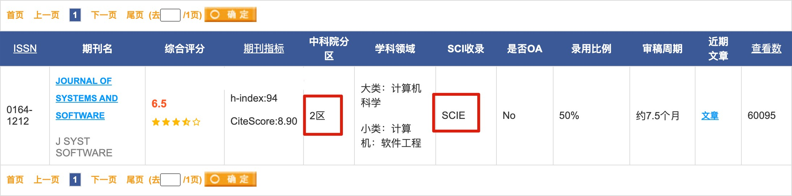
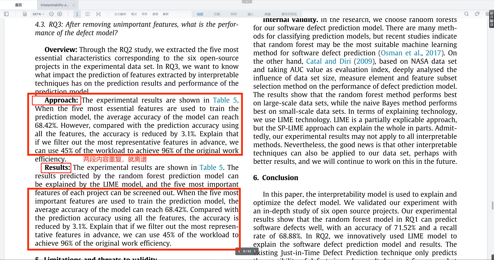
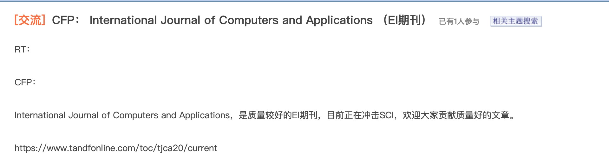
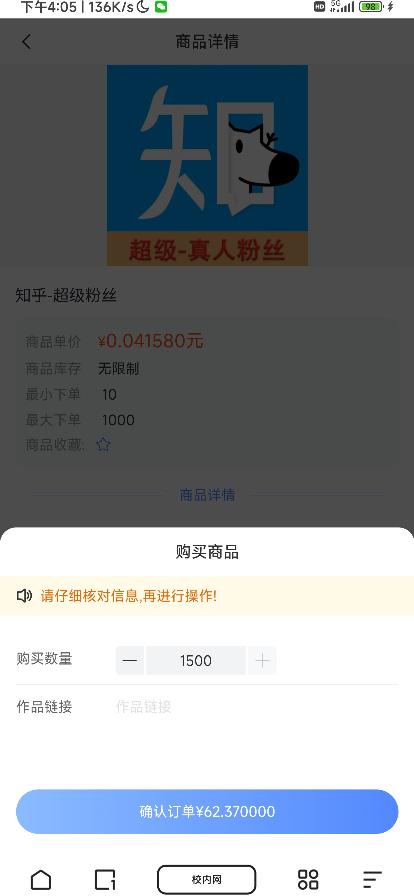

> [**研究⽣⾃救指南由B站Up，<u>⽔论⽂的程序猿</u>，<u>htt</u>p<u>s://s</u>p<u>ace.bilibili.com/383</u>
> <u>551518</u>，独家整理，购买后不可传播，侵权必究**](https://space.bilibili.com/383551518)

#  **<u>研究⽣⾃救指南</u>** 

> [**⼀、引⾔**](#引)

1.  [研究⽣的处境](#研究的处境)

2.  [研究⽣的基调](#研究的基调)

3.  [写这份指南的动⼒](#写这份指南的动)

> [**⼆、第⼀个暑假规划**](#第个暑假规划)

1.  [引⾔](#引-1)

2.  [未找导师](#未找导师)

3.  [已找导师](#已找导师)

    1.  [未定⽅向](#_bookmark8)

    2.  [已定⽅向](#已定向)

4.  [总结](#已定向)

> [**三、毕业⽬标的选择**](#已定向)

1.  [为什么要定⽬标](#已定向)

2.  [主要⽬标分类](#已定向)

    1.  [考公](#已定向)

    2.  [考编](#_bookmark16)

    3.  [⺠办⾼校](#_bookmark15)

    4.  [国央企](#国央企)

    5.  [⼤⼚](#国央企)

    6.  [中⼩⼚](#_bookmark20)

    7.  [读博](#_bookmark19)

3.  [没有毕业⽬标选哪个⽬标好](#没有毕业标选哪个标好)

4.  [⼀定要有毕业⽬标吗](#定要有毕业标吗)

5.  [对于⽬标种类的选择](#对于标种类的选择)

6.  [总结](#导师类型简介)

> [**四、如何选合适的导师**](#导师类型简介)

1.  [引⾔](#导师类型简介)

2.  [导师类型简介](#导师类型简介)

    1.  [学术型](#学术型)

    2.  [项⽬型](#学术型)

    3.  [半放养型](#学术型)

    4.  [指导型](#_bookmark32)

    5.  [纯放养型](#_bookmark31)

3.  [如何选合适的导师](#如何选合适的导师)

4.  [总结](#总结-2)

> [**五、与导师的相处**](#五与导师的相处)

1.  [示弱](#示弱)

    1.  [为什么示弱](#_bookmark37)

    2.  [如何示弱](#_bookmark38)

    3.  [示弱的副作⽤](#交好)

2.  [交好](#交好)

    1.  [为什么交好](#示弱的副作)

    2.  [如何交好](#示弱的副作)

3.  [沟通](#沟通)

    1.  [和导师之间的沟通](#_bookmark44)

    2.  [和辅导员之间的沟通](#莫较真)

    3.  [和师兄姐之间的沟通](#莫较真)

4.  [莫较真](#莫较真)

5.  [⽃争](#争)

6.  [总结](#总结-3)

> [**六、选错了导师怎么换**](#六选错了导师怎么换)

1.  [什么是互选](#什么是互选)

2.  [互选前](#互选前)

3.  [⾮必要不换导师](#必要不换导师)

    1.  [以德服⼈和装可怜](#互选后)

4.  [互选后](#互选后)

    1.  [怎么换](#_bookmark56)

    2.  [如何换](#总结-4)

5.  [总结](#总结-4)

> [**七、⽅向的选择**](#七向的选择)

1.  [按课题组⽅向划分](#按课题组向划分)

    1.  [课题组有⽅向](#按毕业标划分)

    2.  [课题组⽆⽅向](#按毕业标划分)

2.  [按毕业⽬标划分](#按毕业标划分)

    1.  [⽔论⽂的⽅向选择](#课题组有向)

    2.  [搞科研的⽅向选择](#_bookmark65)

3.  [浅谈博⼠⽅向选择](#浅谈博向选择)

4.  [总结](#总结-5)

> [**⼋、识破导师的push和pua**](#_bookmark68)

1.  [如何识别导师的pua和push](#_bookmark69)

2.  [如何应对导师的push和pua](#_bookmark70)

    1.  [隐藏实⼒](#_bookmark72)

    2.  [明修栈道暗度陈仓](#_bookmark71)

    3.  [⽃争](#_bookmark77)

3.  [总结](#_bookmark76)

> [**九、与导师鸿沟之这个好发论⽂**](#_bookmark75)

1.  [引⾔](#_bookmark74)

2.  [⽩⻢⾮⻢](#_bookmark73)

3.  [到底再说啥](#到底再说啥)

4.  [总结](#_bookmark79)

> [**⼗、公共数据集和私有数据集**](#总结-7)

1.  [公共数据集](#总结-7)

2.  [私有数据集](#总结-7)

3.  [怎么判断有没有公共数据集](#总结-7)

4.  [总结](#_bookmark87)

> [**⼗⼀、科研捷径之继承**](#_bookmark86)

1.  [什么是继承](#_bookmark85)

2.  [怎么继承](#_bookmark84)

3.  [没有继承怎么办](#没有继承怎么办)

4.  [总结](#总结-9)

> [**⼗⼆、导师让你造航⺟怎么办**](#导师让你造航怎么办)

1.  [什么是造航⺟](#什么是造航)

2.  [造航⺟该怎么办](#造航该怎么办)

3.  [⾮逼着你造怎么办](#逼着你造怎么办)

4.  [总结](#总结-10)

> [**⼗三、毕业要求查询**](#三毕业要求查询)

1.  [培养计划获取⽅式](#培养计划获取式)

2.  [专硕培养计划分析](#_bookmark97)

3.  [学硕培养计划分析](#学硕培养计划分析)

    1.  [学制要求](#_bookmark100)

    2.  [科研能⼒的培养（重中之重）](#_bookmark99)

    3.  [其他](#总结-11)

4.  [总结](#总结-11)

> [**⼗四、基础的寻找和学习**](#四基础的寻找和学习)

1.  [Ai专业找基础](#_bookmark104)

2.  [⾮Ai专业找基础](#_bookmark105)

    1.  [领域内通⽤技能](#bookmark106)

    2.  [⽅向内专业技术](#_bookmark107)

3.  [基础的学习](#基础的学习)

4.  [总结](#总结-12)

> [**⼗五、科研善⽤两个⼯具**](#五科研善两个具)

1.  [百度](#百度)

2.  [ChatGPT](#chatgpt)

3.  [总结](#总结-13)

> [**⼗六、ChatGPT的注册和使⽤指南**](#_bookmark114)

1.  [ChatGPT的注册和使⽤](#_bookmark115)

2.  [ChatGPT英⽂论⽂润⾊和中英互译使⽤指南](#_bookmark116)

    1.  [注意事项](#_bookmark117)

    2.  [英⽂润⾊](#_bookmark118)

    3.  [中英互译](#_bookmark119)

    4.  [其他任务](#_bookmark120)

3.  [ChatGPT整篇论⽂撰写指南](#_bookmark121)

4.  [ChatGPT使⽤⼼得](#_bookmark122)

5.  [总结](#总结-14)

> [**⼗七、三年的时间规划**](#七三年的时间规划)

1.  [打基础](#打基础)

2.  [看论⽂](#看论)

3.  [做实验](#做实验)

4.  [写论⽂](#写论)

5.  [找⼯作](#找作)

    1.  [进⼚](#论)

    2.  [考公考编](#论)

6.  [⼤论⽂](#论)

7.  [总结](#总结-15)

> [**⼗⼋、要不要去联培呢**](#要不要去联培呢)

1.  [什么是联培](#什么是联培)

2.  [为什么联培](#为什么联培)

    1.  [嫌你麻烦](#要不要去联培呢)

    2.  [赚⼈头费](#总结-16)

    3.  [真没办法](#总结-16)

3.  [总结](#总结-16)

> [**⼗九、如何搜和下载论⽂**](#_bookmark144)

1.  [搜论⽂](#_bookmark143)

2.  [怎么搜论⽂](#_bookmark142)

3.  [下载论⽂](#_bookmark141)

4.  [总结](#总结-17)

> [**⼆⼗、综述和研究性⽂章的异同**](#综述和研究性章的异同)

1.  [综述性⽂章](#综述性章)

    1.  [什么是综述性⽂章](#什么是综述性章)

    2.  [没有综述性⽂章怎么办](#什么是综述性章)

    3.  [综述性⽂章怎么写](#什么是综述性章)

    4.  [综述性⽂章能毕业嘛](#研究性章)

2.  [研究性⽂章](#研究性章)

3.  [总结](#_bookmark156)

> [**⼆⼗⼀、顶刊和⽔刊看哪个**](#_bookmark155)

1.  [引⾔](#_bookmark154)

2.  [先看⽔刊⽔会](#bookmark153)

3.  [再看顶刊顶会](#再看顶刊顶会)

4.  [总结](#总结-19)

> [**⼆⼗⼆、如何⾼效阅读⽂献**](#如何效阅读献)

1.  [中⽂核⼼](#中核)

2.  [精读外⽂核⼼](#精读外核)

> [22.1.1 如何阅读外⽂核⼼](#_bookmark162)
>
> [22.2.1 外⽂阅读⼯具推荐](#_bookmark163)

1.  [总结](#总结-20)

> [**⼆⼗三、顶刊的秘密**](#三顶刊的秘密)

1.  [引⾔](#引-5)

2.  [获取顶刊论⽂](#获取顶刊论)

3.  [顶刊的秘密](#顶刊的秘密)

4.  [总结](#总结-21)

> [**⼆⼗四、学术裁缝**](#四学术裁缝)

1.  [科研思维及其弊端](#科研思维及其弊端)

2.  [什么是学术裁缝](#什么是学术裁缝)

    1.  [浅谈基准模型](#_bookmark173)

    2.  [浅谈模块](#_bookmark174)

    3.  [浅谈编故事](#_bookmark175)

3.  [学术裁缝可⾏性分析](#学术裁缝可性分析)

4.  [如何和导师讲学术裁缝](#如何和导师讲学术裁缝)

5.  [总结](#总结-22)

> [**⼆⼗五、找基准模型**](#五找基准模型)

1.  [什么是基准模型](#什么是基准模型)

2.  [怎么找基准模型](#怎么找基准模型)

3.  [总结](#总结-23)

> [**⼆⼗六、找模块**](#六找模块)

1.  [什么是模块](#什么是模块)

2.  [怎么找模块](#怎么找模块)

3.  [为什么选择做的⼈多的⽅向](#为什么选择做的多的向)

4.  [总结](#总结-24)

> [**⼆⼗七、缝模块**](#七缝模块)

1.  [如何缝模块](#如何缝模块)

    1.  [理论⻆度](#级缝模块术)

    2.  [实践⻆度](#级缝模块术)

2.  [⾼级缝模块术](#级缝模块术)

3.  [总结](#总结-25)

> [**⼆⼗⼋、开题答辩**](#开题答辩)

1.  [开题答辩的本质](#开题答辩的本质)

2.  [开题报告怎么做](#开题报告怎么做)

3.  [答辩被提问怎么办](#_bookmark201)

4.  [总结](#_bookmark200)

> [**⼆⼗九、⼩论⽂的三个实验**](#_bookmark199)

1.  [对⽐试验](#_bookmark198)

    1.  [什么是对⽐试验](#_bookmark197)

    2.  [怎么做对⽐试验](#_bookmark202)

    3.  [Sota的挑选](#_bookmark204)

    4.  [对⽐论⽂结果的获取](#_bookmark203)

    5.  [没⽤通⽤的指标怎么办（造航⺟）](#消融实验)

    6.  [没有对⽐的论⽂怎么办（造航⺟）](#消融实验)

2.  [消融实验](#消融实验)

    1.  [什么是消融实验](#_bookmark208)

    2.  [怎么做消融实验](#_bookmark209)

3.  [实例分析](#实例分析)

    1.  [什么实例分析](#_bookmark211)

    2.  [怎么做实例分析](#_bookmark212)

4.  [总结](#总结-27)

> [**三⼗、科研和学术的区别**](#三科研和学术的区别)

1.  [什么是科研](#什么是科研)

2.  [什么是学术](#什么是学术)

    1.  [学术圈](#学术圈)

    2.  [圈层的重要性](#学术圈)

    3.  [什么是学术](#实例演示)

3.  [实例演示](#实例演示)

4.  [总结](#总结-28)

> [**三⼗⼀、如何编个好故事**](#三如何编个好故事)

1.  [学术裁缝](#学术裁缝)

    1.  [复刻思想](#学术裁缝-1)

    2.  [堆叠思想](#学术裁缝-1)

2.  [⾮学术裁缝](#学术裁缝-1)

3.  [强扯问题](#强扯问题)

4.  [科研trick之捆绑销售](#_bookmark228)

5.  [总结](#总结-29)

> [**三⼗⼆、⼩论⽂必备三张图**](#_bookmark230)

1.  [摘要图](#摘要图)

2.  [⽅法图](#法图)

3.  [总结图](#总结图)

4.  [总结](#总结-30)

> [**三⼗三、⼩论⽂怎么写**](#三三论怎么写)

1.  [定位⽬标期刊](#定位标期刊)

2.  [写⼩论⽂的核⼼：模仿](#写论的核模仿)

3.  [论⽂翻译](#论翻译)

4.  [⼩论⽂模板](#_bookmark242)

5.  [总结](#_bookmark241)

[**三⼗四、⼩论⽂需要查重吗**](#_bookmark240)

1.  [⼩论⽂需要查重吗](#_bookmark239)

2.  [论⽂查重⼯具推荐](#论查重具推荐)

3.  [总结](#总结-32)

> [**三⼗五、论⽂期刊分级**](#三五论期刊分级)

1.  [如何查询期刊](#如何查询期刊)

2.  [按刊号所处地划分](#按刊号所处地划分)

3.  [按地域划分](#按地域划分)

4.  [核⼼期刊](#核期刊)

    1.  [国内核⼼](#_bookmark250)

    2.  [国内期刊核⼼机构售价](#bookmark251)

    3.  [国际核⼼（SCI、SSCI、A&HCI、EI）](#_bookmark253)

    4.  [国际期刊核⼼（SCI）机构售价](#bookmark252)

    5.  [ESCI、SCI和SCIE的区别](#普刊)

    6.  [国际会议核⼼（ISTP、EI）](#普刊)

5.  [普刊](#普刊)

    1.  [普刊机构售价](#_bookmark257)

6.  [顶刊、权威、A、B、C、D类（⼀般为学校内部期刊评级）](#顶刊权威abcd类般为学校内部期刊评级)

    1.  [什么是顶刊](#顶刊权威abcd类般为学校内部期刊评级)

    2.  [学校内部期刊评级](#顶刊权威abcd类般为学校内部期刊评级)

7.  [计算机领域特有期刊评级（CCF）](#计算机领域特有期刊评级ccf)

    1.  [CCF和SCI的区别](#_bookmark262)

    2.  [国际期刊](#_bookmark265)

    3.  [国内期刊](#_bookmark264)

    4.  [会议](#_bookmark263)

8.  [⽔刊怎么确定](#刊怎么确定)

9.  [总结](#总结-33)

> [**三⼗六、顶刊和⽔刊的区别**](#三六顶刊和刊的区别)

1.  [⼆三区为界限](#三区为界限)

2.  [顶刊有多顶](#顶刊有多顶)

    1.  [论⽂引证](#顶刊有多顶)

    2.  [编⼀个好故事](#编个好故事)

    3.  [挑⼀个好对⽐](#_bookmark273)

3.  [⽔刊到底有多⽔](#刊到底有多)

    1.  [⽅法⼀：换药不换汤（SCI四区）](#_bookmark275)

    2.  [⽅法⼆：换汤不换药（EI期刊）](#法换汤不换药ei期刊)

4.  [总结](#总结-34)

[**三⼗七、国内核⼼和SCI投哪个**](#三七国内核和sci投哪个)

1.  [国内核⼼和SCI投哪个](#_bookmark279)

    1.  [撰写难度](#_bookmark282)

    2.  [审稿速度](#_bookmark281)

    3.  [审稿难度](#bookmark280)

    4.  [认可度](#总结-35)

    5.  [使⽤范围](#总结-35)

2.  [总结](#总结-35)

[**三⼗⼋、学术漏洞Ei会议和普刊**](#三学术漏洞ei会议和普刊)

1.  [普刊](#普刊-1)

2.  [Ei会议的审核机制](#ei会议的审核机制)

3.  [如何写⼀篇Ei会议](#如何写篇ei会议)

4.  [如何投稿Ei会议](#_bookmark290)

5.  [总结](#总结-36)

> [**三⼗九、科研漏洞OA期刊**](#三九科研漏洞oa期刊)

1.  [什么是OA期刊](#_bookmark293)

2.  [为什么投OA期刊](#_bookmark294)

3.  [怎么找OA期刊](#_bookmark295)

4.  [总结](#总结-37)

> [**四⼗、期刊会议的选择**](#四期刊会议的选择)

1.  [找到所有⽬标期刊](#找到所有标期刊)

2.  [定期刊级别](#定期刊级别)

    1.  [毕业不需要论⽂](#_bookmark300)

    2.  [⾮读博](#_bookmark301)

    3.  [读博](#读博-2)

    4.  [课题组有要求](#读博-2)

    5.  [时间来不及的怎么办](#定具体期刊)

3.  [定具体期刊](#定具体期刊)

4.  [被拒后怎么重选期刊](#被拒后怎么重选期刊)

5.  [总结](#总结-38)

> [**四⼗⼀、⼩论⽂投稿指南**](#四论投稿指南)

1.  [作者指南](#作者指南)

2.  [排版格式](#排版格式)

3.  [总结](#总结-39)

> [**四⼗⼆、论⽂返修注意事项**](#四论返修注意事项)

1.  [有问必答](#有问必答)

2.  [⾃我意淫是⼤忌](#我意淫是忌)

3.  [能舔则舔](#能舔则舔)

    1.  [必要解释](#_bookmark316)

    2.  [必要修改](#据理争)

    3.  [实验补充](#据理争)

    4.  [参考⽂献](#据理争)

4.  [据理⼒争](#据理争)

5.  [如何修改](#如何修改)

    1.  [返修⽂件修改](#总结-40)

    2.  [论⽂修改](#总结-40)

    3.  [能否修改作者等信息](#总结-40)

6.  [总结](#总结-40)

> [**四⼗三、毕业⼤论⽂**](#四三毕业论)

1.  [⼩论⽂和⼤论⽂评分差异](#论和论评分差异)

2.  [论⽂写作与⼯作量](#论写作与作量)

    1.  [格式规范和语⾔流畅](#论选题)

    2.  [结构严谨](#论选题)

    3.  [⼯作量充⾜](#论选题)

3.  [论⽂选题](#论选题)

    1.  [与专业学位研究⽣教育特点相符合](#格式规范和语流畅)

    2.  [具有理论价值和应⽤价值](#_bookmark334)

4.  [⽂献综述与理论知识](#献综述与理论知识)

    1.  [综述能⼒](#_bookmark336)

    2.  [基础⽅法](#_bookmark337)

5.  [创新与成果](#创新与成果)

    1.  [新观点、新⽅法、新技术](#基础法)

    2.  [新数据](#_bookmark340)

    3.  [⼯作量的衔接](#_bookmark341)

6.  [研究或设计⽅法与能⼒](#研究或设计法与能)

    1.  [研究设计合理和⽅法得当](#查重和学术不端)

7.  [查重和学术不端](#查重和学术不端)

8.  [总结](#总结-41)

> [**四⼗四、⼤⼩论⽂创新的区别**](#四四论创新的区别)

1.  [⼤论⽂的新](#论的新)

2.  [⼩论⽂的创新](#论的创新)

3.  [模型性能提升了能发论⽂吗？](#模型性能提升了能发论吗)

4.  [总结](#总结-42)

> [**四⼗五、毕业答辩**](#四五毕业答辩)

1.  [毕业答辩的本质](#毕业答辩的本质)

2.  [毕业答辩PPT怎么做](#_bookmark353)

3.  [答辩被提问怎么办](#_bookmark354)

4.  [⼈⽣中的其他答辩](#_bookmark355)

5.  [总结](#_bookmark356)

> [**四⼗六、包装简历的⼀些看法**](#_bookmark357)

1.  [如何写简历](#如何写简历)

2.  [实事求是](#实事求是)

3.  [⽆中⽣有](#_bookmark360)

4.  [总结](#中有)

> [**四⼗七、线上作弊指南**](#中有)

1.  [物理作弊](#中有)

2.  [魔法作弊](#_bookmark367)

3.  [笨⽅法](#_bookmark366)

4.  [总结](#_bookmark365)

> [**四⼗⼋、对找⼯作的⼀些建议**](#_bookmark364)

1.  [投简历](#投简历)

2.  [应试](#应试)

    1.  [笔试](#投简历)

    2.  [⾯试](#投简历)

3.  [骑驴找⻢的重要性](#_bookmark375)

4.  [总结](#_bookmark374)

> [**附录1：读研的意义**](#_bookmark373)

1.  [功利的⻆度](#_bookmark372)

    1.  [体制内](#_bookmark377)

    2.  [体制外（⼤⼚）](#_bookmark376)

2.  [⾮功利的⻆度](#功利的度-1)

3.  [读研的终极意义](#读研的终极意义)

4.  [总结](#总结-47)

> [**附录2：对于读博的看法**](#附录2对于读博的看法)

1.  [申博](#申博)

    1.  [持续扩招](#_bookmark383)

    2.  [申博难度](#_bookmark384)

2.  [读博的困难](#读博的困难)

    1.  [时间压⼒](#_bookmark386)

    2.  [健康压⼒](#bookmark387)

    3.  [⼯作压⼒](#_bookmark389)

    4.  [⾦钱压⼒](#_bookmark388)

3.  [对于双⾮博的特殊看法](#对于双博的特殊看法)

4.  [什么样的⼈建议读博](#什么样的建议读博)

5.  [总结](#总结-48)

> [**附录3：对于机构的看法**](#附录3对于机构的看法)

1.  [引⾔](#引-6)

2.  [代写代发机构](#代写代发机构)

3.  [论⽂辅导机构](#论辅导机构)

4.  [到底有没有靠谱的机构](#到底有没有靠谱的机构)

5.  [总结](#总结-49)

> [**附录4：毕业没有论⽂要求要弄⼩论⽂吗**](#附录4毕业没有论要求要弄论吗)

1.  [为什么要弄⼩论⽂](#为什么要弄论)

2.  [⼩论⽂对⼤论⽂的作⽤](#论对论的作)

3.  [总结](#总结-50)

> [**附录5：⾼质量SCI⽔⽂模板**](#_bookmark403)
>
> [Abstract](#abstract) [Introduction](#abstract) [Realted
> Work](#abstract) [Approach](#abstract)
>
> [Basic Module](#abstract)
>
> [你的⽅法（⼀般为标题）](#experiments)
>
> [Experiments](#experiments)
>
> [Experiments Settings](#你的法般为标题) [Performance
> Comprison](#你的法般为标题)
>
> [Analysis](#analysis)
>
> [Quantitative Analysis（消融实验）](#analysis) [Case Study](#analysis)
>
> [Conclusion](#analysis) [Acknowledgments](#analysis)
> [Reference](#analysis)
>
> [**附录6：开题报告模板**](#analysis)
>
> [**附录7：论⽂返修模板（开题模板后⾯）**](#analysis)
>
> [**研究⽣⾃救指南由B站Up，<u>⽔论⽂的程序猿</u>，<u>htt</u>p<u>s://s</u>p<u>ace.bilibili.com/383</u>
> <u>551518</u>，独家整理，购买后不可传播，侵权必究**](https://space.bilibili.com/383551518)

# **<u>⼀、引</u>****<u>⾔</u>** 

### **<u>研究⽣的处</u>****<u>境</u>** 

根据我的粉丝情况初步统计，90%以上的研究⽣基本都属于以下这⼏种情况：

1.  完全被放养，甚⾄同时被瞎指挥（瞎指挥：导师啥也不懂，硬把⼀些博⼠甚

> ⾄是导师⾃⼰都很难实现的东⻄让硕⼠去完成）；

1.  被破做横向（项⽬），对未来有益的横向也就罢了，⼤多数横向要么骗xx钱，要么看起来很⾼⼤上但对学⽣未来⽆益；

2.  开天辟地、造航⺟，即这个没⼈做，这个做的⼈少，好发论⽂，然⽽这个好发论⽂是指好发好论⽂，这⽆论是对未来搞科研还是不搞科研的，都是灾
    难；

3.  研究⽣培养计划毕业要求⼀篇ei会议、⼀篇OA论⽂即可，然⽽课题组内要求奇⾼，疲于应对

4.  不知道如何度过⾃⼰的研究⽣⽣涯，很迷茫，更不知道如何和导师相处，与导师的关系⾯临冰点，甚⾄抑郁、想休学退学，甚⾄想轻⽣

5.  对于找⼯作⾮常迷茫，不知道如何找⼯作，怎么安排⼀个时间找⼀个好的⼯作。

如果你属于以上情况中的⼀种或⼏种，本合集《研究⽣⾃救指南》就⾮常适合你，全⽂共89233个字，不仅教会你如何从零到⼀⽔出⼀篇论⽂（⽔论⽂的套路所有领域都是通⽤的）的套路，给你规划好研究⽣三年的安排以及毕业后的

⽬标，同时还会教会你如何与不良导师⽃争，合法合理的争取属于⼀个研究

⽣、⼀个正常⼈的权益。说⽩了，就是研究⽣的保姆级指南，更是每⼀个研究

⽣都值得拥有的《独孤九剑》。

你可以认为该⽂字合集属于割⾲菜，但我更想解释，不是我不想，⽽是受限于短视频和⾃媒体的底层逻辑，视频不能做成纯⼲货，得要有⽭盾、得要有争
论、得要有谎⾔才可能被⾃媒体平台的算法推⼴出去，很多内容讲不清楚讲不全也讲不了，所以才准备开动⽂字版的巨作《研究⽣⾃救指南》，事⽆巨细，反复雕磨，让每⼀位还在科研苦海中挣扎的研究⽣收益。当然，我也不否认，我缺钱，我真的很缺钱，我写这个指南也是为了赚钱。但是我不会赚昧良⼼的钱，物必有所值，如果你觉得⾮常不值得，可以给出合理的理由申请退款，做

⼈做事全凭良⼼。

### **<u>研究⽣的基</u>****<u>调</u>** 

这是我写到⾃救指南某⼀章节时的感悟，这也是很重要的⼀点，适⽤每个⼈：少问，多做。当你做到⼀部分的时候⼀定会遇到问题，通过百度+gpt+思考，继续做下去，没有谁⼀⽣下来就是毕业的研究⽣，每⼀个毕业的研究⽣都是从0到⼀的拿到学位证。很多⼈的问题并不是他真的有啥问题，⽽是他不愿付出⾏动，遇到问题不想思考。就和我写这份指南的时候，我不可能⼀来就规划处这么多内容，都是写着写着这⾥加⼀点，那⾥想起来了⼜加⼀点。

### **<u>写这份指南的动</u>****<u>⼒</u>** 

写这段话的时候，离前⼥友提出分⼿已过了22天，也是这份⾃救指南完稿临近尾声的时间点。这段时间也已慢慢和前⼥友关系慢慢缓解，从刚开始的朋友都没得做到现在的还能⼀起出去吃个饭，写这份⽂档，靠的也就⼀个动⼒，写好之后⼤卖，然后把⼤卖的截图发给前⼥友看，告诉她我能让她不⽤再害怕，我有能⼒在未来带给她更多的幸福和安全感，也希望借此再次突破那层窗户纸，

挽回上⼀段没被⾃⼰好好珍惜的感情，以及那个曾被⾃⼰冷落和伤害的⼈⼉。

可是，越临近尾声，⼼⾥越没底，真的能⼤卖吗？不能⼤卖，已经22天了，⾯对⼀份近在咫尺⼜远在天边的感情，⾃⼰⼜还能如此坚持多久呢？⼜如何找到其他新的优势去挽回这段感情，陷⼊了⽆限的迷惘和惆怅……尽⼈事，听天命吧。也许很多事情真的错过就错过了，也不知道为什么要写下这⼀段，内⼼想写，那就写点吧。也希望上天能眷顾我⼀次，让我付出的努⼒能有所得，得到的也是我的那份初⼼！也⾮常感谢⼤家对这份指南的⽀持！感谢！！！

# **<u>⼆、第⼀个暑假规</u>****<u>划</u>** 

### **<u>引</u>****<u>⾔</u>** 

其实对于绝⼤多数研究⽣⽽⾔，第⼀个暑假（指研究⽣录取-9⽉份开学）这段时间，如果能好好利⽤，能够为未来的⾃⼰缓解很⼤的压⼒。当然，这段时间不是让你⾼负荷的去学什么，⽽是能够浅浅的了解⼀些什么，毕竟这可能是你

⼈⽣最后⼀段最快乐的时光，⽆忧⽆虑，所以，我也不主张这段时间去让⾃⼰压⼒满满，相⽐较更应该去好好享受！

针对这个暑假的规划，我们主要针对两类⼈群来详述，⼀个是已经找好导师的，⼀个是未找好导师的。

### **<u>未找导</u>****<u>师</u>** 

根据我的了解，绝⼤多数同学都将在暑假联系导师，并且确定导师，对于这类同学，我们会等下说。为什么要先说未找导师的呢？因为如果你还未找导师
的，我只能说，你先别急，⼀定要看完我的这份研究指南，⾄少得看到章节“导师让你造航⺟怎么办”这⾥后，才去考虑找导师的事情。

也就是说，如果你暑假还没有确定导师，你⼀定要先看我的指南和视频，然后再去确定导师，因为未来的你的种种都将由你找的导师确定，在你找到导师之前，尽情的享受⽣活就⾏了，也没有⼈给你施加压⼒。

在通过我教你的⽅法找到导师之后，那我们应该做什么呢？想看下⽂的“已找导师”那⼀节。

如果你暑假⼀直不想找导师，也不是不可以，那么也要给⾃⼰⼀定的任务，不

⽤太复杂，把我的该指南和我B站的视频都过⼀眼，不要求能看懂，看不懂的就跳过，⾄少得知道研究⽣现在是个什么⾏情，怎么去和你导师相处，怎么能保证⾃⼰顺利毕业，怎么能确保⾃⼰以后⼀定能找个较好的⼯作，上述这些都

⼤概有个印象。如果你时间有多的话，可以查看章节“基础的寻找和学习”去确定你⾃⼰未来的⼀些通⽤的理论基础和技能，每天花个⼀点点时间过⼀遍，不要求全部掌握，⾄少得⼤概知道有哪些东⻄，⼤概再⼲嘛。就是⼀定要初步略看⼀下这些东⻄，当然，
并不意味着这个东⻄你看⼀遍就⾏了，未来进了学校就是要认真的过⼀遍，暑假这个阶段还是以享受为主，尤其是没有导师的你
们。

### **<u>已找导</u>****<u>师</u>** 

对于已找导师的同学，⼜分为两种情况，⼀个是定了⽅向的，⼀个是未定⽅向的，对于这个未定⽅向的⼀般会占多数，因为你们这个时候还没⼊⻔，这个时候着急定⽅向就等同于普通⼈⾼考毕业选学校选专业⼀样，赌命。

这⾥多说⼀嘴，虽然你找了导师，但是你找的导师并不⼀定是和你的未来匹配的，这⾥可以参考章节“如何选合适的导师”，看看你的⽬标和你的导师是否匹配，如果不匹配，这个时候可以开溜，换导师，越早溜越好，千万不要觉得你溜了会怎么样，不会怎么样，开学之后别⼈早忘了你是谁。

##### **未定⽅向**

对于找了导师未定⽅向的同学，⼀定要清楚你的导师会给你定什么⽅向，也就是有哪些⽅向可以选择。当然，这个时候你不要急着定⽅向，你先获取这些⽅向之后，然后按照章节“⽅向的选择”所说的去挑⼀个最适合你的⽅向。然后再去学⼀些基础性的东⻄，把该指南看完，然后看看我的视频，学基础性的东⻄略看就⾏，还是以享受⽣活为主。

##### **已定⽅向**

对于定了⽅向的同学，我的建议还是看看章节“⽅向的选择”，因为这个时候你还有调整⽅向的可能。然后再去学⼀写基础性的东⻄，把该指南看完，然后看看我的视频，学基础的时候除了应付导师外稍微学学就⾏，同时以享受⽣活为主。

### **总结**

对于暑假的规划，⼀定是按照你的情况来考虑的。虽然这段暑假对你的未来还是挺重要的，但是这个暑假⼤概率是你⼈⽣仅有的最后⼀段⽆忧⽆虑的时光，因此，学要学，但都是略看，学的时候⼀定还是以享受⽣活为主，⽐如，去⼀些想去的地⽅，做⼀些想做的事。

# **三、毕业⽬标的选择**

### **为什么要定⽬标**

研究⽣三年下来，最重要的⼀件事：毕业，针对毕业，可以查看“毕业要求查
询”那⼀章，其中说到了毕业最重要就是要有⼀篇满⾜毕业要求的⼩论⽂。⽽你的毕业⽬标的不同，也就决定了你毕业需要发⼀个什么级别的论⽂，同时也决定了你未来需要进⼀个什么样的课题组，选择⼀个什么样的导师。说⽩了，如果你刚读研毕业⽬标都没定好，犹如⼀只⽆头苍蝇⼀样乱⻜，会浪费很多的宝贵时间，最主要的是3年后你往回看，会后悔不已。

### **主要⽬标分类**

##### **考公**

都说宇宙的尽头是体制内，这句话绝不是空⽳来⻛。对于公务员来说，没有任何限制，⽆论你家⾥有钱没钱，你个⼈能⼒强不强，有没有顶刊顶会，任何⼈都适合，为什么适合，我只能说你进去了⾃然就清楚了，因此如果你没有合适的⽬标，⽆脑冲这个就完事了。

⽽且公务员只有国考和省考，只能通过考试进去，⾮常适合绝⼤多数通过⼀次

⼜⼀次国家考试上来的做题家。别在这⾥和我说选调⽣、说⼀些其他的特殊渠道，那和普通的你有关系吗？仔细去研究下选调⽣，都不会做这种⽩⽇梦。

当然，对于乡镇的公务员，尤其是那些三不限的公务员，我只能说慎重，三不限是给专科⽣和⽼油条准备的，⽽不是给你这个研究⽣准备的。

##### **考编**

考公只能通过正⼉⼋经的国考和省考才能进去，⽽对于考编就会松很多。因为编制太⼤太⼴了，绝不是⼀两场考试就能考全的，⾼校、医院、中⼩学、各种局、各种所等等都是事业编。

说了这么多，只要你按照我的⾃救指南⾛下去，早点把⼩论⽂和⼤论⽂给结束了，总能考到⼀个编制。最差最差也能有个⾼校的⼈事代理保底吧，当然，⾼校的⼈事代理⼀般会给你画⼤饼，如果有⼈退休就让你顶替，就有编了。

##### **⺠办⾼校**

这是⼀个很难讲的⼯种，往上说是⼀个⾼校⽼师，往下说就是管理你的地⽅也有董事会。我只能说，除⾮万不得已，别选这个，这⼀定是下下策，⺠办⾼校是研究⽣流通率最⾼的地⽅，每年进去的⼈很多，⾛的⼈也很多。

⼯资不⾼，事贼多，五险⼀⾦奇低，唯⼀有个带薪的寒暑假福利，说实话，你

⽆论在哪⾥也不差那点带薪的薪。

##### **国央企**

这就是⼀个承上启下的⼯种了，像企业，但⼜不是纯粹的企业，类似于电⽹、五⼤银⾏、电信、移动等等以中国⼆字开头的企业。按照世俗的眼光，往上

（考公考编）看就是躺平，⾮常稳定，稳定的贫穷但饿不死；往下（进⼚）看就是奋⽃，不稳定，并且有些岗位存在35岁的压⼒，来钱快，可以⽤身体换更多的钱，机会多，但对于绝⼤多数⼈最后都只是平凡的打⼯仔；对于国央企，则是较为稳定，然后待遇稍微好⼀点。

国央企的考核⽐较重要的是学历和专业对应，其次就是相⽐较考公考编多了点技术性的东⻄，但是这点技术性的东⻄相⽐较你要进⼚准备的技术性东⻄等同于⽆。

说⽩了，考公考编，你只要准备好⾏测申论，⽆关学历，准备好笔试即可，⾯试很重要，但相⽐较笔试没那么重要，对于技术要求基本就是⽆；进⼚，你要准备的东⻄，没有⼀个定论，就是各种各样的技术的学习，最主要的是你的学历，你的能⼒；⽽对于国央企，学历看不看重，看重，笔试看不看重，也有点看重，技术⾯需不需要，也需要⼀点。注意，这⾥基本看不到⼀点论⽂的影

⼦，你发顶刊顶会还是⽔刊⽔会对这些⼯种基本都不会起到决定性作⽤，甚⾄起不到作⽤

1.  **⼤⼚**

**本⼈从不歧视进⼤⼚，反倒，我觉得如果你真的有能⼒进⼤⼚，我巴不得你进**

**⼤⼚，我不是吃不到葡萄说葡萄酸的⼈，进⼤⼚赚⼤钱，以后开豪⻋找个漂亮**

**⽼婆（⽼公）挺好的，但是，我怕你对进⼤⼚执念太深，最后伤了身体⼜⽵篮打⽔⼀场空，所以，⼀定要三思。此外，去体验⼀下被身⼼掏空的感觉，才更利于个⼈的成⻓。**

⾸先⼤⼚对于学历卡的很死，如果本硕的学历不好，尝试都不要去尝试，不要去做这种梦，最后可能⽵篮打⽔⼀场空，还不如其他的准备中⼩⼚的同学。那你们学院有没有资格进⼊⼤⼚⻔槛，其实很简单，可以咨询辅导员你们学校往届毕业情况，⼀定要记住：千万别觉得⾃⼰是个例外，如果你是个例外的⼈，

⼤概率看不到我这句话。

如果你真的想要进⼤⼚，那⼀定要在研⼆争取实习，⼤⼚最看重的就是实习，别⼈需要的是⼀个学历⾼的，并且毕业进⼚就能直接带来收益的⼈，对你发什么论⽂，说实话，hr基本根本就看不懂。即使让你进⼊了技术那⼀关，除⾮你的论⽂和未来你需要⼲的技术直接相关，否则，也没啥⽤，说⽩了，就是两个字：现实。

对于⼀些想进⼤⼚做研发岗的同学，我拿我们ai领域和⼤家介绍⼀下情况，如果是纯ai领域的研发岗，那么就是本硕985（末9有点…），然后最少⼀篇顶
会，实则需要两篇定会了，那些本硕直博c9的⼈可不是吃素的；如果是做纯ai领域的偏应⽤岗，论⽂⼀般不看，看的是你的实习经历，⽽且⼀般是这样的，研⼆你去字节实习，然后研三快毕业领导觉得你不错，你才有可能转正的机
会，能⼒⼀定要的，但是运⽓成分也很⼤。

##### **中⼩⼚**

给个参考吧：双⾮⼀般的极限就是不知名中⼚，绝⼤多数就是⼩⼚（没有名字的⼚），剩下的就是211和末9了。当然，不排除个别学校有个例，可以咨询辅导员往届学⻓学姐的毕业情况，早做打算。

中⼩⻓的前途⼀定就是进⼤⼚，⾄于如何进⼤⼚，只能说先进了中⼩⼚再说
吧，社招这个东⻄⼀⾔难尽，还需要你⾃⼰去经历，只能说很苦，我有个同事苦到得了渐冻症，哎。为什么⼀定要进⼤⼚，因为⼤⼚的35岁了可以退居中⼩

⼚当个⼩领导，你这个中⼩⼚的总不能等到35岁，然后⾃⽣⾃灭吧？这也是为什么绝⼤多数⼈最后会选择考公考编的原因，除了⼀些极个别的越⼲越吃⾹的

⾏业，35的压⼒就是摆在那⾥，⽆法避免，⽽体制内别说35岁压⼒，退休压⼒都没有。

##### **读博**

读博就是赌博，相信每⼀个已经在读博的⼈都会不反对我上⾯那⼀句话。

对于读博，我的建议就是这⼏条，如果你家⾥有钱，随随便便，不⽤关⼼什么，接下来我们谈的更多的是性价⽐。

⾸先除⾮⼀些特殊专业（你是不是特殊专业，如果你有这个疑问，那你就不是这个特殊专业），并且你在这个特殊专业已经是本硕双⾮，那么你可以破罐⼦破摔，去尝试双⾮博，否则，极⼒不推荐双⾮博。

其次对于其他的博⼠，你把这些要求对应下⾃⼰，如果没问题，就可以去尝试。

⾸先，对于申博，你要进⼊⼀个能给你引荐博⼠的导师名下，这个很容易判
断，看看往届师兄的去处，如果没有读博的师兄姐，就别相信你导师的饼，你也可以相信⾃⼰可以是是那个开天辟地的⼈；其次，对于你科研能⼒的把握，其实，这个很好判断，如果你能进⼀个可以引荐读博的课题组，然后你能在那个组⾥正常的活下来，其实你的能⼒也没啥问题，如果你是勉强甚⾄很难受的待着的，我不太建议你读博，可以和导师表明⾃⼰的想法，因为读博的压⼒是远远⼤于硕⼠的，在硕⼠期间就扛不住，读博⼤概率是去活受罪；最后，对于申博，你的学历是很重要的，不仅是你的硕⼠学历，还有你的本科学历，如果你的学历不好，就需要通过级别很⾼的论⽂来抵消，当然，如果你是双⾮的，就不仅仅要论⽂来抵消了，需要很多很多，我个⼈现在的看法是，如果不是有执念，花这个精⼒赌读博，不如赌进⼤⼚赚钱，因为等你博⼠毕业了，⼜要看你的第⼀学历，第⼆学历，⼜是⼀个循环。

说⽩了读博，本硕期间的学历很重要，课题组的资源很重要，导师的引荐很重要，⾃身的天赋也很重要，否则，别被画了⼤饼，还在乐呵呵的给⼈数钱，到了，研三，发现申博也申不了太好的，⼯作也找不到好的，南柯⼀梦。更多的可以查看章节“对于读博的看法”。

### **<u>没有毕业⽬标选哪个⽬标</u>****<u>好</u>** 

给出定论，⽆脑考公考编就对了，这⼀定是⼀个不会错的选择，并且，应届⽣身份错过也就错过了（好好思考下为什么还要专⻔给你设⽴应届⽣身份），其他的选择都存在很⼤的赌的因素。

考公⼀般准备的是⾏测和申论，⽽考编⼀般也需要准备⾏测和⼀些附加的偏简单的科⽬，也就是说当你准备考公的时候，实则也在准备考编。并且当你去考

⼀些国央企，诸如电⽹、电信等公司，也会涉及到⾏测的内容。也就是考公等同于在考编等同于在准备国央企。

其次，公务员和编制的好处，其他的时候你看不到，但是疫情三年，你还没想明⽩吗？如今你爸妈年事也⾼，你看看你爸妈，再看看那些快退休的体制内⼈员，两相对⽐，相信你也有答案了吧。你千万别觉得你能脱离你爸妈的影⼦，当你能有机会进⼊体制的时候，其实⼀定程度就是脱离了他们了，已经很棒
了。

### **<u>⼀定要有毕业⽬标</u>****<u>吗</u>** 

我们现在履⾏的并不是萧炎的三年之约，也没有萧炎的那个⽃志。你说你现在定下来了毕业⽬标，以后会不会变化，我不敢保证，你也不敢保证。但是，你定下来的⽬标绝⼤概率不会变化，即使变，⼀般也会往下降，⽽不是往上涨，因为我可以肯定，研究⽣的三年⽣涯⼀定会⼀步⼜⼀步的压碎你的幻想。

因此你⼀定要现在定下⼀个毕业⽬标，当你定下来的时候，你的研究⽣的基调就定下来了，即使你的毕业⽬标降下来了，你的⽣活也不会变化的太⼤。

### **<u>对于⽬标种类的选</u>****<u>择</u>** 

⾸先，你可以判断⾃⼰的家庭状况。判别⽅法很简单，我⼀直觉得以什么为标准去判别呢，就是你毕业之后，家⾥能否给你所待得地⽅付得起⾸付、⻋⼦和彩礼，别和我说以后不结婚，⾸先不说有⼏个⼈能扛得住不结婚的同辈压⼒、

⻓辈压⼒，现在国家的政策也在慢慢往年轻⼈要结婚那边倾斜，不结婚，不⽣

⼩孩，是可以，你现在是年轻，就怕你未来⼀个⼈顶不住那个压⼒，千万别被那些营销号洗脑，识时务者为俊杰。

如果家⾥可以，那对你⽽⾔，我觉得最好的就是考公考编，当然如果你有远⼤理想，可以进⼚，不阻拦；如果不可以，考公考编不⼀定是⼀个很好的选择，毕竟考公考编就是为⼈⺠服务，别想着发财，进⼚赚钱可能更适合你。

当然，其实这都是很⽚⾯的，因为当你考公考编，考上的那⼀刻，只要你家⾥不是特别穷，你毕竟还是个研究⽣，婚姻这东⻄不⽤特别愁的，以后你们单位会经常安排和其他单位联谊，总能找到适合⾃⼰的，⽽且两个体制内的⼀⼩
对，努努⼒房⻋总不是问题的。

那么，到底什么对我们找⼯作起决定性的作⽤呢？很简单，你⾃⼰的内⼼早已给出了答案，你只要不断地去强化你内⼼的那个答案即可，我⼀直相信万事万物都是公平的，都是围城，我们需要做的，就是接受。

### **总结**

毕业⽬标的重要性，我想强调再强调，但是我也⼗分清楚，如果不让你进去磨练⼀番，你可能觉得我在忽悠你，那就忽悠吧，佛度有缘⼈。唯⼀想反复和你唠叨的就是，⼀定要在研⼀上就明确⾃⼰毕业后的⽬标，尤其是对于是否读
博，以及是去考公考编还是进⼚的抉择，否则，⼀错再错，错的太多，挽回起来，会异常痛苦、后悔。

# **四、如何选合适的导师**

### **引⾔**

选导师⼀定是相对⽽⾔的，不能⼀概⽽论哪个就适合你。并且每个⼈能⼒不
同、⽬标不同，所需要选择导师也⼀定是不同的，因此我们⾸要讲⼀下导师的类型分类，然后再讲讲如何根据⾃身的情况选择⼀个合适的导师。

下⽂所有的选导师倾向绝不是让你躺平，⽽是能希望你能理智的选出对⾃⼰最有利的导师⽅案，就和导师挑你⼀样

### **<u>导师类型简</u>****<u>介</u>** 

##### **学术型**

此类导师，⾃⼰都会有现还未结题的并多次拿了⽐较⾼级的国家基⾦。亦或者每年都会有指导的学⽣发⼀些级别⽐较⾼的期刊，⼀定要记住，是每年都会，

⽽不是昙花⼀现，因为每年都会发顶刊顶会的这类导师不仅掌握了顶刊顶会的技巧，并且他有着这样的资源和⼈脉，顶刊顶会仅靠能⼒是很难保持每年都有的。相应的，你别觉得你能⼜愉快的发好⽂章，⼜能愉快的度过研究⽣⽣涯，做好被Push，做好996的准备，甚⾄要007.

因此，如果你有着强烈的渴望读博，⼀定要进这样的组，记住仅仅是读博。发

⽂的学术能⼒并不代表搞科研的能⼒，搞科研的⼀定还是要综合考虑的。

##### **项⽬型**

此类导师，学院⼀打听就清楚了，不⽤问我他有什么性质，⼀般时间安排都是
996起步。除⾮你能明确的你未来的⼯作相关和这类导师的项⽬接轨，否则⼀点都不推荐，极有可能做了⽜⻢还要给别⼈数钱，简称push+pua。

⽐如我们Ai领域，很多导师接⼀些Ai相关的项⽬，然⽽绝⼤多数学⽣毕业都是出去⼲Java等，总之就是找不了Ai相关的⼯作，那你找这类导师的意义何在？其次，即使导师让你⼲Java相关的项⽬，也是让你做免费劳动⼒，⽽且这类
Java项⽬说实话也很男真正的学到什么，不如去纯放养的导师那⾥⾃学Java，然后去正经公司实习。

##### **半放养型**

此类导师，⼀般在时间上不会对你有过⾼的要求，也不会给你时不时丢出⼀个

⼤项⽬让你做，但是会定⽉定周开组会。对于这类导师，其实最不怕的就是压榨，因为学术型导师压榨你，但是由于他有⼀定的个⼈能⼒，因此在给你指导上⾯不会过于的不正常。

怕就怕你遇到这种半放养型的导师，每次开组会的时候给你提⼀些⾮正常的要求。即你的⽬标只是想顺顺利利毕个业，你只想⽔⼀篇论⽂，但是你的导师确认为咱不能⽔，咱得做出点有意义的东⻄，咱得怎么怎么样，也就是我们常说的瞎指挥。

但是⼀般这类导师是⼀个导师的分⽔岭，即他们都会有⼀些共性，在你研⼀研

⼆的时候都会对你充满幻想，等你快到了研三，到了研三，对你的幻想可能会慢慢逐渐消失，你如果只是⽔论⽂保毕业也多半不会拦着你。⽽对于学术型和项⽬型的导师，那可就不⼀定了，你研三下了，对你可能还是⾼要求，不能丢了他的⾯⼦，要把他供到院⼠；你研三下了，对你还是⾼强度的push，要供出他的库⾥南。

##### **指导型**

指导型的导师，⼀般针对学术型和项⽬型，很多忙着学术和项⽬型的导师，基本也没啥空指导学⽣的，要么丢到联培的地⽅去，要么随便丢到⼀个⼩导师那

⾥去看命。说⽩了，就是学术型和项⽬型能有指导那就更好，但是这个说实
话，你不进去很难明确导师是否会帮你，因为读研读的是⼈情世故，除⾮你能

⼒特别强，
否则你做不来⼈情世故，别⼈也不太会愿意帮你。只能说，这个也就⾃⼰多观望观望吧！

##### **纯放养型**

这类导师，就很佛系了，你爱⼲嘛⼲嘛，我也不管你，也不给你瞎指挥，想去实习就去实习，甚⾄可能没有实验资源，版⾯费也是⾃⼰来出，说的再通俗
点，可能就是⾯都⻅不到，只负责帮你在⽂件上签字。

我只能说这才是绝⼤多数研究⽣最理想的导师，尤其是对于仅仅想⽔论⽂毕业的研究⽣，⽔⼀篇论⽂需要啥⾼级设备（5000左右），⽔⼀篇论⽂需要啥版⾯费（5000左右），1万元就能让⾃⼰三年⽆忧⽆虑，别说1万元了，再贵点随便出去⼲点兼职都有了，甚⾄⼜有多少同学想花更多的钱都买不来。这种导师，

⼀般只有梦⾥有；这种好，也只有读过研的同学才能体会到。

注：这种也并不是只是针对所有⼈，⼀定会有⼀些学科，即使真的⽔论⽂，但也真的很需要导师资源，但是这个学科应该不多。

### **<u>如何选合适的导</u>****<u>师</u>** 

⽆论硕博，选择导师⾸要的最好的评判标准，两个字“⼈品”，⼈品这个东⻄如何体现，就是看⼀个导师是否尊重学⽣的想法和未来规划。

那到底如何选导师呢？对于学术型和项⽬型的导师，你其实很容易从你们学院官⽹的导师简历⾥看出来，当然，有些导师的简历不⼀定会经常更新，这个也要注意。

其次，就是多打听。研究⽣上岸之后，⾸先⼀定要做的就是及时找到组织，⼀般都是qq群的形式，⼀定会有组织这样的群，多⽅打听，多问。刚考上研究⽣的你们还是单纯的，多问问同样考到这个学院的研究⽣，别不好意思，⼀般就能问出来。这种群⾥会有各个导师的师兄姐，你就多加⼏个学⻓学姐打听情
况，⼀般加群的学⻓学姐都会挺热⼼的，聊前礼貌点，聊后发个奶茶钱的⼩红包。其次，也可以通过判断学⻓学姐的精神状况，来判断⾃⼰未来的精神状
况。

最后也是最重要的，如何找导师，并不是⼀定要找到梦中导师，⽽是⼀定要通过多⽅打听，多⽅对⽐，把所有不太好的导师给找出来，在不踩雷的情况下，然后看命随便挑⼀个其他的导师。你要记住没有梦中导师的，每个⼈或多或少都会有他的问题，偏执的⼈不⼀定能成功，但是成功的⼈或多或少都会有点偏执甚极端。

### **<u>总</u>****<u>结</u>** 

对于找导师，⾸先⼀定要明确⾃身的毕业⽬标，然后明确导师的类型，尽量找到和⾃⼰⽬标匹配的导师。对于没什么伟⼤⽬标和⽃志的同学，个⼈更倾向于你去找散养的导师，因为等你⼊学后，你会发现导师不瞎指挥你就胜利了⼀
半，其他的同学按号⼊座即可。其次，如何选导师呢，⼀定要⾃⼰找渠道通过多⽅打听，多⽅对⽐，这样做也并不是让你找出最适合你的导师，⽽是让你尽

⼈事避雷，其他的交给命运。

> [**研究⽣⾃救指南由B站Up，<u>⽔论⽂的程序猿</u>，<u>htt</u>p<u>s://s</u>p<u>ace.bilibili.com/383</u>
> <u>551518</u>，独家整理，购买后不可传播，侵权必究**](https://space.bilibili.com/383551518)

# **<u>五、与导师的相</u>****<u>处</u>** 

本篇⽂章更多的只适⽤于硕⼠，对于博⼠慎重，尤其是“⽃争”那⼀节，博⼠基本没什么权利⽽⾔，也不需要隐藏什么实⼒，交好倒是可以借鉴下，你⽼实做你的⼤⽜⻢就⾏，谁让你们真的只要毕业了，就能够享受挺⼤的红利，不过今年博⼠⼜扩招了，博⼠的红利期也要慢慢消失了。

免责声明：如果你的导师不push你，尊重你的任何想法，在科研学术上帮助
你，让你做的事⼤都是对你真正有益，⽽不是pua，以上以下所有⽅法都不适

⽤，你就该怎么样就怎么样！并且适当的帮导师完成⼀些举⼿之事，⼀些不⽤
过度熬夜不⽤通宵不⽤拿命才能完成的事，也是研究⽣应该的。

### **<u>示</u>****<u>弱</u>** 

##### **为什么示弱**

⾼开低⾛，让⼈嫌弃，低开⾼⾛，让⼈欣赏~

⽆论你是否想读博还是想考公考编亦或者要进⼊企业，最⼤的忌讳就是暴露你的实⼒，即使你没有实⼒，你总有⼀条可以⼀天可以活蹦乱跳24⼩时的狗命，那也是你的实⼒。也就是说，实⼒不仅包括你的能⼒，还包括你做事的态度，这两者都需要保持⼀个度。

你千万不要觉得研究⽣是⼩⽜⻢，你导师就是⼀个坐享其成的主，你⼀定要明确的是你的导师才是最⼤的⽜⻢。为什么这样说呢？作为⼀个导师，如果他只要还有欲望，只要没有想清楚彻底躺平，他是讲师就需要评副教授，副教授需要评四级教授，四级教授需要评三级教授，⼆级教授需要评院⼠，这些都需要论⽂的堆叠；即使你的导师想清楚躺平了，每年他们还会有业绩考核，业绩考核最重要的就是论⽂。

作为⼀个上有⽼⼩有⼩的⼈，仅靠教授的死⼯资，怎么混成他⼈眼中的教授
样？学校各种杂七杂⼋的如上课等事物需要他们去处理，他们的精⼒也很难全放在论⽂这⾥，并且你想评职称，⼀个学院职称就那⼏个，你需要的就是和同

⾏竞争，并不是说你的业绩达到了⼀个特定的数量就⾏了，那么，怎么办？靠

⾃⼰？不可能的。即使躺平，躺平的绝⼤多数都是能⼒稍逊的，也就是往上评职称⽆望了，那么这个业绩考核⼜该由谁来完成。

说了这么多，就是想让你对你的导师有⼀个清晰地认识，他可以⼈好，但是耐不住评职称对他的诱惑、业绩考核对他的压⼒，以及经济上的压⼒，甚⾄还有

⼀部分有学术理想的。有没有可能会遇到没有任何压⼒的导师，有，但可能性极⼩。

因此，如果你⼀来就放⼤招，释放了⾃⼰全部的潜能，你今天花了6个⼩时就做完了，我们⾸先不考虑你的导师过⼏天会不会让你花8个⼩时，但是你哪天⽬标变了，亦或者谈恋爱了，你拿出4⼩时，你说你导师⽣不⽣⽓。⽽且绝⼤数的情况是，你刚去学校，你的导师会⼀步⼀步尝试你的能⼒，看看你的极限在哪

⾥，任务会⼀天⽐⼀天重。所以你要学会示弱，该摆就摆，这是在未来三年给

⾃⼰留退路，年轻⼈切记⼀来就精⼒⽆限，那么剩下的就是⽆限的push和
pua。年轻⼈明明就是要成⻓的，那为什么我不拿出所有的时间来学习成⻓
呢？我们前⽂⼀⼤堆的铺垫忘了吗？你导师他也是个⼤⽜⻢，也就是说，他交给你的任务绝⼤多数是为了完成他⾃⼰的任务，⽽不是真正站在你的⻆度为你考虑。并且绝⼤多数交给研究⽣的任务对研究⽣未来的就业是⽆益的，你把时间全部浪费在这些⽆益的事情之上，临近毕业你怎么和其他⼈竞争好的⼯作，靠论⽂？hr那关都过不去，hr也不知发的论⽂是啥。

其次对于想读博的，你可能觉得，我拼命发论⽂不也挺好的吗？申博⼀般需要的是⼀篇⾼质量的论⽂，以及未来能有引荐，⾼质量的论⽂则需要的是你要进

⼊⼀个好的课题组，以及个⼈能⼒。如果你进⼊的不是⼀个很好的课题组，很有可能你会和我的⼀个朋友⼀样，发了5篇普通⽂章只给导师做了嫁⾐，最后只能在导师的帮助下顶多申请⼀个双⾮博⼠（我的建议：双⾮博⼠真读不了⼀
点），导致最后⾃⼰读博读不了，⾃⼰java还没有学明⽩，找⼯作很费劲。⽽对于⾼质量⽂章，课题组的帮助是⼀点（这个课题组能不能发⾼质量⽂章，看看师兄姐就⾏，⼈⽣就怕总以为⾃⼰是个例外），个⼈能⼒也是慢慢挖掘的，

你如果在挖掘⾃⼰能⼒的时候发现⾃⼰不适合科研，可以及时⽌损；如果适合科研，慢慢释放潜能就⾏，然后发个⼀篇⾼质量⽂章就够了，如果你真的很
强，有很多idea，留到读博的时候在⽤，那时候才是你展现真功夫的时候。

##### **如何示弱**

能考上研究⽣，即使你是通过扩招补录进来的研究⽣，
也没有弱者，顶多说你可能对科研不敏感，但是你的身体必然是相对健全的，意志⼒相⽐较是顽强
的。

那到底怎么示弱呢？很多导师⼀来就会让你看论⽂，很多新⽣会好奇没有基础怎么看得懂论⽂呢？其实这就是⼀种变相的push，让你看论⽂，你看不懂，你就得花更多的个⼈时间学基础。这是没有必要的，你只要按照我的“研究⽣⾃救指南”慢慢⾛，总能⾛到终点的，尤其是对于未来不想搞科研的同学。说⽩了就是，不要盲⽬攀⽐，每天给⾃⼰固定的分配时间，个⼈的事分配⼏个⼩时，科研学术的事分配⼏个⼩时（能⼒强分配少点，能⼒弱多分配），导师的事分⼏个⼩时，只要超过这个限度那对你来说其实就是push，然后给⾃⼰⼼⾥定⼀些周期⽬标，没有完成这个⽬标，那就再适当的调整时间的分配，总⽽⾔之，不能把⾃⼰的时间全部交付给了你的导师，尤其是需要去加班、熬夜、通宵，那更是不可⾏的。

⼀定要记住，很多事，慢慢来，慢慢做，你开⼼，你导师也开⼼，认为你很负责很细⼼；如果你很快的完成，很多时候会让⼈觉得不负责任。其次对于有⼀个deadline的任务，除了有红头⽂件规定的deadline，千万别觉得你导师第⼀次和你说的时限就是那件事真正的deadline，⼈和⼈之间是没什么信任的，你

⼀定要通过和你导师的相处，知道你在deadline多久之后完成才不会触碰你导师的底线，在此之前，尽情的让他催，千万别愣头⻘，⼀下⼦蛮⼲就把他⼲完了，你⼀旦让他有了⾼期待，那么等待着你的就是⽆尽的⼲不完的活，永远要表现出：我能⼒差、我不⾏、我会努⼒。

总之，⾃⼰⼀定要给⾃⼰⼀个底线，其次导师给你安排的活，让你做的事，答应给你的奖励，再相信这之前多想⼀想：我不是他亲⼉⼦，更不是私⽣⼦，那这些到底是饼还是陷阱，⼤概率是pua。

##### **示弱的副作⽤**

其实示弱就是你未来在职场的⽣存法则，兔⼦博鹰，永远有底牌，让⼈看不
透。示弱看起来很好，那有没有副作⽤，有，⽽且还很⼤，遇到奇葩导师，会对你辱骂，骂你傻逼，骂你垃圾，相信很多同学也碰⻅了此类⼈，那还要不要继续示弱呢？你要想想对于这类⼈，他的欲望能有限吗？达到什么样才能让他满⾜呢，那就是完全奉献出你的健康和⾃尊，真⼀点都没必要。不如脸⽪厚
点，让他尽情的辱骂好了，你想过上更好的⽣活，脸⽪这个东⻄迟早有⼀天是要丢弃掉⼀些的，说⽩了都是选择⽽已，不强迫。

最后，示弱的时候莫忘了达到毕业要求，不过仅仅是毕业，其实都不难，最怕的就是遇到⽆端的导师，所以⼀定要学会和导师交好以及和导师多沟通。

### **<u>交</u>****<u>好</u>** 

##### **为什么交好**

示弱之后，就是交好，来弥补你和你导师之间的⼀些缝隙了。导师毕竟是你的导师，可能他没空帮你，对你没有指导，但是你或多或少都需要⽤到他提供的资源，即使你甚⾄没⻅过他⼀⾯，但他也是你的导师，未来的很多东⻄都需要他帮你签个字才⾏，⼀旦签下他的名字，代表的就是责任，千万别觉得帮你签字理所当然，哪有那么多理所当然。

其次，⼤部分导师也都是混⼝饭吃，你延毕、你毕不了业，对他⽽⾔也会造成损失，何必和你⼀直拉拉扯扯，更何况，你要是在读研究⽣期间搞出什么⼤新闻，他的铁饭碗都没了那怎么⾏。

##### **如何交好**

⾸先对于⼀些⼒所能及的事，能帮则帮；对于耗时不是特别过分，可以不⽤加班、熬夜就能完成的事，能做则做；对于⼀些很累很难的事，如果是公开场合丢给你的，先不要反驳丢了他的⾯⼦，尝试着做⼀段时间，但不是让你拿命
做，⽽是尝试着找出较为客观的难点，或以身体为由等等，然后私底下沟通不

做。对于好的导师⼀般就够⽤了，对于难搞的导师，更推荐明修栈道暗度陈
仓，即明⾯上答应，明⾯上要显得很努⼒，私底下做⾃⼰的尽量保证达到⾃⼰的毕业要求，消磨他对你的坚持，最后⼀定在他眼中⼀定是要表现出：我很努

⼒了，但是真的做不出来。

其次就是⾔语和⽣活上的，⾔语上不说拍⻢屁，好话不能少，瞅准机会就说你这个想法真的不错，⽼师很厉害诸如此类的话，不要吝啬漂亮话；⽣活上，逢年过节私⼈订制的祝福少不了，其次就是看看能不能给⽼师送点⼟特产，不要太贵重那就是⼈情往来，师⽣情谊，⽽且师⽣之间还很难谈到贿赂⼆字，更多的是表达感谢的情谊！尤其是你和你导师关系激化的时候，跪舔有时候不是
舔，⽽是给⾃⼰更多的可能，尤其这段感情是⽆法丢弃的时候，尽量是呈现出
弱者的姿态以交好为主。

### **<u>沟</u>****<u>通</u>** 

##### **和导师之间的沟通**

绝⼤多数的研究⽣和导师的⽭盾，都是来⾃于信息的不匹配，说⽩了就是，缺乏沟通。当你踏⼊研究⽣⽣涯的那⼀刻，绝⼤多数导师都是默认你是个⾮常努

⼒的孩⼦，上进的孩⼦，想学到真本事搞科研的孩⼦；同时绝⼤多数研究⽣也都认为研究⽣是能改变命运的地⽅，是能学到真本事的地⽅，是能让⾃⼰能找到更好⼯作的平台。

说上述这些什么意思呢？绝⼤多数的导师都是挺好的，并且研究⽣阶段还是受社会包容、受学校保护的阶段，因此你想混个学位证就混个学位证，想考公考编就考公考编，想去企业⼯作就去企业⼯作，不要对你的导师有过多的隐瞒，能做就是能做，不能做就是不能做，学得慢就是慢，⼀切在进⼊学校的时候就要慢慢透露出来，千万不要让你的导师对你有过⾼的期待。

你要知道，你什么都不说，导师让你⼲啥就⼲啥，极有可能让他会觉得（⼀般默认）你是⼀个想搞科研的好孩⼦，并且你要记住，你遇到⼀个尊重你想法的导师，你和他不沟通，很有可能会产⽣认知偏差导致分歧；你遇到⼀个不尊重你想法的导师，你沟通也是那样，不沟通也是那样。因此，在你不确定你导师

性格的情况下，有效沟通、敞开了聊对你是百利⽽⽆⼀害。

总之，万事⼀定要沟通，尤其是在准备⼀些带有戾⽓的事之前，**能沟通解决的**

**⼀定要通过沟通解决，**⼀级⼀级往上沟通，不要做傻事（做傻事很容易贴上不可磨灭的标签，⾎的教训），作为研究⽣你还是有很多的合法权益，还是受学校受法律保护的群体，没必要做⼀些过激的冲动事。

##### **和辅导员之间的沟通**

上⽂我们说了，绝⼤多数研究⽣也都认为研究⽣是能改变命运的地⽅，是能学到真本事的地⽅，是能让⾃⼰能找到更好⼯作的平台。实则呢？实则因学校⽽异，因此要尽量多去咨询辅导员⼀些现实的情况，⽐如往届学⻓学姐的毕业情况，学院的毕业要求（也可以查看我写的“研究⽣培养计划”那⼀章），评奖评优细则啥的，总⽽⾔之两点，不要被互联⽹洗脑⾃我意淫，⼆是不要觉得⾃⼰是个例外能脱离往届师兄姐的步伐。双⾮有案底，⼤专坐过牢这句话可不是空

⽳来⻛。多问，多看，眼⻅为实。

##### **和师兄姐之间的沟通**

我⼀进学校，就莫名其妙被师兄姐排斥，可能是我过于装，给他们造成了不好的影响，也可能是其他吧。但我极其不推荐像我这种被孤⽴，还是要尽量有⼀两个相处的还⾏的师兄姐，以后总有⼀些问题能相互交流，亦或者他们能提前告诉⼀些事，很多时候信息差是⼀个很重要的东⻄。不过现在这个社会，⼈性复杂，尤其是到了研究⽣这个阶段，看你⾃⼰，不喜欢也不要过于勉强，该⼲嘛⼲嘛！现在这个社会，⼀辈⼦能有⼀两个真正知⼼的朋友也就够了，很多事很多⼈没必要强求的。

### **<u>莫较</u>****<u>真</u>** 

做⼈做事莫较真。⾯对你的导师，很多时候，正确与否不重要，听不听话很重要。

⽆论你导师对你说什么事，这件事我也知道⼀听就很荒唐，很离谱，做不出
来，但是你的第⼀反应也不能是⻢上就反驳别⼈，⼀定要按着他的想法来。如果这件事不给你做，你别掺和；这件事给你做，私底下去尝试着做，⾄少得表现出你去做过了，真做不出来，慢慢和他解释。

⼀件事做不出来也⾮逼着你去做，说⽩了就是他喜欢扯蛋，你就跟着扯淡就好了，为什么要较真了，⼤家⼀起扯淡，⼀起开⼼，不好吗？⼤环境如此，识时务者为俊杰。你就⾮要拗，拗到最后两败俱伤？如果你真的想两败俱伤，就看下⼀节“⽃争”，但是真的不推荐⽃争，⽽是极⼒推荐得过且过。你导师他想认真就陪着认真，他想忽悠就陪着忽悠，他逼着你把⼀件不可能的事做出结果
来，你就给他搞个结果来，他作为论⽂第⼀负责⼈都不怕，你怕甚？不能说再多了，⾃⼰好好悟这⼀段话，总结：他异想天开，你就陪着他哄着他异想天开就好了，他开⼼了，你⾃然也就毕业了。

绝⼤多数研究⽣不能毕业，并不是他的学术能⼒不⾏，说实话，⼀篇论⽂真的不难，研究⽣不能毕业更多是花了太多时间去处理和导师之间的关系，还没处理好，那不如完全顺着来不处理（逼着你做⽜⻢⼲项⽬是另⼀回事）。

### **<u>⽃</u>****<u>争</u>** 

示弱、交好、沟通，和99%的导师相处⾜够了，但是保不准就会出现⼀些奇葩导师，示弱你就是fw；交好是必不可能的，你不仅不只是⽜⻢，就是⼀个⼯具

⽽已；沟通谁和你去沟通，你就是应该按照我想的来我想的做；达到学院要求就能毕业？学院要求就是放p，我的要求才是要求；加班熬夜、冲顶刊顶会、不间断的帮我做横向才是⼀个正常的研究⽣。

说⽩了，这类⼈，就是精致的利⼰主义者，对付他们其实也很简单，做也继续做，⾃⼰百度亦或者咨询辅导员研究⽣和导师的关系，去明确什么该做什么不该做，然后搜集证据，通过这些证据找辅导员和学院领导据理⼒争⾃⼰的⼀些合法权益，如果这都还不⾏，那要来就⼀起来个⼤的。什么⼤的，就是当你遇到奇葩导师，研究⽣三年你勤勤恳恳，努努⼒⼒，达到研究⽣培养计划的毕业
要求了（这是⼤前提），然后还对你提出超级⽆端过分的要求，⽐如做家务，接送⼩孩等等，对你尽是⽆端的辱骂和pua，把这些证据搜集起来，往学院举

报，不⾏，往学校举报，再不⾏，往教育厅（部）举报，再不⾏，直接报警。

⼀定要牢记，研究⽣是⽜⻢，但顶多是个⼩⽜⻢，如果有⼀切东⻄会让你变得抑郁、甚⾄想轻⽣，⼀定要在你还受保护的时候，及时争取合法权益，⽽不是选择离开这个世间，⼈⽣真的还有很多美好等着你！**但是对于⽃争，有⼀点也
很重要，**我们该做的都得做到位后，⼀定是⾃⼰实在想不到什么好办法后，情绪快绷不住了后，才能去搞⽃争，舆论也才会站在我们这⼀边，否则最后的舆论⼤都是：你是学⽣，他是导师，这些都是你应该的。

### **<u>总</u>****<u>结</u>** 

其实研究⽣三年与导师与同学的相处，就是我们未来进⼊社会与领导与同事打交道的基础，因此总有⼈说⼤学就是⼀个⼩社会，⼀个⼤染缸，那对于绝⼤多数⼈⽽⾔，尤其对于研究⽣⽽⾔更是和社会接轨的淡海⽔交界处，不仅仅要学会如何做事，更要学会如何做⼈。

谁也不敢保证三年间⾃⼰的想法会⼀变再变，示弱是为了让⾃⼰有退步的余
地；交好则是我们未来对待所有⼈的态度，⽆论内⼼有多么讨厌这个⼈，明⾯上都要保持微笑，这不是虚伪，⽽是尊重每⼀个⾃然⼈，尤其是当⼀段关系⽆法丢弃，弱者就要有弱者的姿态，三千越甲能吞吴；沟通除了能打破双⽅的认知偏差，更是⼀种赌，赌我们遇到的是正常的导师，能够博得尊重；还未⾛到抑郁，未⾛到想轻⽣的那⼀步，能忍则忍，明修栈道暗度陈仓，⽃争那定要是

⽆奈之举，毕竟⽃争的结果是两败俱伤。

我能有上述的分享，不仅仅是我看过很多书，去了解过很多⼈很多事，还有很多是我之前在社会上的亲身体会，⾎的教训！当然，上述很多都只是我的⼀些看法，很多事还是要因地制宜，因⼈⽽异，⾃⼰多经历多感悟，但对于绝⼤多数正常的导师，⾜矣！

# **<u>六、选错了导师怎么</u>****<u>换</u>** 

### **<u>什么是互</u>****<u>选</u>** 

⾸先明确下什么是互选，即你和某位⽼师开学后会签⼀份合同（互选表），这份合同会规定以后研究⽣三年由他来负责你的⽣活起居⾐⻝住⾏，并且也只有当这份合同签完之后，他才能称作为你的导师。同理，没有签这份合同之前，他仅仅只能称为⽼师，你们也没有什么互相绑定的，他不需要对你负责，你也不需要⼀定要帮他做什么。

### **<u>互选</u>****<u>前</u>** 

对于互选前换导师，其实没有那么多原则需要去考虑，在组⾥待得不开⼼了，不喜欢就可以换。因为在你互选前选择导师，就和你在⼀家公司试⽤三个⽉⼀样，这个阶段，你在适应公司，公司也在挑你，你⽆法适应，随时可以跑路，也不⽤去交接什么；公司觉得你能⼒不⾏，随时也可以辞退你，也不需要⽀付你⼀笔额外的补偿费。

同样的，对于互选前我们选导师，更多的就是两个⼈相互了解，如果你不喜
欢，你随时可以⾛，同时，你也很有可能⾯临导师觉得你能⼒不⾏，随时把你给踢掉的情况。所以，千万别觉得，这个时候，我⾛了，是不是不合适，未来导师是不是会给我穿⼩鞋。⾸先，你不要过于⾃恋，你⾛后⼀个星期，⽼师

（还不叫导师）就忘记你叫啥了，其次，你都感觉不合适，不好的第⼀印象都有了，你还呆在那⾥赖着不⾛，你不仅仅在让别⼈恶⼼你，你还在恶⼼别⼈，

⽽且还准备互相恶⼼三年。

说⽩了，随时⾛，⼤⼤⽅⽅的⾛。我在进⼊我现在这个的导师课题组前，我就进⼊过其他两个导师的组内待过，⼀个可能偏向于做项⽬，我觉得不合适，我溜了，⼀个可能太偏向于学术，我觉得会很累，也溜了，也没⻅得谁给我穿⼩鞋，甚⾄他们连我⻓啥样都不知道。当然咯，现在他们⼀定是知道我是谁的，我在我们学院上下4届都是“⻛云”⼈物。

### **<u>⾮必要不换导</u>****<u>师</u>** 

对于互选后换导师，除⾮你选择了学院⾥臭名昭著或⾮常严格的那⼏名导师，或者你对你的毕业⽬标产⽣了很⼤的改变，亦或者你的毕业⽬标和你现在的导师差的很远，否则极⼒不建议换导师。

你要知道，⼀个中学⽣只要没有换⼀个班级，他仍然是他，在同⼀个班级⾥坐第⼀排和坐最后⼀排成绩不会有明显的变化，只有把他调⼊更优秀的班级可能才会有明显的变化。也就是，你只要还是在这所学校，选这个导师，还是选那个导师，你只要还是你，就不会对你的未来产⽣太⼤的波澜。如果真的遇到了什么不能解决的问题，可以⽤以德服⼈和装可怜的⽅法去和导师沟通。

##### **以德服⼈和装可怜**

好声好⽓的和导师沟通，待了⼀段时间不是特别合适，想做的⼀直做不了，就可以去装可怜。例如，如果你是想⼯作的，然⽽导师不放实习，就可以说，我家⾥条件不好，⽼爸喜欢读博，⽋债⼏⼗万，然后我还有⼀个弟弟，未来的压

⼒很⼤，⽗⺟那⾥给的压⼒也很⼤，⾃身也很焦虑，你这⾥⼀直不放我实习，我能不能换个导师。总⽽⾔之，就是不断地找借⼝，不断地把责任推到⽗⺟那边去，反正不是觉得你有问题，⽽是我的问题，我的问题很⼤。

### **<u>互选</u>****<u>后</u>** 

##### **怎么换**

对于互选后，你要明确的是，这个时候你就相当于进⼊公司，并且已经不在是试⽤的身份，⽽是正式⼯了。如果这个你⾮要从你导师这⾥⾛⼈，⾸先就得废掉那张互选表。可能看起来好像只是废掉了那张互选表，实则是在打你导师的脸，告诉全天下，我的导师有问题，有⼤病，所以我要跑路。

其实，已经说出来互选之后我们如何换导师了，那就是昭告天下，我的导师有问题。但是，你的导师有问题，也绝不是凭借你嘴巴上巴拉巴拉⼏句就⾏的，如果你只是嘴巴巴拉巴拉⼏句，我导师有问题，我要换导师，最后的结果，基本就是领导帮你当做⽆理取闹处理，随便打发就完事了。并且你始终永远要记住，你不仅是弱势群体，当你没有任何凭据的时候，没有⼈会帮你，⽽且⽼师与⽼师之间再怎么样，也是抬头不⻅低头⻅的，⽽你，三年过去就⻅不到了，即⽼师⼀定是更倾向于⽼师。

##### **如何换**

⽆论做什么事，⼀定是先⽤委婉的⼿段，再来强硬的，以德服⼈好过强杀掳
掠，尽量⽤3.1节的“以德服⼈和装可怜”来解决问题，解决不了，才是接下来的下下策。

对于如何换的本质，我们已经说得很清楚，就是要告诉全天下，你的导师有问题，实则，⼀级⼀级往上告诉就⾏了，也不是全天下，⽐如和你导师沟通、然后和学院院⻓和书记沟通、然后找研究⽣院、然后再找学校，实在不⾏再去教育部（厅）。那么现在的重点就是怎么证明你的导师有问题，很简单，平常聊天随身带着录⾳笔，然后所有不好的聊天记录随时记录着，总之任何能证明这个导师师⻛师德的证据⾃⼰都要搜集好。当你拥有了实质性的证据后，再去控告，你才不是⽆理取闹，你才能站在道德的制⾼点，舆论的上⻛，打赢这场
仗，说⽩了，就是卧薪尝胆，三千越甲可吞吴。

这⾥再次申明，尽量不要动武，搜集证据后，也要⾸先和导师好好沟通，沟通还不顺畅再往上⾛，详情可参考章节“与导师的相处”。

### **<u>总</u>****<u>结</u>** 

互选前选错了导师，你怎么开⼼怎么来，不⽤顾虑太多。但是对于互选后选错了导师，我⼀直主张⾮必要不要换，可以尽量通过以德服⼈和装可怜的⽅法去获取⾃⼰想要达到的⽬的，只有⼀切努⼒都没有了⽤，才建议去做⼀些保护好

⾃⼰的措施。

# **<u>七、⽅向的选</u>****<u>择</u>** 

选⽅向这个东⻄⼀定不能是⼀概⽽论的，他⼀定是相对的东⻄，⾸先你得有⽅向可以选，你才能谈你选什么⽅向；其次你⼀定要谈你未来的规划，你才能谈你具体选哪个⽅向。

### **<u>按课题组⽅向划</u>****<u>分</u>** 

##### **课题组有⽅向**

你这个就很简单了，课题组给你规定了⽅向，说⽩了就是导师给了你10个⽅
向，然后你只能从这10个⽅向⾥⾯挑⼀个做，那么你只需要再参考下⽂的“按毕业⽬标划分”即可。

##### **课题组⽆⽅向**

你这个就很麻烦了，很多⼈其实最怕的就是看起来选择实则没有选择，题外话

⼀句：有时候⼥孩⼦让你选的时候，你可千万别说随便，你真不知道选啥，随便选⼀个都⽐随便好。

对于课题组没有⽅向，那我们到底该怎么办呢？其实很简单，就是⾃⼰给⾃⼰挑10个⽅向，有⼈问，这个挑有没有什么法⼦，有也⾮常简单，说⽩了，就是从⼀个⼤领域⾥挑10个顺眼的，如果顺眼对你来说都很难，那就掷骰⼦。

### **<u>按毕业⽬标划</u>****<u>分</u>** 

好了，现在每个⼈都有10个⽅向可以选了，那么我们就是从这10个⽅向⾥⾯挑最后⼀个，那就必须得按照我们的毕业⽬标来选择，注：除了读博的⼀律按照

⽔论⽂的⽅向选择就不会错。

##### **⽔论⽂的⽅向选择**

对于⽔论⽂选择⽅向，其实很简单，说⽩了就是你⾃⼰去研究这10个⽅向，如何研究呢？没有那么多的七七⼋⼋，哪个⽅向做的⼈多，你就选哪个。判断哪个⽅向做的⼈的⽅法也很简单（可提前看章节“如何搜和下载论⽂”）：

1.  通过知⽹和⾕歌学术，按照⽅向关键词，分别搜出这10个⽅向的近三年的所有论⽂；

2.  选择1个论⽂数量最多的论⽂。

为什么如此做就这样能确保⾃⼰在这个⽅向更好的能⽔出论⽂呢？原理很简
单，四个字总结：浑⽔摸⻥。细说就是，当⼀个领域近两三年做的⼈很多的 话，
这个⽅向⼀定是个热⻔⽅向，既然是热⻔⽅向，会有现成的数据集，会有现成的基准模型，会有现成的⽅法、观点给我们借鉴，我们不需要造航⺟，再配上我的⾃救指南⾥的裁缝思想，我只能说两个字：⽆敌。⾄于这种⽅向好不好发论⽂，就是浑⽔摸⻥了，那么多⼈都能发论⽂，怎么就不能轮到你了，你是傻⼦还是通过关系读的研究⽣，从实招来。反倒是，做的⼈的少的⽅向，你就要好好考虑能不好发论⽂了，凡事都要问问：凭什么轮到你来做第⼀个吃螃蟹的⼈，你真的有那个能⼒和勇⽓吗？

##### **搞科研的⽅向选择**

搞科研的⽅向选择其实也很简单，思路和⽔论⽂的⽅向选择相反就⾏了，也就是你挑做的⼈少的⽅向就⾏了，如果只是硕⼠，⼀定也不要挑做的最少的⼈，可以权衡下，挑个中间档的，给⾃⼰留点后路。

为什么要这样做呢？⽔论⽂可以说是浑⽔摸⻥，⽽你搞科研就要做领头⽺，做第⼀个吃螃蟹的⼈才⾏了。尤其是现在的申博，你想申⼀个双⾮博，⼀区都只是⻅⾯礼，顶刊顶会才是打开这条道路的钥匙。⽽你当选择了这条路，向往⽔论⽂的⽅向变，就很难变了，
所以对于读博，我⼀直觉得慎重。

但是，对于想搞科研，想读博的，最好的出路还是继承优秀导师的⽅向，有导师的亲历指导，否则你想靠⾃⼰的能⼒在2年内开天辟地的发出顶刊顶会，只能说难如登天，这两种横竖都是⽜⻢，既然读博了，也要做好当⽜⻢的准备。

### **<u>浅谈博⼠⽅向选</u>****<u>择</u>** 

硕⼠两年真的很难做出来点啥，两年时间既要学会专业基础，⼜要学会如何写发论⽂，所以⽔论⽂的浑⽔摸⻥，搞科研读博的可以选个中等的⽅向。

但对于博⼠，你的专业基础⼀定是有了的，对于发论⽂的基础你也都有了，也就是你有⼤把的时间可以真正的搞科研上的东⻄。这个时候，我更建议选择做真正做的⼈少的⽅向。并不是说做的⼈少，就不⾏，做的⼈少，配合裁缝的思想，配合莫较真的思想，你也可以出成果，⽽且正是由于做的⼈少，新颖，创新度⾼，论⽂只要能跨出⼀⼩步，就能发到好的刊物上，没必要拼了命的卷调参。并且，正是由于做的⼈少，对⽐的是⾃⼰，你只要能跨出第⼀步，做出⼀个基准模型，那么你不仅可以发⾼质的论⽂，还可以⽔⾼量的论⽂，博⼠的论

⽂既需要质⼜需要量，相信这个感受你们⽐我更深。

### **<u>总</u>****<u>结</u>** 

选⽅向⼀定是重中之重，研究⽣三年⽅向⼀定是远远⼤于努⼒的。选⽅向⼀定是⼀个相对的东⻄，如何选也很重要，⾸先你得有⽅向选，其次就是按你的⽬标规划去选择最好的那个⽅向，想⽔就浑⽔摸⻥，想搞科研就要做第⼀个吃螃蟹的⼈。

> **<u>⼋、识破导师的push和pu</u>** class="anchor">**<u>a</u>**

1.  **<u>如何识别导师的pua和pus</u>****<u>h</u>**

其实，⼀句话就能讲清楚：天上不会掉馅饼。说的直⽩点，就是价值交换，现在这个社会，很多⽗⺟与⼦⼥之间都是价值交换的关系。⽽很多学⽣傻逼兮兮的，⼀直觉得导师⼈好，就是会⽆条件的对我好。

不否认导师间真的有⼤善⼈，但是，从你读研的那⼀刻，就要意识到，你读研就是为了和你导师完成⼀种价值交换，不要觉得他会⽆缘⽆故给你什么，千万更不要因为⼀些⼩利⽽忘记了⾃⼰。说的在通透点，在你进⼊学校的那⼀刻，就要清醒，⾃⼰的能⼒⼏⽄⼏两，然后导师承诺给你什么的时候，⼀定要三思再三思，⾃⼰是否有那个能⼒得到他承诺的那些，以及师兄姐有没有⼈得到过那些！

不贪，则不会陷⼊画饼的怪圈中。但是不可否认的是，你不贪，不代表有些⼈

⼼眼坏得很，有些⼈为了⾃⼰的帽⼦之路，职称之路，不择⼿段的push和pua你，尤其是那⼀纸⽂凭⼀定程度扣押在他们⼿上的时候。

1.  **<u>如何应对导师的push和pu</u>****<u>a</u>**

其实这⾥可以详看章节“与导师的相处”，这⾥简单说说。

##### **隐藏实⼒**

⼀般这个时候，你已经蠢蠢的展现了很多实⼒，那么最好的做法就是装病、装可怜、搬出⽗⺟给⾃⼰的压⼒。你别在这⾥真的天真的说，我没有这些，⼤
哥，你不说你没有，谁能证明你没有？谁⼜有空去证明这些？别太⽼实了。

这⾥以装病举例：可以经常去医院逛⼀逛，然后拍个挂号单、和医院的⻛景⼀起搞个⾃拍，然后发个朋友圈给导师看，我最好是希望你没病，但是没病你也能有病。淘宝Ps⼀般也就是⼗⼏⼆⼗吧，嫌贵就找个⽹图。别⼈能耍⼿段pua你，你就不能清醒点，玩点⼿段回击下？但是，我从没叫你去骗⼈，我只是让你发个真真假假的⽹图，朋友圈不要加上任何⽂字，让看到的⼈遐想去吧。这个时候⼜有⼈说，我导师不看朋友圈，让别⼈看到⼀些东⻄的⽅法多得很，⽽且我⼀直想让你举⼀反三，⽽不是⽣搬硬套。

##### **明修栈道暗度陈仓**

当你被感觉被导师push和pua的时候，⽆⼒反抗的时候，装病也没⽤，那就别反抗了，明着⾯做被push的那些事，明着⾯和导师打好关系，也可以适当地送点⼟特产维持你和导师之间的关系，但是暗地⾥要做⾃⼰的，保证⾃⼰能够毕业，这个应该很简单吧，⾃⼰把时间分配好点。

唯⼀需要注意的就是，当你被push后再明修栈道暗度陈仓，有些导师会以你笨对你⼈身攻击，能忍则忍，毕竟现在忍不了，以后社会也会教会你这些，就当提前磨练了。但是别忍出病来了，感觉有点受不了了，找辅导员聊聊，⽆⽤再找学院领导聊聊，实在不⾏，要被逼的抑郁了要退学了要轻⽣了，往下看，⽃

争吧！

##### **⽃争**

当你能达到毕业条件，仅仅是因为没有满⾜导师的⼀些⽆礼需求（哪些是⽆礼需求，可百度），他不让你毕业，那就逼⾃⼰硬⽓⼀回吧，⽃争吧！正义永远会战胜⿊暗。

如何⽃争详情查看章节“与导师的相处”，但是对于⽃争，就⼀点很重要，我们该做的都得做到位后，才能去搞⽃争，舆论也才会站在我们这⼀边，否则最后的舆论⼤都是：你是学⽣，他是导师，这些都是你应该的。

### **总结**

天下从不会掉⼤饼，感觉⾃⼰得到能得到诺⼤的好处的时候，多掂量下⾃⼰⼏

⽄⼏两，就不容陷⼊画饼的怪圈中。但是⼀旦被画⼤饼，被push和pua后，⼀定要想办法救⾃⼰，示弱、明修栈道暗度陈仓以及万事不得以后的⽃争，⼀定要努⼒让⾃⼰站在舆论的最上⽅，即你该做的，能做的都已经做过了。

# **九、与导师鸿沟之这个好发论⽂**

### **引⾔**

为什么这个简单的话题还要单独出⼀期呢？就是⾮常想和你说明⽩，你和你导师之间是有很⼤的认知鸿沟的，然⽽很多东⻄他都是相较的，尤其是好坏，希望讲清楚这个点之后，⼤家能举⼀反三，认清哪些是坑哪些是⼤饼，能少被
pua，少被push。

1.  **⽩⻢⾮⻢**

相信很多研究⽣刚进学校，听的最多的⼀句话就是：这个好发论⽂，这个对你好。都是好，这两个好有什么区别呢？

这个好发论⽂，⼤多数⼈刚进学校，可能就会觉得这个好发论⽂，容易毕业。实则这个好发论⽂指的是，这个好发优秀的论⽂。如果是“这个好发优秀的论

⽂”，我说成“这个好发论⽂”有问题吗？⼀点问题都没有。但是，却和你理解的
“这个好发论⽂，容易毕业”却是天壤之别，好发优秀的论⽂，可能会花你两
年，甚⾄三年的时间也发不出来，因为真正优秀的论⽂绝不是两三年就能搞出来的，即使好发优秀的论⽂，时间也很漫⻓，再加上你什么也不会；⽽如果真的是好发论⽂，容易毕业，对于毕业⽽⾔，要求的⼀篇⽔⽂就够了，说实话，先打基础后同时看我的⾃救指南和视频，两年发⼀篇论⽂保毕业⼀定没有问
题。

这个对你好，也是同样的道理，对你好，却不说对你有多好。⽐如你现在每个

⽉有补助的600元元，去帮你导师⼲项⽬，他每个⽉多给你400元凑成1000

元，那么帮你导师⼲项⽬相⽐较你不去⼲那个项⽬，仅仅从你每个⽉拿的钱来看，是不是对你好。但是，如果从另⼀个⻆度看，即从你画的时间、精⼒等等

⻆度去看，会好吗？⼀点都不好。但是你的导师，说对你好，有没有问题，没有任何问题啊！因为站在他的⻆度多给了你400元，就是为你好啊。

### **<u>到底再说</u>****<u>啥</u>** 

可能有些同学还很迷糊，其实很简单，就⼀个“好”字，由于你和你导师的认知不同，理解不同，就会造成很相反的看法，更别说其他的很多东⻄。因此，我想说的就是，⼀定要和你的导师明着⾯沟通（可参考章节“与导师的相处”），尽量减少你们之间的认知偏差，避免他想让你做这个，你做那个；你想做这
个，他却以为你想做那个，这是很多研究⽣和导师之间产⽣巨⼤⽭盾的来源之

⼀：缺乏沟通。其次，你和你导师之间虽然公平，但还是有很多身份上的差
距，有些事你导师可能指着⿅说是⻢，如果事情⽆关紧要，那就说，对，那是

⻢！领导需要的是⾂服，⽽不是会⼲事，除⾮你⼲事的能⼒已经，然⽽，当你通过渠道看到这个的，就证明你⼲事的能⼒达不到那⼀点。

但是，但是，凡是都有例外，有些导师和学⽣之间是有鸿沟，有些学⽣和导师沟通的很清楚了，有些导师也看到了这个鸿沟。他们不仅疯狂利⽤这个鸿沟去压榨push学⽣，还要对学⽣进⾏pua，因此你就要去识别这种pua和push，可参考章节“识破导师的push和pua”。

### **总结**

缺乏沟通，你和导师之间的认知偏差则会导致，导师和你之间的很多想法都是

⽩⻢⾮⻢，因此，⼀定要和导师及时有效的沟通，如何有效，说⽩了，就是别怕，敞开了聊！

> [**研究⽣⾃救指南由B站Up，<u>⽔论⽂的程序猿</u>，<u>htt</u>p<u>s://s</u>p** class="anchor">**<u>ace.bilibili.com/383</u>
> <u>551518</u>，独家整理，购买后不可传播，侵权必究**](https://space.bilibili.com/383551518)

# **⼗、公共数据集和私有数据集**

对于公共数据集和私有数据集的了解，是为了更加精准的去找⼀个好⽅向，实属很容易理解的⼀点，但就怕你不知道，跑去造航⺟了。

### **公共数据集**

公共数据集，字⾯意思理解就⾏，说⽩了就是公开的数据集，⼤家都能⽤，随便⽤，如果可以的话⼀定要选择有公共数据集的⽅向，因为道理很简单，公开数据早就已经被⽤烂了，各种处理⽅法啥的，说⽩了，你拿来不⽤做任何处理就能⻢上⽤。

### **私有数据集**

私有数据集，就是这个数据集从零到⼀都由⾃⼰构造，具体怎么构造，说⽩了就是收集、清洗、处理等等⾮常多的步骤，如果你只是为了⽔⼀篇论⽂毕业，不推荐。如果你是想搞出什么⼤新闻，亦或者想发好的论⽂，发好多⽔⽂，这是⼀个不错的做法，但真的也没必要，纯粹的浪费时间，因为⽬前学术圈对只做数据集的认可度不⾼，主要是耗时耗⼒，没有裁缝⼀篇论⽂的速度快。

### **怎么判断有没有公共数据集**

⼀般⼀个⽅向有公开数据集，百度⼀下就能百度到。实则还想确认，可以找⼀两篇这个⽅向的综述，⼀般综述⾥⾯都会提及这个⽅向有什么公开数据集，可能有⼈会问，没有综述怎么办，综述都没有，你说可能会有公开数据集吗？即使有公开数据集，你觉得能拿来直接就⽤吗？

### **总结**

公共数据集和私有数据集主要的区分就是有没有在互联⽹上公开，公开的数据集必然会有很多⼈图⽅便直接使⽤，在这样的数据集上进⾏试验，会省时省

⼒，当想做出过⾼的成就就得另辟蹊径；私有数据集，什么都是⾃⼰说了算，容易出⾼的成就，但是期间需要的花费就不得⽽知了。

# **⼗⼀、科研捷径之继承**

### **什么是继承**

继承这个东⻄很好理解，继承就等同于你是令狐冲，天天开开⼼⼼的玩着，就等着继承《独孤九剑》；没有继承就等同于你是林平之，必须要意志坚刚，得到的也是《辟邪剑谱》，需要狠⼼挥⼑才能得到你想要的。

放在我们研究⽣的三年⽣涯上，其实继承就是师兄姐的先前的⼯作，⽆论是论

⽂还是代码还是种种。当然，⼀定要是你的师兄姐⽐较情愿的把他们的东⻄继承给你，千万别勉强，勉强的后果就是啥也不是，继承和没继承⼀个样。如果别⼈⾮不给你，你也别去强扭那个⽠，极⼤可能那个⽠是个烂⽠，只是⻩婆卖

⽠，⾃卖⾃夸，他们⼼善，不想坑你，你别⾮要把⾃⼰往⽕坑⾥跳。

### **怎么继承**

因为未来我们使⽤的学术裁缝的做法，⼀定要牵扯到⼀个基准模型，如果能继承师兄姐的⾐钵，你⾄少能少掉半年的功夫，在此期间，你遇到什么问题也有个⼈能帮你照应下。

在科研学术上，⼀个坑放给⾃⼰踩，真不知道要踩多久，有你师兄姐的帮助，

⾄少在达到他那个⾼度之前，你基本都是平步⻘云，⽽这对你来说就⾜够了。继承的好处不⽤我多少，多说也说不出来啥，说⽩了，就是路他⼈给你铺平
了，甚⾄直到缝模块写论⽂之前都能有⼀个⼈快速的回答你的⼀些疑难杂症，不⾄于这⾥卡⼀下，那⾥卡⼀下，让⼈很难受。

那到底怎么继承呢？这个就是你⾃⼰平常多留⼼观察，这个师兄怎么样，那个师姐怎么样，然后私底下可以问问他们，得靠⾃⼰最后判断。⼀般这个师兄姐能让你继承，你能明确的感觉到可以继承他的，如果你感觉到怀疑，那不⽤想了，就别继承了。如果平常打扰的多了，别忘了请你继承的师兄姐吃吃饭，喝喝奶茶啥的。

### **<u>没有继承怎么</u>****<u>办</u>** 

前⽂也说道，继承就等于开局拿到了《独孤九剑》，但其实也只是上半部分。那没有继承该怎么办，很简单，你现在看到的也是《独孤九剑》，⽽且⼀定是全⽹最全的《独孤九剑》，多看多悟，然后我B站的视频也要多看多悟，⾄少看完这些，你的研究⽣顺利毕业且找⼀个较好的⼯作是没有任何问题的。

**写到这⾥，多说⼀句吧！我的这份《独孤九剑》在打算写之前，我就能想到写出来后必然有⼈免费转发给你，甚⾄有些恶⼼的⼈会公然上传到⽹上9.9包邮。我能理解到很多学⽣真的没什么钱，但呕⼼沥⾎整理这些也真的不容易（全⽂共89233个字，从暑假就开始计划，到现在的11⽉份完稿），所以我尽量压低
到亲⺠的价格（现在初步定价99.99，未来可能会涨价）。如果你感觉这《独孤九剑》真的受⽤，也不是那么贵的东⻄，能去B站⼯房（B站橱窗）⽀持我更[好，再不济也可在B站给我充个电⽀持下，<u>htt</u>p<u>s://s</u>p<u>ace.bilibili.com/38355</u>
<u>1518/d</u>y<u>namic</u>。都是苦难的⼈，真的不容易，初做B站家⾥其实就已经出现](https://space.bilibili.com/383551518/dynamic)了⼀些⼩的变故，后⾯⼜因为想把B站做的更好，更是失去了太多太多，尤其是冷落掉了⼀段珍贵的感情，现在愤笔疾书也是希望事成后，能赶在两周年之前有⼀定的资本再去尝试挽回这段感情！虽然命运⼀直在和我开玩笑，但我仍**

**⼀直坚信那⼀点，做善事，积善果；做恶事，积恶果。⼀直希望我能帮到每⼀位看到这本剑谱的你，同时也⾮常感谢每⼀位同学的⽀持！感谢！**

### **<u>总</u>****<u>结</u>** 

继承这个东⻄其实很简单，就是继承某⼀位师兄姐的⾐钵，但是这个东⻄勉强不得。如果没有继承其实也没啥，仔细研读你现在⼿上拿的这份《独孤九

剑》，然后再把我B站的视频刷⼀刷，保个研究⽣的毕业应该问题不⼤，你的重⼼更多就是想办法如何提升能⼒去找个好⼯作了。

# **<u>⼗⼆、导师让你造航⺟怎么</u>****<u>办</u>** 

### **<u>什么是造航</u>****<u>⺟</u>** 

很多同学经常会碰到这种情况：导师有⼀个想法，这个想法他觉得挺有趣的，他觉得好出成果（可查看章节“与导师鸿沟之这个好发论⽂”），并且这个想法组内没⼈做，但是⽹上⼀搜也没⼈做，说⽩了就是让你去做⼀个全新的⽅向。也就是我们说的造航⺟，通俗点讲就是让你开天辟地做出⼀个从未有⼈做过的新事物，⽐如蜜蜂识别，假设你有10000只蜜蜂然后⾃⼰给他们编个号，识别出特定编号的蜜蜂。

⾸先不考虑这个蜜蜂识别真的能不能做出来，我们可以考虑下，即使它做的出来，我们应该怎么做：

1.  ⾸先你得去搜集10000只蜜蜂，然后得清洗数据，也就是保证蜜蜂的完整率，不能说⼀⼤堆的蜜蜂缺胳膊短腿的；

2.  然后你得标注数据，也就是给蜜蜂们标个号；

3.  然后你得去找模型、找⽅法来识别蜜蜂们，期间你⽆法确定那个⽅法有⽤，就在不断地在这个相似领域⾥找呀找，这是最费时间的过程。假设你不是造航⺟，数据不仅不需要你造，你随便找个开源的顶刊顶会，复现他们的代码就⾏了；

4.  最后你找了模型，还得对模型进⾏⼤⼑阔斧的改造，适合你的蜜蜂数据，对结果的评价种种都需要你⼀个⼈去尝试；

5.  等你写论⽂的时候，⼜没有对⽐模型，⼜没有综述可以借鉴去写相关⼯作；

6.  等你投稿的时候，⼜不知道投到那个期刊合适

> 7\. ……
>
> 8\. 等你临近毕业了，发现论⽂还没写好。

说⽩了，造航⺟，就得从零到⼀都没有借鉴的，只能靠⾃⼰⼀个⼈慢慢做出
来，⽽且不叫做出来，
更多的是尝试再尝试。不会真的还有⼈看到这，会认为这是导师对你给予厚望，器重你吧！那么，⼀旦我们被要求去造航⺟，我们该怎么办呢？接着往下看。

### **<u>造航⺟该怎么</u>****<u>办</u>** 

如果你被安排了造航⺟，恭喜你，你要⽐别⼈早点学会⼀项技能：学会拒绝。当然，你不要直接愣头⻘似的去你导师办公室，然后和他说，这是航⺟，我不造，我拒绝，你这不是去拒绝，是打你导师的脸，做⼈做事得要谋略。

⾸先，当你意识到你的⽅向是开天辟地，从未有⼈做过或者很少有⼈做过的的新⽅向后，⾸先你要去明确的找出这个⽅向的不可⾏性，不要⽤嘴巴说，要⾃

⼰去搜集资料证明这个东⻄很难，再想办法把这个很难再夸⼤成不可能，并且在找⽅向不可⾏性的过程中，去找⼀个新的合适的⽅向。即发现问题（⽅向不可⾏），并给出⼀个⽅案解决问题（新的⽅向可能还不错）。

具体实施可以按照两步⾛：

1.  ⾸先，⽆论是从理论层⾯还是技术实现层⾯，你都要去搜集资料，证明这个东⻄很难，做不出来，我觉得这个应该很好证明，从未有⼈做过就是⼀个很好的证明，然后不断地承认⾃⼰多垃圾，可能很多东⻄做起来很困难；

2.  在这个过程中，尽量找该⽅向的相似⽅向，⽐如让你做视频描述，你就去看看图⽚描述，尽量就是按照章节“⽅向的选择”选择适合⾃⼰的⽅向，然后尽量和你这个造航⺟的⽅向相似，如果实在找不到相似的，那就找和你导师提供的其他⽅向相关的⽅向，亦或者你师兄姐相似的⽅向，总⽽⾔之，你得给

> ⾃⼰找好下家， 同时给你导师台阶下；

1.  整理好所有的东⻄后，私底下去找你导师，记住是私底下找你的导师，和他敞开了聊。

基本碰到正常点的导师，这个问题也就解决了。如果导师⾮逼着你做这个⽅向怎么办，那就得搞点⼿段了。

### **<u>⾮逼着你造怎么</u>****<u>办</u>** 

⼀定有不正常的导师，就得逼着你做，因为你研⼀研⼆做不出来对他没有啥损失，这种情况更是⼀定要拒绝，因为对于这种导师，⼀旦你这次答应了，就会不断地有下⼀次。

拒绝导师的⽅法也很简单，可以参考章节“识破导师的push和pua”，这⾥简单说⼀些实⽤的⽅法：

1.  装傻充愣，说⾃⼰⼤学四年没怎么学过代码，说⾃⼰的基础不⾏，说⾃⼰的怎么怎么；

2.  说⾃⼰身体不好，说⾃⼰身体不好不能熬夜，需要经常去医院看病；

3.  说⾃⼰的⽂笔差，写论⽂困难；

4.  说⾃⼰刚分⼿，很痛苦，畏难；

5.  总之，就是数不尽的理由和借⼝。

造航⺟这个东⻄，不是特别想读博，不是下定决⼼搞科研，只想混个毕业，真碰不了⼀点，多少个前⻋之鉴，否则三年你将会⾮常痛苦，⽽且最后还很容易

⾛向学术不端。

### **<u>总</u>****<u>结</u>** 

造航⺟即让你开天辟地，开天辟地就是从零到⼀的尝试，⾸先不论能不能尝试出来，就是这种不断的尝试就是极其耗费精⼒和时间的，硕⼠不过短短3年，能有⼏个⼈可以⼀个⼈去开天辟地的，真把它做出来，即使拼了⽼命做出来了，对硕⼠⽽⾔⼜有何意义呢？

# **<u>⼗三、毕业要求查</u>****<u>询</u>** 

俗话说，知⼰知彼，⽅能百战百胜，研究⽣开学最重要的⼀件事，就是得去找
到⾃⼰专业对应的研究⽣培养计划并研究。因为这⾥藏着你的毕业要求。

### **<u>培养计划获取⽅</u>****<u>式</u>** 

研究⽣培养计划，⼀般辅导员会在开学发给你们，让你们知晓并签字，就相当于签合同了，记住，研究⽣培养计划就相当于你的卖身契，达到特定要求才能把你放出去，即研究⽣培养计划外的内容都是扯淡，例如，课题组的要求。如果你们学校没有发放，可以咨询辅导员，或者前往研究⽣管理系统查看（我们学校的研究⽣培养计划在研究⽣管理系统即可找到。）

以我们学校的研究⽣培养计划查询⽅式举例，⾸先打开研究⽣管理系统：

##### **专硕培养计划分析**

⽬前全国所有⾼校，甚⾄top2的清北也没有对专硕提出⼀个⼤统⼀的培养⽅案，对专硕的培养都是很模糊的，因此绝⼤多数⾼校对于专硕的培养其实和学硕都差不多，所以这章我们会着重讲学硕。但是专硕相⽐较学硕还是很容易毕业的，因为专硕对于毕业的要求以及双盲审的要求都是远远低于学硕的，因
此，插句题外话，如果以后并不是找⾮学硕不可的⼯作，不推荐学硕，但是你选择了学硕，那就既来之则安之。

由于我们是⼀个双⾮学校，对于专硕没有特别严格的要求，只有⼀个看起来⽐较困难的如下图所示的专业实践要求，但是上过⼤学的你应该很清楚怎么应付这种实践要求，说⽩了就是最后去楼下⼩卖铺盖个章，狠⼈可以去某宝，不过多赘述。

### **<u>学硕培养计划分</u>****<u>析</u>** 

下⽂是我对我们学校学硕培养计划的分析，你可以找到你们学校的培养计划，然后对应分析，举⼀反三，找到重点。

##### **学制要求**

如下图所示，⾸先看看学硕的学制（左图为专硕的学制要求，右图为学硕的学制要求），⼀来就给你⼀个下⻢威，这就不⽤我多说什么了吧？如果严格按照
培养计划⾛，学硕是会存在毕不了业的情况的，但是，⼀般学校都会要求毕业率，这个也就看看就好，我们继续看重点。

##### **科研能⼒的培养（重中之重）**

“科研能⼒的培养”是整份⽂件中最重要的⼀点，因为这个没⼈能帮到你，是啥就是啥。主要看的就是下图中的第三点，可以看到我们学校的学硕毕业要求为，⾄少发表学术论⽂⼀篇，什么意思，即普刊、ei会议都满⾜毕业要求，说

⽩了，就是正规期刊的正规论⽂就可以满⾜毕业要求，再说⽩了，就是没有毕业要求。

>  style="width:2.79653in;height:1.04562in" />

针对你们的学校，你可以仔细研读这⼀部分，研究清楚你们毕业的最低要求是什么，记住是最低要求，这很重要，因为你只要达到这个最低要求就满⾜了卖
身契的要求，就可以顺利毕业这在未来的⽂章中，会反复拿出来鞭⼫。

最低要求的论⽂级别参考（注意EI，⼀定要分清楚是EI期刊还是EI会议，EI期刊有难度，EI会议是有⼿就⾏，如⽂件不明确，问辅导员到底是EI会议还是EI期刊）：SCI
（SCI四区5w左右） &gt; EI期刊（2-3W左右） &gt; CCF会议 （2-3万左右）&gt;
国内核⼼（3-4万左右）&gt; OA期刊（2万左右，版⾯费） &gt; 发明型专利

（4000左右，但需要课题组内有渠道）&gt; EI会议（4000左右） &gt; 普刊
（4000左右）&gt; 实⽤新型专利（1500左右） &gt;
软著（300左右）。专利是个分界线，专利以上的去搜购买渠道，能搜到，但绝⼤多数不靠谱；专利以下，去搜购买渠道，⼤都⼤差不差，都是花钱买录⽤通知书。

注：部分学校还会有⾃⼰对期刊级别的划分要求，⽐如顶刊、权威期刊、
[ABCD类期刊，可以咨询辅导员，期刊的详细划分也可参考该视频：<u>https://w</u>
<u>ww.bilibili.com/video/BV1</u>y<u>M41157</u>y<u>T/?spm</u>\_<u>id</u>\_<u>from=333.999.0.0</u>。](https://www.bilibili.com/video/BV1yM41157yT/?spm_id_from=333.999.0.0)

**注：**没有论⽂要求怎么办，没有论⽂要求的同学，
个⼈也推荐⽔⼀篇有⼿就⾏的EI会议，为未来的毕业⼤论⽂做铺垫，毕竟硕⼠毕业论⽂和本科毕业论⽂完全虽然都是毕业论⽂，但不是同⼀个层级的东⻄，⼀个淘宝卖1000左右，⼀个机构卖20000左右（2w全是学术不端且不保真，如果保真，我估计要5-10w打底），也就是硕⼠毕业论⽂是有⼀定难度的，⽔⼀篇EI会议知道论⽂的这个流程后，毕业论⽂的难度会⼤⼤降低，⾄少通过我教你的⽅法，你能省掉这
20000元，并且不⾄于学术不端。

##### **其他**

其实对于研究⽣培养计划⾥，除了“科研能⼒的培养”，还有⼀个就是⼤论⽂的要求，⼤论⽂的要求后⾯章节会细讲。⾄于其他的都是扯淡，为什么扯淡，因为那些都不是定死的要求，都很活，再加上⼀句俗语：规矩是死的，⼈是活
的，那些规矩则就是活中活，扫⼏眼看看就好，⼤多数导师也⽆法按照那个要求做得到，你也别太较真，写别⼈得写的完美，做不做则是你的事。

### **<u>总</u>****<u>结</u>** 

研究⽣培养计划的重要性不⾔⽽喻，这是你三年的⽣死契，你三年需要做什
么，做到什么程度才能拿到毕业证和学位证，上⾯都说的清清楚楚，那必定就需要研究清楚。当然，上⾯的内容⼤多数都是形式，说都得说，然⽽，学院很难做到，你导师也很难做到，你⾃⼰⾃然也没必要过于较真，把最主要的⼀些硬性的不能放⽔的科研要求达到即可。

# **<u>⼗四、基础的寻找和学</u>****<u>习</u>** 

当你定下了毕业⽬标，选择了⼼仪的导师，确定了⾃⼰的研究⽅向后，⽆论你未来是想考公考编，还是想读博亦或者进⼤⼚，前期最重要的⼀步都是打基
础，基础越扎实越好（读博的需要⾮常扎实），万丈⾼楼平地起。千万别觉得

⽔论⽂有捷径，很多东⻄可以跳着来，⽔论⽂唯⼀的捷径就是造假。（不否认万能的⾦钱，但是市⾯上的论⽂辅导，⼗之⼋九九九循环都是智商税，玩的就是幸存者偏差，如果是特别贵的辅导，可以尝试，反正你家也不缺钱）

1.  **<u>Ai专业找基</u>****<u>础</u>**

[对于Ai专业的同学，可以直接购买我曾经整理好的<u>Ai</u>裁缝<u>⼊⻔指南</u>：<u>https://</u>g<u>f.</u>
<u>bilibili.com/item/detail/1103786036</u>，不强迫，不购买的同学也可以通过“⾮](https://gf.bilibili.com/item/detail/1103786036)
Ai专业”的流程⾃⼰⼊⻔，⽆⾮是我给了⼀个现成的。但是，即使打算购买这个
指南⼀步到位，也推荐看完下节的“⾮Ai专业”，时间线不同，感悟不同，写的东⻄不同，可以对应看加深印象。

1.  **<u>⾮Ai专业找基</u>****<u>础</u>**

对于⾮ai专业的同学，可以按照以下流程找到⾃⼰⽅向的基础是什么，怎么学这个基础，切记，基础乃重中之重，掉以轻⼼者⼀般最后混得都很惨。

##### **领域内通⽤技能**

对于⼀些领域内通⽤的基础，可以通过百度、知乎和gpt寻找答案，但在学习基础的时候，切记你的⽬标，如果你的⽬标是学术裁缝（⽔论⽂），则需要注意以下⼏点：

1.  ⼤多数理论的知识只要浅尝辄⽌，也就是你得需要知道有这个东⻄，这个东

> ⻄⼤概是什么，能做什么即可，内部的⼀切细节不要纠结，看不懂就跳过，
>
> ⽔论⽂不需要你对理论的细节有过深的把握；

1.  对于需要实践、动⼿的技能知识，则⼜需要分情况讨论：

    1.  越基础的技能（例如编程中最基础的技能Python，胶⽔技能），则越需要扎实；

    2.  形⽽上、⾼⼤上的技能，往往不需要精通（例如编程中的框架技能

> Pytorch，模块技能），也是浅尝辄⽌即可。

为什么要如此学习呢，理论知识浅尝辄⽌，胶⽔技能刨根问底，模块技能浅尝辄⽌？什么⼜是胶⽔技能和模块技能？未来学术裁缝那些章节会做出详细的说明，在这⾥先做个⽣动形象的⽐喻：

1.  ⽔论⽂就相当于我们建房⼦⼀样，学理论知识就相当于打地基，但是对于学术裁缝⽽⾔，我们不会构造⾃⼰的地基，我们将会挪⽤他⼈的地基

> （Baseline），之后我们将在这个地基上⼤⼑阔斧的改造，所以对于这个地基，我们只要能看懂即可，⽽不是通过学习扎实的理论知识构建出⼀个地基；

1.  ⽔论⽂第⼆步则是要在地基上构造出⾃⼰的房⼦，那怎么构造呢？其实也并不是通过我们的技能知识进⾏构建，即并不是让你成为砖匠、瓦匠和⽊匠，因为我们的⽬的是建出⼀个房⼦，这个房⼦看起来是个房⼦即可。那我们该

> 怎么做呢？这个房⼦的墙⾯设计的好，搬过来；那个房⼦的屋顶设计的好，搬过来，⽽我们的⼯作就是把这个墙⾯和屋顶在地基上拼接出来（即，
> Baseline + A +
> B），懂了吗？因此，对于技能知识的学习，我们并不需要构造模块，我们只需要慧眼识珠找到模块，我们真正所需要会的就是如何把这两个模块缝起来，所以我们对于胶⽔技能，越扎实越好；对于模块技能，浅尝辄⽌。

那么在实践的过程中，如何区分胶⽔技能和模块技能呢？除了胶⽔技能⽐模块技能更基础之外，需要⽤到但⼀般不会在论⽂⾥提及到和展现到的技能⼀般是胶⽔技能，因为这是很基础的技能；反之，⼀直在论⽂⾥提及的技能则多是模块技能，当然，这也是笔者的经验，还需要同学们的1-3个⽉的反复实践去判断。

##### **⽅向内专业技术**

⽅向内专业技术，注意，此时⽤的词是“技术”⽽不是“技能”，因为这种技术⼤都是⼀个很⼤的东⻄，类似于我们在通⽤技能讲的模块技能，但是这种技术⼀般只适⽤于你们这个⽅向或者相似⽅向。做个形象⽣动的⽐喻：⽔论⽂就是造房

⼦，那么你可能造的是别墅，那么你的技术可能就是造花园、造假⼭、造亭⼦等等；如果你造的是居⺠楼，那就是居⺠楼的⼀些技术；同理如果是造⼤型体育馆，那就是操场、篮球场等等，这些都是你⽅向内专业技术。⽽对于砖匠、瓦匠、⽊匠等等就是领域内的通⽤技能。

对于⽅向内专业技术的学习，可以去下载⼏篇你选择的⽅向的综述，英⽂的综述要下载，中⽂的综述也要下载：

1.  英⽂综述（1-2篇引⽤次数较⾼的，精读⼀两篇即可）：⼀般你这个⽅向从零到⼀，细枝末节都会给你讲明⽩，数据集、常⽤模型、评价指标都会和你说的⼀清⼆楚，可以细看，但是看不懂的地⽅可以跳过，对你的⽅向的⼀些专业技术做到⼼中有数即可。

2.  中⽂综述（2-3篇，少看不⾏，多看⽆益）：紧追实事，不给你⼀句多余的话，说⽩了很多就是导师下的死命令，⾃⼰随便找了⼏篇英⽂综述拼拼凑
    凑，看他的主要⽬的是知道你们⽅向英⽂词和中⽂词的对应关系，顺带加强

> 下你对你们这个⽅向脉络的了解。

### **<u>基础的学</u>****<u>习</u>** 

⾸先，学基础的时候，不要在意细枝末节，我们未来⾯临的不是⾼考，不是研究⽣考试，不是⼀分定终⽣的应试（笔者⾼考差⼀分上本科，最后读了个专
科，实则也不影响终⽣，很多东⻄看⼈不看事），所以看不懂就跳过，⼤胆跳过。

其次，学基础的时候，不仅不要不注意细枝末节，更重要的是理清基础的脉
络，知道你们这个领域、这个⽅向是如何发展到今天的，⼀步⼀步怎么⾛过来的，其实就是对综述的把握，未来相关⼯作的写作思路。此外，如果是偏实验学科，还需要在学基础的时候，把握住每⼀个⼩的实验的流程，因为未来你开始动⼿做实验的时候，其实就是⼀个个⼩实验的总和，你遇到的bug也就是你做⼩实验时遇到的那些bug。

最后，在这个信息爆炸的年代，要学的东⻄很多，最重要的不是把每个知识点都给学透，⽽是要质也要量，即对于很多东⻄你不可以不知道，你得知道他们是什么，能做什么；⽽⼜对于很多东⻄，你就必须得学透，什么东⻄要学透
呢，其实就是你跳过他就不可的时候，进⼊社会之后这种要学透的情况⼀般挺少⻅的，得过且过很多时候才是⼈⽣的主旋律。当然，对于未来学术裁缝需要

⽤到的很多基础知识，我会提醒你们要学透，对于你们研究⽣三年⽣涯遇到的种种我也会尽量和你们说清楚，⾄于未来，⼈各有命，祝好运！

### **<u>总</u>****<u>结</u>** 

[对于Ai专业的基础，可以直接购买我曾经整理好的<u>Ai</u>裁缝<u>⼊⻔指南</u>：<u>https://</u>g<u>f.</u>
<u>bilibili.com/item/detail/1103786036</u>，不强迫，你也可以按照找⾮Ai专业基础](https://gf.bilibili.com/item/detail/1103786036)的⽅法，⾃⼰找，主要就是分清楚⼀些通⽤技能和专业技术，通⽤技能⽆论是理论上还是实践上的，只要是很基础的技能都需要搞清楚，越清楚越好，⽆论是你未来做学术裁缝还是写论⽂编故事，他们都少不了；⽽对于专业技术，我们以后⼤概率很难从事研究的那⼀⾏，⼤都是看得懂，稍微会⽤即可。最后，对于基础的学习，⼀定不要在乎那些细枝末节的东⻄，我们真正要看重的是⼀

个事物发展的脉络，扩⼤⾃⼰的知识眼界，⾄于很细节的东⻄，现在互联⽹这么发达，百度+gpt基本能满⾜你的所有需求。

> [**研究⽣⾃救指南由B站Up，<u>⽔论⽂的程序猿</u>，<u>htt</u>p<u>s://s</u>p<u>ace.bilibili.com/383</u>
> <u>551518</u>，独家整理，购买后不可传播，侵权必究**](https://space.bilibili.com/383551518)

# **<u>⼗五、科研善⽤两个⼯</u>****<u>具</u>** 

对于科研，其实⼀定要善⽤两个⼯具，尤其是在现代知识爆炸的情况下，⼀个就是百度⼀个就是ChatGPT。没有谁⽣来就能发论⽂，都是在不断地学习过程中成⻓，⽽且研究⽣⼤都是⾃主学习，没有⼈带着。百度和ChatGPT就是绝⼤多数研究⽣的好⽼师，⽽且他们俩基本可以解决你科研⽣涯99.99%的专业性的问题。当然，对于科研以及学术中的⼈情世故啥的还是得多看⽔导视频，然后多悟，毕竟ChatGPT和百度有时候也不能瞎说⼤实话。

### **<u>百</u>****<u>度</u>** 

初学者⼀定要先⽤百度，为什么要⽤百度。

⾸先当我们遇到问题不知道怎么解决的时候，第⼀反应就是去百度，千万别拿你的那个⼩脑袋在那⾥遐想连篇。⽽对于百度，当然不是遇到问题就把问题原封不动的抛过去，百度只是⼀个搜索引擎，还没有过⾼的智能，更不能原封不动的理解你的问题。

因此，在使⽤百度的时候，⼀定要擅⻓总结问题，找到问题的关键点，⽤久
了，百度久了，多去总结反思，就能明⽩遇到⼀个问题需要百度什么关键词得到答案。当然正是由于百度没有智能，只是⼀个很普通的搜索引擎，⽽且⾃带

⼴告debuff，⽤了⼀段时间感觉⾃⼰可以很容易的发现问题的关键点后就可以尝试换个⼯具了，那就是科研神器——ChatGPT。

## <u>ChatGP</u><u>T</u> 

对于ChatGPt的注册和使⽤可以参考章节“ChatGPT的注册和使⽤指南”。也可以直接进⼊这个地址
[<u>国内ChatGPT稳定</u>接⼝](https://slw.chatyy.com/)
，[<u>https://slw.chat</u>yy<u>.com/</u>](https://slw.chatyy.com/)，开个会员，直接免科学上⽹使⽤ChatGPT。

为什么要先要⽤百度，再⽤ChatGPT呢？因为通过百度能够锻炼我们总结问题关键点的能⼒，会提⾼我们问问题的上限。如果你⼀来就使⽤ChatGPT，很有可能⽤着⽤着就会达到瓶颈。为什么呢？因为ChatGPT实在是太智能了，你问什么他就能给你什么答案，⾄于答案是否准确Gpt可不会关⼼，很有可能随着你问题的问错，ChatGPT也会给你⼀个答案，⼀个错误的答案，⽽对于百度，实则是没有答案的。

因此，通过百度的搜索，我们能学习到正确总结问题，找到问题关键点的能

⼒。然后，再去使⽤ChatGPT，你只要问题总结的好，问得好，得到的答案不仅更符合你内⼼想要得到的那个答案，更不会得到⼀个错误的答案⽽不⾃知。

最后ChatGPT的能⼒绝不仅仅只是回答你的问题那么简单，它的能⼒太强太强了，研⼀的同学⼀定要花时间好好学学这个东⻄，然后要善于利⽤它，科研神器⼀点都不过分。当然，百度和ChatGPT⽐也不是⼀⽆是处，因为两者⾛的路线也完全不⼀样，不要⽤了ChatGPT就忘了百度。

### **<u>总</u>****<u>结</u>** 

科研的两个神器百度和ChatGPT，前期通过使⽤百度锻炼我们总结问题并找到问题关键点的能⼒；然后再通过这种能⼒的加持，再通过更加智能的ChatGPT获得更加符合我们内⼼想法的答案。当然，百度有百度的优缺点，ChatGPT有
ChatGPT的优缺点，两个⼯具交互使⽤才能达到最好的效⽤。

> **<u>⼗六、ChatGPT</u>** class="anchor">**<u>的注册和使⽤指南</u>**

[这⼀章可以参考视频：<u>https://www.bilibili.com/video/BV17k4</u>y<u>1t7sT/?spm</u>\_i](https://www.bilibili.com/video/BV17k4y1t7sT/?spm_id_from=333.999.0.0)

[<u>d</u>\_<u>from=333.999.0.0</u>](https://www.bilibili.com/video/BV17k4y1t7sT/?spm_id_from=333.999.0.0)

ChatGPT就不⽤我多做介绍了，实则你也不需要知道它是什么，只要知道它能帮你润⾊论⽂就⾏了，然后你只要掌握怎么让他帮你润⾊的⽅法就⾏。很多⼈傻不拉⼏⾮要去研究ChatGPT的原理，怎么没⻅你去研究WPS、研究⼿机的构造呢？⾮要做点显得⾃⼰很蠢（⾃作聪明）的事。

1.  **<u>ChatGPT的注册和使</u>****<u>⽤</u>**

注：⽬前⾃⼰注册ChatGPT账号的性价⽐不⾼，不如直接使⽤国内现成的
ChatGPT接⼝平台， [<u>国内ChatGPT稳定</u>接⼝](https://slw.chatyy.com/)
，[<u>https://slw.chat</u>yy<u>.com/</u>](https://slw.chatyy.com/)，开个会员，直接免科学上⽹使⽤ChatGPT，也不⽤担⼼被封号的⻛险。实在想注册的，可以按以下流程注册。

1.  注册⼀个google账号（⼀般需要科学上⽹，科学上⽹这个都不知道是啥，[直接放弃吧，何必为难⾃⼰呢？注册地址：<u>https://m</u>y<u>account.</u>g<u>oo</u>g<u>le.co</u>](https://myaccount.google.com/)
    [<u>m/</u>），然后再去注册ChatGPT（注册ChatGPT地址：<u>https://openai.com/</u>
    <u>blo</u>g<u>/chat</u>gp<u>t</u>）。如果你⽆法注册google账号或ChatGPT，⽬前国内某些](https://openai.com/blog/chatgpt)平台可以间接使⽤ChatGPT（可以去百度、b站、淘宝搜索，⼀般都是买次数）

2.  然后通过google账号登录chatgpt，此时会让你验证⼿机号码，⽼美为了打压我们国家，⽬前国内所有地区的⼿机号码都⽆法进⾏该操作。此时你需要弄⼀个国外的⼿机号码进⾏这个验证操作（⾃⼰想办法百度（某宝、某⻥）解决，市场价1$解决），验证⼀次后，下次不需要再验证，可以直接使⽤
    google账号登录。

3.  开始⽤吧！

    1.  **ChatGPT英⽂论⽂润⾊和中英互译使⽤<u>指</u>****<u>南</u>**

##### **注意事项**

1.  ChatGPT是美国佬创⽴的，训练ChatGPT时可能偏向英语，因此，当我们让ChatGPT帮我们⼲活时，尤其是类似论⽂润⾊这种精细活，最好是使⽤英⽂指令。

2.  **有没必要升级ChatGPT的Plus会员（20$）：**如果你只是做英⽂润⾊⼯作和中英互译的⼯作，真的很没有必要，GPT3.0⾜够你使⽤了，⽽且还很多余了。你要知道GPT增加了什么功能，这些功能对于你的润⾊起不了质的变化，你的论⽂也不可能因为你⽤GPT4润⾊了就能增⼤中稿的概率。但是，智商税是个好东⻄。有⼈会说Plus会有更低的延迟，更好的体验感，⼤哥你

> ⾃⼰怎么使⽤ChatGPT的不清楚吗？你只是魂魄进去了，你的身体还没有
> 进⼊ChatGPT呢，粉丝给我综合评论就是开通了Plus class="anchor">也没有更好的体验，也会出现⽹络延迟等问题，所以不是为了体验模态（图⽚，视频）的互动，不建议开通

1.  如果你可以进⼊⾕歌和⾕歌学术，⽽进不去ChatGPT，检查下，很有可能
    是你的校园⽹或学校wifi把ChatGPT的⽹站（[<u>https://chat.openai.com/</u>](https://chat.openai.com/)）给禁掉了（我们学校就有这个操作），此时可以通过连接⼿机热点进⼊，如下图所示：

> 1\.
>
> 2\.
> 出现上述情况的可能还有⼀种，你的魂魄进错地⽅了（⽼美在⼿机验证这⼀块，把⾹港和台湾也给禁⽌了的，如果你魂魄来到这个地⽅，懂了
>
> 吧），所以得换个⽼美认可的结点，不⾏就⼀直换，或者等⼀会再进去

1.  由于使⽤ChatGPT的⼈太多了，再加上ChatGPT⽬前⽆法通过国内⽹络直接连接使⽤，导致使⽤ChatGPT时会出现各种问题，我的建议：⽆论什么问题，直接刷新⻚⾯，重新问⼀遍。如下图所示，不需要点击红⾊框内的
    Regenerate response，直接刷新⻚⾯最便捷：

> 1\.

1.  由于ChatGPT⾃⼰本身的限制，普通版本单次输⼊输出共限制3000字，但是，你不要真的⼀次性给别⼈3000字，最好是⼀次不超输⼊超过1000字的字符。

2.  如果你的论⽂中有数学公式，可以⼤胆点，ChatGPT虽然⽆法识别公式，但是对于⽆法识别的公式这附近的内容会原封不动的进⾏替换（注意：\\会替换成\\涉及计算机领域的知识，不解释，但是需要注意），即使你段落内有数学公式，也可以⼤段放⼊润⾊。如下图所示：

>  style="width:4.62647in;height:5.87924in" /> class="anchor">1.

好了，现在我们来讲讲如何通过ChatGPT达到⼀个英⽂论⽂润⾊和中英互译的作⽤。

##### **英⽂润⾊**

在红⾊框内输⼊以下指令后按enter键，或者点击框内右边的发送图标： Below is
a paragraph from an academic paper. Polish the writing to meet the
academic style, improve the spelling, grammar, clarity, concision and
overall readability.

1.  （不指定研究领域）Please polish my research paper to make it more
    concise, readable, and engaging. I need help with editing,

> proofreading, and making any necessary improvements to the language
> and grammar. I am looking to improve the overall quality of
>
> my paper and make it ready for submission to a scholarly journal : 冒
>
> 号后⾯输⼊你需要润⾊的论⽂（尽量不要超过1000字）

1.  （指定研究领域）Hello ChatGPT, I would like to request your help in
    correcting my research paper in the area of video captioning
    (请注意替 换论⽂的研究领域). I have already written the paper, but I
    need

> assistance in improving the language, grammar, spelling, and
> punctuation. My paper is intended for submission to a scholarly
> journal, and I need it to be error-free and polished to the highest
>
> standards: 冒号后⾯输⼊你需要润⾊的论⽂（尽量不要超过1000字）

1.  输⼊演示：

>  style="width:5.69243in;height:5.28582in" /> class="anchor">1.

##### **中英互译**

同2.2，指令如下（如需英中互译，调换Chinese和English的位置即可）：

1.  Translate this Chinese into English:
    冒号后⾯输⼊你需要翻译的⽂字（尽量不要超过1000字）

2.  Hello ChatGPT, please translate my research paper from Chinese to

> English, and make the translation accurate and professional:
> 冒号后⾯输⼊你需要翻译的⽂字（尽量不要超过1000字）

1.  使⽤演示：

>  style="width:4.89571in;height:5.34626in" />1.

##### **其他任务**

同样的道理，你只需要把你想做的事通过百度翻译翻译成英⽂指令输⼊进去就可，通过2.2和2.3节，你应该能举⼀反三了吧？⼜不是⼩学⽣，还要我事⽆巨细？

1.  **<u>ChatGPT整篇论⽂撰写指</u>****<u>南</u>**

⽬前OpenAI只开放了GPT3.0版本Chatgpt的接⼝，基本⽆法实现稿件撰写的。

但是，即使他开放了3.5或4.0版本，或者我们升级为Plus会员。我的主张是：他也⽆法帮我们完成⼀篇论⽂的撰写，如果通过ChatGPT撰写出⼀篇论⽂，⽆疑是给⾃⼰的学位证埋雷。通过ChatGPT撰写的论⽂⽆异于机构写⼿的中英互
译和拼凑论⽂的⽅法，甚⾄由于ChatGPT只能帮你搜寻他学到的东⻄，没有推理能⼒，那么ChatGPT写出来⽂章的还⼤有可能⼀稿多投。也就是说，即使

ChatGPT能帮你写出⼀篇论⽂，也是⼀篇⻛险极⼤的论⽂。这还不如使⽤我

（B站：⽔论⽂的程序猿）在往期视频⾥讲到的裁缝⽅法，然后你跳过缝代码的步骤，直接造假写结果保险。

不过，我们可以通过ChatGPT完成⼀些重复性体⼒⼯作，⽐如相关⼯作的撰写。当然，也可以通过ChatGPT给予我们⼀些写作的灵感，这也是可能达到的。

1.  **<u>ChatGPT使⽤⼼</u>****<u>得</u>**

与其说ChatGPT是⼀个Ai的产物，不如理解为它只是⼀个容量⼤的数据库，他能快速的帮你搜寻他学到的东⻄，但缺乏⼈类的推理能⼒，因此，拿他做创造性的事情，慎⽤。等它能完成⾼考最后⼀道证明题的时候，你就可以放⼼让它做所有事了，毕竟你都⽆法完成那⼀道要命的证明题。

然⽽对于英⽂论⽂的轻度润⾊和翻译⼯作，亦或者是⼀些重复性的⼋股⽂案写作，⼀定是⽜的。但是，⽤它来写出⼀篇具有创新性的论⽂（⽂章），它⽬前还没有这么强的推理能⼒，但是它能给你拼凑出⼀篇，或者给你中英互译出⼀篇，⽽且这⼀篇还可能存在⼀稿多投的⻛险，即通过它完完整整⽔⼀篇论⽂，

⻛险还是挺⼤的。

举⼀个很简单的例⼦，ChatGPT能学会参考⽂献的格式，因此，他能给你创造出⼀个符合参考⽂献格式的参考⽂献，⽽他还没有学到我们⼈类能学到的：参考⽂献实则对应⼀篇论⽂。因此它能创造出⼀个符合参考⽂献的参考⽂献，⽽这个参考⽂献也只是符合这个形式罢了，⽹络上能不能找到这个参考⽂献对应的论⽂，可能找不到。也就是它并不具有推理能⼒，所以⽤的时候，⼀定要慎

⽤，免得做了啥事被别⼈⼀眼就看出来是假的。

### **<u>总</u>****<u>结</u>** 

ChatGPT的注册其实是⽐较麻烦的，现在由于美国佬的制裁，⽽且成型的GPT调⽤接⼝的⽹站也很多，实则就没必要强⾏注册ChatGPT，去⼀个接⼝⽹站花个10元基本就够你研究⽣三年的使⽤。⾄于ChatGPT的使⽤，本⽂只是教了你使⽤它的⽅法，但是对于它的厉害，只能说，⽤过⼏天你就知道它到底有多么

⽜逼了。

# **<u>⼗七、三年的时间规</u>****<u>划</u>** 

以下时间的计算，是按照⼀个⼈每天能有4-6个⼩时的有效时间放在论⽂上⾯，然后⼤概就是最好有⼀个996的状态。

论⽂说简单很简单，它的套路简单，尤其是你看完该指南后，按照指南的规划

⼀步⼀步⾛，不存在发不出来论⽂的可能；但是论⽂说难也很难，需要时间的积累，绝不是说你摆个两年、三年就能搞定的。你说摆个两年、三年能不能搞定，能，只要你⼤胆，把三篇英⽂拼在⼀起，也是⼀篇⼤论⽂，⽽且语⾔写作功夫好，甚⾄还能骗过盲审专家拿到学位证，但是，⼈不到万不得已，为什么

⾮要给⾃⼰安⼀个陪伴⾃⼰终身的雷呢？⽽且，你们要知道，即使研究⽣毕业

⼤论⽂造假，也是需要有⼀定⽔平的，绝不是本科毕业论⽂那样，临时抱抱佛脚就⾏。

### **<u>打基</u>****<u>础</u>** 

基础阶段越扎实越好，然后⼀般研⼀还会有课要上，所以，对于打基础，我觉得配合上暑假期间的懒散学习，开学后再花个半年左右的时间，期间可以定下

⽅向，看看综述了。⾄于要学什么基础，可以看章节“基础的寻找和学习”

也就是这应该是你研⼀下开学前就应该要完成的事！

### **<u>看论</u>****<u>⽂</u>** 

如果你⽤的是学术裁缝的想法，看论⽂其实不需要看那么多⽂章，精度⼏篇⽂章就可以了。可能就是在找基准模型的时候可能要花点功夫，当然，你找基准模型，也没必要读懂那篇⽂章，就是不断反复地尝试，这个时间其实是很漫⻓的，运⽓好的可能⼀两个⽉就结束了，运⽓不好的可能要花个三四个⽉。

也就是说，找到⼀个基准模型，然后加上精度⼏篇⽂章找模块这个过程基本也要有⼀个半年的时间。也就是到了研⼆上开学的时候，你就应该有⼀个可以正常运⾏的基准模型了，以及很多个可以尝试排列组合的模块想法了。

### **<u>做实</u>****<u>验</u>** 

缝模块也是⼀个漫⻓的过程，且很扎⼈⼼的过程。因为你⽆法判断哪个模块加上去⼀定有⽤，如果这个模块没⽤，配合上科研trick也没⽤，只能换⼀个模块继续尝试，继续使⽤科研trick调整它的指标性能。这个过程其实也是需要花2-3个⽉。

当你确定了模块之后，你就需要做消融实验，其实当你在缝模块的时候，就是在做消融实验，只不过做的消融并不⼀定全⾯，现在就是去补充实验。然后精挑细选出⼏个好的案例，放到未来论⽂的案例分析⾥去。这个过程可能也要花个1-2个⽉。

总的来说，实验可能也要占据你半年的时间，也就是说，研⼆下开学的时候，你的实验已经全部完成了。

### **<u>写论</u>****<u>⽂</u>** 

当你写论⽂的时候，⼀定是找到了⽬标期刊的。其实写论⽂其实不难，但也不简单，⼀般这些流程加在⼀起1-2个⽉也就完稿了，然后论⽂投出去了。也就是说快⼀点的，研⼆下刚开学就完成了⼀篇论⽂的投稿；时间慢⼀点的，可能研

⼆下开学，还要花个⼀两个⽉的时间。

### **<u>找⼯</u>****<u>作</u>** 

##### **进⼚**

如果是想去企业的，上述所有环节的时间基本都要压缩压缩，⽐如可以把4-6个

⼩时的有效时间提⾼到6-8⼩时，甚⾄可能需要007。因为你想去企业，最好是要去实习的，没有实习经历想毕业去企业，基本就是⽩送或者找不到好的企
业。

这种情况的同学，应该在研⼆上就把所有事情全部完成了，然后研⼆下开始找企业实习，甚⾄在研⼆上末尾的时候就确定实习⼯作了，尽量要保证⾃⼰有半年到⼀年的实习时间。

##### **考公考编**

考公考编的同学，正常按照这个进度来就⾏了，可以在九⼗⽉份国央企招⼈的时候就可以尝试⾯试了，但是这种进度基本就是放弃国考的进度。如果你想稳国考，进度可以参考进⼚的同学。

### **<u>⼤论</u>****<u>⽂</u>** 

⼤论⽂其实在你研⼆结束的那个暑假，就应该有构思有规划，然后在⼗⽉份之后可以尝试初步的动笔，有些学校对⼤论⽂的要求晚的，可以推到国考之后开始动笔，但是基本研三下⼀定是要完成⼤论⽂的写作的。因为研三下，才是考公考编的同学⻩⾦时间，对于进⼚的，可能会宽松很多。

### **<u>总</u>****<u>结</u>** 

只要你每天都能付出4-6个⼩时的有效时间，按照指南规划的⼀步⼀步⾛，毕业总不会成为问题的。如果发现⾃⼰离这个时间规划的进度慢了，就⾃⼰加快点进程；如果发现快了，可以停下来犒劳下⾃⼰，也可以继续往前冲⼀冲，冲⼀冲国考，冲⼀冲⼤⼚，这也许是你⼈⽣最后⼀段可以肆⽆忌惮的时间了，既要享受，但也要努⼒。以后你⽆论读博与否，都不能再会拥有⼀段这样想学习就学习，想摆就摆的时光了，好好珍惜！

# **<u>⼗⼋、要不要去联培</u>****<u>呢</u>** 

### **<u>什么是联</u>****<u>培</u>** 

都说现在的读博就是赌博，那对于联培，更是豪赌，⼗赌九输。联培⼀般是研究⽣研⼀把该修的基础课学分修满之后，到了研⼆⾮常空（有的地⽅研⼀就会送，有的地⽅惨绝⼈寰研三了都还要送），然后导师会找个地⽅把你丢出去联合培养，⼀般要么是丢到好公司，要么是⾼档研究所，要么就是更⾼级的学
府，对，看起来都很好，都很⾼档，都很⾼级。如果你看过章节“识破导师的
push和pua”，你应该要⻢上醒悟过来，不贪就不会陷⼊画饼的怪圈⾥。

### **<u>为什么联</u>****<u>培</u>** 

##### **嫌你麻烦**

我们不能以最坏的⼼思去揣测别⼈，绝⼤多数导师还是嫌你麻烦的。从⼏个点觉得你麻烦呢，⽐如你导师⽼来得⼦，你的导师⼩孩正在全⼼备考⾼考，你的导师⻢上退休想图个清静，这类导师说⽩了，对管研究⽣真么啥想法，巴不得你不要打扰到他，因此找个地⽅把你丢出去最合适不过了。

还有⼀分部分可能是博导，⼿底下⼀堆硕博，博⼠都管不过来，其次博⼠也很好出成果，要么就把你丢给博⼠管，要么就把你丢出去。

对于上述这两种情况的联培，⼀般不会是你的导师故意给你设坑，就是单纯的觉得你麻烦，然后给你随便找个去处，⾄于这个去处怎么样，就很看命。因
此，对于这种形式的联培，⼀般你往届的师兄姐应该也去联培过，你可以多⽅打听他们的情况，如果是坑，你其实都是可以好好和你的导师商量的，说⾃⼰也没想过搞啥⼤新闻，只想摆烂度过余⽣，未来考公考编，愿意做博⼠师兄的

⼩⽜吗，磨⼀磨，基本就不⽤去联培了。如果不是坑，也不说是坑吧，只要正常点对待你往届师兄姐，就可以过去试⼀试。

##### **赚⼈头费**

这就是以⽐较坏的想法去考虑这件事了，如果你去知乎搜索联培，那么这个可能会占主流。当然，并不是说赚⼈头费这么难听，也有可能是赚⼈情费，也有可能是为了达到某种校企合作，把你当做纯⽜⻢，也有可能是其他，总⽽⾔之就是⼀个⼤坑。

你去了那⾥先不说能不能给你导师带来啥，但是你去了那⾥⼀定是被push的，也就是你去了那⾥，那边的导师绝对不是觉得你是去那⾥开摆的，⽽是来这⾥完成⼀番伟⼤事业，然后助推我成为院⼠的。最惨的很可能是，你在那⾥所做的⼀切，最后都要归于那⾥，什么意思呢？就是你⽐如做出来了成果，成果的第⼀单位要是他们那边，⽽第⼀单位使他们那边，不是你学校，是⽆法达到毕业要求的。

对于这种，⼀定要慎重。然后，其实也很好拒绝，没有哪个导师真的能厚颜⽆耻到逼着你去这种地⽅，⼤都是导师给你画饼，你接受了这个饼，你不接受这个饼，然后忍辱负重⼀段时间其实也就过去了。如果真的有导师厚颜⽆耻逼着你去这种地⽅的，适当的反抗吧。

##### **真没办法**

这种情况其实很少⻅的，⼀般就是你导师⾃身的能⼒有限，资源有限，然后⽆法保证你能顺利的毕业，就想着把你丢到其他的地⽅去。对于这种，如果课题组真的极度缺乏资源，⽽你没有这个资源⼤概率毕不了业，那么不去也得去。只要是有⼀点可能能够通过⽔论⽂毕业的，都不建议去，因为你要清楚你导师没资源，你导师⾃⼰知道，你也知道，对⽅不可能不知道，那你这过去了基本没有任何地位。因为很多圈⼦尤其看重江湖地位，因此你去了那⾥⼤概率会很难受。

### **<u>总</u>****<u>结</u>** 

对于联培这场豪赌，我只能说，⼀定要慎重，⼗赌九输，除⾮是⾮常明确⼀定是真的有好处，否则⼀定不去，但是你⾃⼰想想，你何德何能能享受到那个好处呢？不贪则不会陷⼊画饼怪圈。更多详情可以去知乎搜索“联培”，多看看别

⼈凄惨的故事，你应该就懂了。

# **⼗九、如何搜和下载论⽂**

### **搜论⽂**

论⽂也就是⽂献，⼀般可以通过什么渠道搜到论⽂呢？个⼈主要推荐以下四种⽅式搜论⽂：

1.  WOS，[<u>https://www.webofscience.com/wos/alldb/basic-search</u>](https://www.webofscience.com/wos/alldb/basic-search)：⽐较规范，但主要针对已经建刊的论⽂，在线发表的论⽂搜不到，使⽤起来也麻烦，不推荐使⽤；

2.  ⾕歌学术（镜像版），[<u>http://scholar.scq</u>y<u>law.com/</u>](http://scholar.scqylaw.com/)：搜英⽂论⽂就⽤它了；

3.  知⽹，[<u>https://www.cnki.net/</u>](https://www.cnki.net/)：搜中⽂论⽂就⽤它了，并且能找到硕博⼤论⽂；

4.  百度学术，[<u>https://xueshu.baidu.com/</u>](https://xueshu.baidu.com/)：搜英⽂论⽂有⾕歌学术（正常⽆法访问，但有镜像版），搜中⽂论⽂有知⽹，要你何⽤？

### **怎么搜论⽂**

⼀般搜索论⽂的⽅式，就是通过关键词搜索论⽂，这也就够了。

实则搜索论⽂有⾼级搜索⽅式，可以规定作者名、规定年份、规定摘要内关键词等等，每个平台的论⽂⾼级搜索⽅式不同，这⾥不细讲，有兴趣的可以百
度。

### **下载论⽂**

针对中英⽂论⽂的下载，专业的事交给专业的⼈去做，这⾥⾸先给出⼀个万能的解决⽅法（针对99.99%的论⽂）：

1.  中⽂论⽂：某宝搜索“论⽂下载”，然后会出现⼀堆的商品，购买可以包⽉包年的中英⽂数据库，⼀⽉市场价9.9元，⼀年市场价30-40元；

2.  英⽂论⽂：某宝搜索“论⽂下载”，然后会出现⼀堆的商品，购买可以包⽉包
    年的中英⽂数据库，⼀⽉市场价9.9元，⼀年市场价30-40元；

如果上述给出的中英⽂数据库也⽆法下载你想要下载的论⽂，同样去某宝搜索

“论⽂下载”，然后找那种指定论⽂名下载的店家，⼀篇论⽂下载市场价1-5元

对于缺钱的同学，给出⼀些较为通⽤的笨⽅法：

对于找不到的中⽂论⽂，我也不知道有啥好⽅法，那就去某宝只买中⽂论⽂数据库，⼀个⽉5元；

对于找不到的英⽂论⽂，可以尝试sci-hub：[<u>https://sci-hub.ru/</u>](https://sci-hub.ru/)

### **<u>总</u>****<u>结</u>** 

搜论⽂主要其实就是推荐知⽹和⾕歌学术，对于下载的话，只推荐⼀个，去淘宝买包⽉包年的中英⽂数据库，实则也可以去你购买的数据库⾥搜索。

> [**研究⽣⾃救指南由B站Up，<u>⽔论⽂的程序猿</u>，<u>htt</u>p<u>s://s</u>p<u>ace.bilibili.com/383</u>
> <u>551518</u>，独家整理，购买后不可传播，侵权必究**](https://space.bilibili.com/383551518)

# **<u>⼆⼗、综述和研究性⽂章的异</u>****<u>同</u>** 

### **<u>综述性⽂</u>****<u>章</u>** 

##### **什么是综述性⽂章**

好的综述性⽂章说⽩了，就相当于⼀本历史书和⼀本百科全书的总和，他不仅和你讲清楚了你这个领域的从零到⼀的发展脉络，还能和你理清你们这个领域现存的问题、待解决的问题、以及数据集、指标等等。

⽽不同的综述性⽂章⼜有什么不同呢，就是对于这个发展脉络的整理⽅向不⼀样，⽐如历史书，可能有的⼈从帝皇的⻆度整理，有的从⼠⼤夫的⻆度整理，有的从平⺠百姓的⻆度整理，从不同的⻆度整理需要解决的问题也是不⼀样
的。也就是说，东⻄仍然是那个东⻄，只是从不同的⻆度去分类汇总那个领
域，⼀般不同类型的看个2-3篇就够了，然后⾃⼰思考下⾃⼰要从哪个⽅向出发。

注：⼀般推荐看英⽂综述，⼤多数中⽂综述都是揉了2-3⽚英⽂综述的某个⽚段，⼀般都不成体系，为了写综述⽽写综述，亦或者是摘抄了某篇综述的某个分类，然后⾃⼰再添加了⼀点东⻄。但是中⽂综述也可以看看，这样可以知道你们这个领域的关键词对应的英⽂是什么。

##### **没有综述性⽂章怎么办**

⼀个领域，没有综述性⽂章，我只能说能否找些相似领域的综述性⽂章，如果连相似领域都没有，放弃吧！你凭什么觉得你能做出来⼀个开天辟地的东⻄？我们国家的第⼀艘航⺟“辽宁舰”都是从乌克兰买来的“瓦良格”号航⺟。对于造航

⺟的同学，真⼼推荐不如裁缝出⼀篇论⽂保毕业。可以参考章节“导师让你造航

⺟怎么办”。

##### **综述性⽂章怎么写**

别想着写出⼀篇伟⼤的综述性⽂章出来，你没有那个精⼒，甚⾄连你的导师都没那个精⼒。

对于普通的综述性⽂章，其实上⽂我们讲过了如何写，糅合2-3⽚英⽂的综述⽂章，也就是综述⽂章A拿⼀部分，综述⽂章B拿⼀部分，然后再加点⾃⼰的东

⻄，适当的替换掉⾥⾯的某些⽂章，添加⼀些最新的⽂章，然后通过Gpt降重，完⼯！

如果没有综述性⽂章可以借鉴，那就是⾃⼰对⾃⼰个这个领域按照特定的分类去分类后，然后对于每个类别都汇总出部分论⽂写出⼀个逻辑关系，也就是对你们领域近年来的论⽂进⾏分⻔别类，难就难在从什么⻆度去分⻔别类。

##### **综述性⽂章能毕业嘛**

这个需要看每个学院的政策，具体可以咨询辅导员或者研究⽣院。⾃⼰也可以查看你的研究⽣培养计划，再看学校的期刊级别划分，有没有对综述性⽂章提出额外要求，没有的话，那就应该可以毕业。

但是，说实话，综述性⽂章先不说有没有技术含量，就⼀单纯的体⼒活。即使真的能达到你的毕业要求，这玩意怎么和你⼤论⽂结合起来。也就是，你综述论⽂写的再好，和⼤论⽂也没啥关系，⼤论⽂还是得去做学术裁缝。说的功利点，你写⼀篇综述性⽂章，未来也不赌博搞科研，就是纯粹的浪费时间浪费精

> ⼒。

### **<u>研究性⽂</u>****<u>章</u>** 

研究性⽂章也就是我们经常看到的⽂章，所以有时候英⽂⾥称作“regular
paper”。

综述性⽂章相当于你们领域的历史书和百科全书的汇总，那么研究性⽂章就是历史中的⼀个⼜⼀个节点，叙说着⼀个⼜⼀个美丽的故事。对于研究性⽂章⼀般会通过以下⼏个部分去叙说⼀个完整的故事：

1.  摘要：对于引⾔、相关⼯作和⽅法的总结，⽤的都是⾮专业术语，⼤⽩话讲清楚你做了个啥玩意；

2.  引⾔：对于相关⼯作和⽅法的更详细解释，有⼀个上下⽂的逻辑关系；

3.  相关⼯作：领域内和你相关、相似的⼀些⼯作发展情况；

4.  ⽅法：你创新的内容和具体做法；

5.  实验：你的⼯作的性能展示，⼀般就是对⽐试验、消融实验和案例分析；

6.  总结：⽅法和实验部分的总结，⾔简意赅你做了什么，达到了什么程度。有些期刊还会要求⼀些⽆意义的未来展望。

### **总结**

综述性⽂章相当于你们领域的历史书和百科全书的汇总，那么研究性⽂章就是历史中的⼀个⼜⼀个节点，叙说着⼀个⼜⼀个美丽的故事。

# **⼆⼗⼀、顶刊和⽔刊看哪个**

### **引⾔**

很多时候，我们刚进学校，导师就会推荐我们看⽂献，有些导师甚⾄会甩⼀堆

⽂献到你脸上，这些⽂献越看越懵逼，因为绝⼤多数都是领域内的经典，经典必然就是顶刊。

即使我们有时候问导师，我们应该搜索哪些期刊的⽂献阅读，导师也会让你去看顶刊顶会的论⽂，当看到你看⽔刊论⽂的时候，有时候还会说上⼏句。其实造成这个问题的原因，可以阅读章节“与导师鸿沟之这个好发论⽂”，⾥⾯讲清楚了为什么。

⾄于顶刊顶会和⽔刊⽔会的区别，在章节“顶刊和⽔刊的区别”中详细解释了，只是你看到这⾥的时候，还未⼊科研⻔，因此本章将通过⼤⽩话的形式和你说明⽩这个道理。

### **先看⽔刊⽔会**

即使你把基础学得很好了，但是因为论⽂还是有其他的⼀定路数的，不同级别的论⽂路数⼀不⼀样，但是⽔刊基本是⼀点路数都没有的，就像⼀个⾚裸的⼥

⼦（男⼦）站在你⾯前，⼀览⽆遗。

因此，个⼈更建议先看⽔刊⽔会，看⽔刊⽔会的⽬的也很简单，因为你看论⽂的⽬的不仅要知道你未来的下限可以在哪⾥，更要知道⼀篇论⽂是怎么写出来的了。⽽对于顶刊顶会，经常会⽤⼀些花⾥胡哨的语⾔和⽅法去修饰它所做的内容，也就是⽔刊⽔会是脱去了外⾐的顶刊顶会，你不存在看不懂它的时候。通过⽔刊⽔会，你很容易掌握论⽂的基本招数，并且每当你看到⼀篇⽔刊的时候，都会惊讶到：原来如此，原来这样就可以发论⽂了呀！

### **<u>再看顶刊顶</u>****<u>会</u>** 

当你通过阅读⽔刊⽔会，习得了论⽂的基本招数之后，再来看顶刊顶会，便可以试着⾃⼰慢慢的揭开顶刊顶会的那层外⾐，甚⾄要习得顶刊顶会的招数：如何把⼀篇屎⼀样的⽂章雕刻成⼀朵花，简称屎上雕花。

也就是看顶刊顶会的⽅法实则很简单，⾸先通过⽔刊的⽅法去看这篇顶刊顶会的基本做法，然后再通过思考去观察出顶刊的外包装，然后总结这种包装的⼿法，以后⾃⼰写论⽂的时候可以⽤上。也就是，你会发现其实顶刊顶会的做法和⽔刊⽔会的做法实则没什么区别，主要就是它的外包装实在是太华丽了。

当你看尽繁华之后，就会发现，顶刊顶会不过就在⽔刊⽔会上做了⼀层包装，

⼤都是编了⼀个更完美的，听起来更⾼⼤上的故事，详情可参考章节“顶刊的秘密”和“顶刊和⽔刊的区别”。

### **<u>总</u>****<u>结</u>** 

论⽂本身是没有那么难的东⻄，⼀般⽔刊⽔会就是⼀头⽺，⾚裸裸的站在你⾯前；⽽绝⼤多数的顶刊顶会实则是披着狼⽪的⽺，看起来是狼，但是等你深⼊学术江湖很久之后，就会发现，实则也不过是⼀头⽺⽽已。

# **<u>⼆⼗⼆、如何⾼效阅读⽂</u>****<u>献</u>** 

### **<u>中⽂核</u>****<u>⼼</u>** 

对于中⽂核⼼不存在⾼效阅读⼀说，把基础打扎实，然后看懂中⽂即可。你⾮要说有什么⾼效的看中⽂核⼼的⽅法，我就简单说说看看论⽂的技巧吧。

⾸看摘要和总结是否符合⾃⼰的⽅向，初看引⾔判断这篇⽂章对⾃⼰有没有过多的作⽤，这个时候都是略看，如果有⽤再重细看引⾔，然后细看⽅法和消融实验，其余的部分没啥好看的；如果略看的时候，就发现这篇⽂章对⾃⼰没有

⽤，那就换⼀篇⽂章。

### **<u>精读外⽂核</u>****<u>⼼</u>** 

> **22.1.1 如何阅读外⽂核⼼**

⼀般⾼效阅读⽂献的⽅法，多指⾼效阅读SCI。对于SCI，很多⼈实则都是卡在英⽂这⼀关，我们主要讲的也就是英⽂这⼀关。

⾸先，你看的前⼏篇论⽂，尤其是综述，我个⼈更建议你打印成纸质的看，不要去特地的借助某⼀款论⽂翻译软件，不懂得词尽量百度，不懂得句⼦尽量去思考下怎么理解，实在不⾏直接跳过，你现在不是在考英语考试，看得懂看不懂⼀两句话不重要，重要的是你能⼤概理解这篇论⽂。

我知道你刚开始看英⽂论⽂的时候⼀头乱麻，但是⼀篇论⽂横竖就这⼏个版
块：摘要、引⾔、相关⼯作、⽅法、实验和总结，每个版块都是固定死的，以及他们的作⽤和写法也都是固定死的。其次，只要你在你这个领域深耕下去，读个两三篇论⽂，你就会发现你这个领域⽤来⽤去就那⼏个领域词，句⼦⽤来

⽤去也就那⼏个句⼦，尤其是⽔刊。

当你通过这种硬着头⽪的⽅法读了⼏篇你们领域的论⽂之后，你再读⼀些论

⽂，会发现论⽂其实真的没有难，尤其对于⼤多数论⽂的阅读，尤其是你只想

⽔⼀篇论⽂保毕业，只要略读就⾏，没必要浪费过多的时间精读，可能你只要精读个三四篇论⽂就⾜够⾜够了。当然，如果你的⽬标不是保毕业，⽽是读博搞科研，那就不能略读了，必须得精读⼤量的顶刊顶会，看这些⽂章是如何写作，如何屎上雕花的，详情可看章节“顶刊和⽔刊看哪个”。

> **22.2.1 外⽂阅读⼯具推荐**

很多⼈会推荐各种各样的⽂献阅读pdf⼯具，在这⾥，我觉得，其实你⽤哪⼀款
pdf⼯具都⾏，只要这个pdf⼯具能正常的看pdf即可。对于翻译软件更是如
此，我觉得你的精⼒真的没必要过多的放在这⾥。如果你⼀来就过度的依赖论

⽂阅读⼯具，如果你只是读个⼀两篇论⽂也就罢了，否则你⼀来就把你的上限摆在那⾥了，
以后每次读论⽂都需要靠这个软件，不仅阅读⽂献麻烦，更难读到论⽂的⼀些共性精髓，看到的都是论⽂⾥那些⽐较浅显的东⻄，⾮常不利于你未来的编故事和写作。

### **<u>总</u>****<u>结</u>** 

对于中⽂核⼼的阅读，最主要的就是把理论基础打扎实，看得懂中⽂就⾏。⽽对于英⽂核⼼的阅读，则需要跳过英⽂那⼀关，对于英⽂那⼀关，特别不推荐

⼀来就通过⽂献阅读⼯具来限制⾃⼰的阅读上限，⼀定要硬着头⽪吭哧吭哧的阅读⼏篇，这样你才能从中学习到⼀些⽐较深⼊的论⽂共性的东⻄，⽽不是浅显的知道了这篇论⽂做了啥。

# **<u>⼆⼗三、顶刊的秘</u>****<u>密</u>** 

注：本章节不存在任何误导，只是客观实事求是的分析了视频描述领域近两年

IEEE论⽂的⼀些既定事实。

### **<u>引</u>****<u>⾔</u>** 

对于学术圈外的⼈来说，学术似乎是⼀个孤独的职业，但圈中⼈则了解，研究是极具社交性的。——《历史的逻辑》

>  style="width:1.65094in;height:3.62771in" />

最近国⾃然放榜刷爆了朋友圈，我估摸着有16%这么⾼的概率：

虽然我在学术江湖中，是个⽆⻔⽆派的学术流氓，三四区论⽂的套路我已烂熟于⼼，并已然成为了B站⽔导（含⽔量最⾼的导）

但是⽣如蝼蚁，当⽴鸿鹄之志，痴⼈做梦的我也想热⾎⼀回，冲⼀冲国⾃然，成为⼩说中意⽓⻛发的男主。但想冲国⾃然，总得要有⼀篇顶刊⽂章吧，于是我开始研究如何发⼀篇顶刊。

### **<u>获取顶刊论</u>****<u>⽂</u>** 

⾸先我在百度学术上通过我们领域的关键词“video
captioning”搜索了近两年所有的⽂章，

> 

然后按照SCI分区，得到了如下图所示的结果：

### **<u>顶刊的秘</u>****<u>密</u>** 

接着我把⼀⼆区的IEEE旗下的每⼀篇论⽂的作者信息汇总了⼀下

看到这个汇总，在双⾮⾥待着的我还是很不服⽓的，于是我⼜另辟蹊径，去

IEEE搜索了每⼀篇论⽂的挂名作者信息。

>  style="width:2.94125in;height:1.96083in" />

于是我⻢不停蹄的去IEEE搜索了我导师的信息，我发现我导师连⼀个IEEE
Member都不是，被冷⽔淋湿的我选择了开⽔，并庆幸我导师从来没有违背科学客观发展规律且不务实的的想着我去帮他冲⼀篇顶刊~

除此之外，⾄少在我们这个领域，近两年顶刊居然没有⼀篇外国⼈的⽂章，唯有两篇外国⼤学的⽂章，作者也全是中国⼈，

让我很诧异，但是我们领域的基础架构⼜都是外国⼈提出来的。

不知道你们知不知道为什么Ai的基础架构cnn、rnn、gcn、attention、
transformer等全是外国⼈提出来的，但在很多Ai的顶刊顶会上外国⼈的⽂章远少于中国。

>  style="width:2.94981in;height:1.82292in" />

⾄于这些顶刊上的论⽂对我有什么启发，没看过也不清楚，但曾看到过知乎上的⼀段话：追求影响因⼦，引⽤率这些，感觉就是⼀群⼈做着荒诞不经的游
戏。

### **<u>总</u>****<u>结</u>** 

最后，来段读研之后的感悟，从不会有任何⼀篇⽂章会取这样⼀个标题“芯⽚是如何设计出来的”，但是在芯⽚被设计出来之后，会有⽆数篇追求影响因⼦的论

⽂：“如何使⽤芯⽚进⾏学术欺骗”，学术⾃强，道阻且⻓！

# **<u>⼆⼗四、学术裁</u>****<u>缝</u>** 

### **<u>科研思维及其弊</u>****<u>端</u>** 

传统搞科研的做法是我们去挖掘现实中的⼀个问题，然后⾃⼰想办法去解决这个问题，然后把你的这个思路写成论⽂给审稿⼈看。

但是搞科研的这种做法实在是太难了，并且对于现在的研究⽣⽽⾔，这样做先不考虑能不能做出来，即使能做出来，性价⽐尤其不⾼，很有可能会浪费⼤量的时间在这个上⾯，导致⾃⼰找不到好的⼯作，主要也是以下两点原因导致找不到好的⼯作：

1.  绝⼤多数研究⽣研究的内容和毕业所要从事的⼯作不相关，尤其是对于考公考编的同学；

2.  搞科研很费时，很难腾出更多时间去找⼯作，加上上述的第⼀点，简直就是负负更负。

为了解决这个⽅法，我们提出了（厚颜⽆耻⼀下，实则是全球多数科研⼈都在

⽤的⼀种⽅法）学术裁缝的⽅法，并针对唯论⽂论的情况加以改进为研究⽣的

《独孤九剑》。也正是如此，通过该剑谱可以让研究⽣在最短的时间内完成⼀篇论⽂的要求，然后开始找⼯作，并且有⼤量的时间找好的⼯作。

### **<u>什么是学术裁</u>****<u>缝</u>** 

前⽂说到搞科研的做法是，先提出问题，然后找到⽅法解决问题，⼀般衡量这个问题是否被解决的做法，就是看你的⽅法有没有在⼀些指标上的提升，也就是说，如果搞科研时抛掉问题不谈，最重要的就是指标上有提升。

那么学术裁缝的做法就应运⽽⽣，我们先不讨论有什么实际问题需要我们去解决，我们做的时候，先想办法让⼀个⽅法在指标上有提升，然后再谈问题；等我们未来写的时候，我们先谈问题，再谈做法。

通过学术裁缝这样做的话，在我们眼中，是先提出⽅法，再谈问题。但是在审稿⼈眼中，我们是提出问题，再提出⽅法，就是搞科研的那⼀套，只要把审稿

⼈唬住了，论⽂也就被接受了。现在就是两个问题，如何找到⼀个⾏之有效的

⽅案让我们提出来的⽅法在指标上有提升，并且我们⼜如何在提出这个⽅法之后有效的提出⼀个问题呢？即如何编⼀个好故事。

学术裁缝的做法其实就类似于我们建房⼦，本章节将简单带你介绍下学术裁缝的做法，未来会详细介绍每⼀个点。

##### **浅谈基准模型**

学术裁缝的做法，⾸先就是去论⽂⾥找到⼀个基准模型A，就类似于我们建房

⼦打地基⼀样，去找到⼀个好的地基。注意，并不是⾃⼰筑基，⽽是去找⼀个地基，然后原封不动的搬过来⽤。

##### **浅谈模块**

当我们找到学术裁缝的地基之后，我们就要开始考虑在地基上建房⼦了。同理，也不是⾃⼰去构建模块建房⼦，也是去不同的论⽂⾥找到不同的模块B、
C、D、E和F。

当我们把基准模型A和模块B、C、D、E和F都找到后，然后我们就开始做学术裁缝了，试⼀下A+B的性能如何，再试⼀下A+B+C的性能如何，再试⼀下
A+B+E的性能如何，再试⼀下A+B+C+E+F的性能如何，说⽩了，就是不断地排列组合，直⾄找到⼀个指标上有提升的组合⽅法。假设A+B+F的组合性能是最优的，那么我们就把A+B+F当做我们的房⼦（⽅法），进⽽我们的第⼀个问题找到指标上有提升的⽅法就被解决了，剩下的就是第⼆个问题编故事。

##### **浅谈编故事**

毫⽆疑问的就是，我们A+B+F在指标上有了提升，但有了提升远远是不够的。但是⼜因为指标上有了提升，那么我们的A+B+F相⽐较A⼀定是多解决了什么问题的，⾄于解决了什么问题，其实我们现在也不太清楚。

因此，这个时候就得编故事了，怎么编呢？这⾥给出⼀些简单的想法，⽐如我们是加了B和F两个模块，由于B和F⼀定是来⾃于某篇论⽂的，那么我们是否可以引⽤B和F论⽂的思想，即解决了B论⽂提出的问题，或解决了F论⽂提出的问题，解决的更好了，亦或者同时解决了B和F两个问题。更多编故事可查看章节
“如何编个好故事”。

### **<u>学术裁缝可⾏性分</u>****<u>析</u>** 

学术裁缝可⾏性分析，主要分析的就是上述说到的组合⽅法的可⾏性，编故事基本是没有问题，只要能⾃圆其说即可。

对于组合⽅法，
我们是找到⼀个基准模型A，然后找到模块B、C、D和E。如果你看完了本指南，就知道我们的基准模型⼀般是来源于近两年的某⼀篇顶刊顶会，并且A他是⼀个很⼤的东⻄，占⽐相当于95%吧。⽽未来我们添加的模
块，⽆论是来源于顶刊顶会，还是来源于⽔刊⽔会，他的占⽐也就是5%。什么意思呢？模块⽆论效果好坏，都很难对我们的基准模型A造成很⼤的实质影
响，即模块的添加不会对A的指标上的数值造成特别⼤的波动，如果再配合⼀些科研trick，那么基本上就是稳增不降，实在不⾏再换换模块，基本上配合上科研trick再换⼏个模块就出来⼀个有效的组合⽅法了。

这⾥额外提⼀句，章节“⼤⼩论⽂创新的区别”讲到过⼤论⽂的创新就是要⼯作量，如果⽤学术裁缝的思想去完成⼤论⽂的⼯作量，那么学术裁缝的思想针对

⼩鸡仔⼤论⽂都是宰⽜⼑了，简直就是爆杀。

### **<u>如何和导师讲学术裁</u>****<u>缝</u>** 

很多同学，经常学到了我的这个⽅法之后，会兴奋的跑过去和导师说：我发现了⼀个A+B+C的⽅法，指标上有了很⼤的提升，我能发论⽂吗？你这种说法，基本上都要挨批。

⼀定要记住，我们学术裁缝做的时候是⽤组合的⽅法做，但是说的时候，⽆论是论⽂写作，还是对你导师讲，还是对其他任何⼈讲，都要先去找到问题，再谈你如何做的，⼀定要⽤科研的思维去包装你的学术裁缝的这个⾏为。

### **<u>总</u>****<u>结</u>** 

学术裁缝说⽩了就是科研的逆向思维解决⽅案，即做的时候是学术裁缝，讲的时候，写的时候，就是搞科研了。

> [**研究⽣⾃救指南由B站Up，<u>⽔论⽂的程序猿</u>，<u>htt</u>p<u>s://s</u>p<u>ace.bilibili.com/383</u>
> <u>551518</u>，独家整理，购买后不可传播，侵权必究**](https://space.bilibili.com/383551518)

# **<u>⼆⼗五、找基准模</u>****<u>型</u>** 

### **<u>什么是基准模</u>****<u>型</u>** 

学术裁缝相当于造房⼦，基准模型就是地基，地基的重要性不需要我过多解释了吧。你想建的房⼦要越⽜逼，那么你的这个地基也要越稳。

那到底什么是基准模型呢？随便找到⼀篇⽂章，都会有他的⽅法介绍表，如下图所示（⼀般就是对⽐实验或消融实验表，详情查看章节“论⽂的三个实

验”）。

> 对于上述这张表格，可以很容易的发现，本篇⽂章使⽤的⽅法UNQE、BLEU、
> BERT、chrF 都是最最基础的基准模型，他们基本是不可分割的。⽽最后⼀⾏的
> Bi-LSTM+attention+BERT+QE 实则就是作者最后的⼯作，那么Bi-
> LSTM+attention+BERT+QE 就可以作为我们的基准模型，也就是我们找到这篇

⽂章的源代码，原封不动的拿过来即可，未来我们只需要在这个上⾯改造就

> ⾏。
>
> 当然，基准模型他不是⼀个很死的东⻄，并不是说你就⾮要拿Bi-
> LSTM+attention+BERT+QE
> 作为基准模型，因为对于这篇论⽂的作者⽽⾔，其实BERT
> 就是他的最基础的基准模型，然后他拼接了QE、Bi-LSTM和attention三个模块上去，也就是什么意思呢？我们也可以拿BERT
> 作为基准模型，我们也可以使⽤表格⾥的ESIM+BERT
> 作为基准模型，同时可以拿Bi- LSTM+attention+BERT 作为基准模型。

现在应该能明⽩基准模型是什么了吧？基准模型说⽩了就是⼀⽚论⽂整个使⽤的⽅法⽽已，我们直接拿来就⽤即可，当然，也可以是这篇论⽂⾥出现的其他的⽅法。

其实在这⾥我们就已经把模块是什么给你讲清楚了，我们可以发现，上述的所有的基准模型都离不开BERT
这个东⻄，也就是BERT 是最最基础的基准模型，

⾄于QE、Bi-LSTM和attention就都是模块了，然后玩的就是组合。

如果你是Ai专业的，应该也能秒懂，BERT是⼀个很⼤的东⻄，可以叫做框架；

⾄于QE、Bi-LSTM和attention都是很⼩的⼀个东⻄，也就是⼀些⼩组件。对于

⾮Ai专业的，你就是要去搞清楚你们领域的框架和⼩组件了。

### **<u>怎么找基准模</u>****<u>型</u>** 

怎么去找基准模型呢？刚刚我们说到了基准模型和地基⼀样，要越牢固越好，怎么确保基准模型牢固，⾮常简单，也就是我们找基准模型，必须得找近两年的顶刊顶会的论⽂，最好就是最近的顶刊顶会。那为什么⾮要找顶刊顶会呢？因为学术裁缝就⼀个原则，能挪⽤的绝不构造，⼀般顶刊顶会的摘要的最后⼀句，会附上他们的⽅法复现链接，除了顶刊顶会的论⽂，99%都不会开源（在
我⼼⾥，不开源等同于造了假，好好悟⼀悟这括号⾥这段话），也就做不到挪

⽤，所以最后你的论⽂基本也不会选择开源。其次，相⽐较其他的论⽂，顶刊顶会⼀定是最牢固的。

但是，但是，如果近两年的论⽂都没有开源⽅法，有⼀篇近3-4年的⽂章开源了

⽅法，且可以复现，能不能作为基准模型？完全可以，有⼀个总⽐⾃⼰从零到

⼀构造的好，除⾮他⽼的过分了。学东⻄千万不要

注：⾸先很多顶刊顶会也不⼀定会开源⽅法，其次并不是顶刊顶会开源的⽅法就⼀定可以成功复现，最后如果别⼈没在摘要的最后⼀句开源的他的⽅法，也就别想着去搜去发邮件找别⼈要了，真想开源何必要弄得这么麻烦呢？

### **<u>总</u>****<u>结</u>** 

基准模型说⽩了就是建房⼦的地基，放到论⽂⾥，就是最基础的⽅法，亦或者对这个基础的⽅法改进后的⽅法。由于基准模型是地基，因此它⼀定是越牢固越好，越牢固，你未来建造的⽅法，你未来组合出来的⽅法在指标上的提升要求也就越低。

# **<u>⼆⼗六、找模</u>****<u>块</u>** 

### **<u>什么是模</u>****<u>块</u>** 

什么是模块呢？其实在章节“找基准模型”的时候就提到了什么是模块。

如上图所示，很明显的UNQE、BLEU、BERT、chrF ，就是最最基础的基准模
型，他们是不可分割的个体。很明显，上图使⽤的基准模型就是BERT
，那么模块，也就很好理解了，模块就是在BERT 上⾯加的东⻄，也就是ESIM、Bi-
LSTM、attention、QE都是不同的模块，⽽上图最终选择的⼯作就是把Bi-

LSTM、attention和QE这个三个模块⼀起缝到了BERT上⾯。

说⽩了，最基础的基准模型是⼀个不可分割的框架，⽽模块就是可以从论⽂的

⽅法中可以剥离的⼩组件（也就是消融实验消融的部分）。

### **<u>怎么找模</u>****<u>块</u>** 

因为基准模型是地基，必须越牢固越好，因此我们强调必须得通过近两年的顶刊顶会找，⽽且越新越好。

⽽我们在章节“学术裁缝”中说过，基准模型占⽐95%，⽽模块占⽐5%。因此对于模块，其实没有那么多讲究，⽆论是来⾃于顶刊顶会，还是来⾃于⽔刊⽔
会，亦或者是⾃⼰⼿动构造的，其实都可以。

我知道很多⼈现在⼼理开始嘀咕了，不是说⽔刊⽔会不会开源⽅法吗？那这个模块我怎么挪来⽤呢？这就是学东⻄死板的体现。基准模型占⽐95%，因此你很难做到通过⾃⼰的能⼒从零到⼀构造，⽽模块的占⽐只有5%，即使对⽅没有开源，你就不能⾃⼰想办法构造出⼀个差不多的模块出来？⽽且，我⼀直觉
得，咱好⽍也是个研究⽣，构造⼀个⼩模块的能⼒总得有吧，这个能⼒都没
有，我只能说，你真的太摆了！快点去往回看章节“基础的寻找和学习”，回去打基础去。

### **<u>为什么选择做的⼈多的⽅</u>****<u>向</u>** 

现在能明⽩，我为什么前期强调，⼀定要选择做的⼈多的那个⽅向吗？做的⼈多，发的论⽂多，开源⽅法的⼈才会多，你能挪⽤的基准模型也才会多。同
理，找模块的时候也是同样的道理，做的⼈越多，能找到的好模块也就越多。放到最后就是你组合的⽅法也就越多，缝出⼀个有效的⽅法的速度也就越快。

### **<u>总</u>****<u>结</u>** 

基准模型是⼀篇论⽂的核⼼，模块就是这篇论⽂锦上添花的玩意⼉，⼀般占⽐都不是很⼤，因此在选择模块的时候，也没必要⾮要去顶刊顶会⾥⾯找。其
次，为什么要选择做的⼈多的⽅向，做的⼈多，可供挪⽤的基准模型就多，可以挑选的模块数量就多，可以排列组合的⽅法就多，保毕业的周期⾃然也会缩短。

# **<u>⼆⼗七、缝模</u>****<u>块</u>** 

### **<u>如何缝模</u>****<u>块</u>** 

##### **理论⻆度**

当我们有了基准模型A，然后有了模块B、C、D、E和F，那么最重要的就是缝模块。从理论⻆度缝这个模块，其实说⽩了就是排列组合找到最优解。

怎么排列组合，很简单，A+B、A+C、A+D、A+E、A+F、A+B+C、

A+B+D……，没有技巧，就是不断地尝试，然后配合各种科研trick，直到找到

⼀个在指标上有提升的组合⽅法。

##### **实践⻆度**

实践⻆度，如何去缝⼀个模块。其实原理上很好理解，A是⼀个框架的东⻄，
B、C、D、E和F是模块，都是很⼩的，我们的⼯作并不是设计⼀个A，顶多设计⼀个B和C，也就是我们需要学习的并不是如何去构造出⼀个A的基础，⽽是构造⼀个B的基础，然后最重要的就是把A和B缝在⼀起的基础，对于Ai⽽⾔，就是把Python学得越扎实越好，因为把A和B缝在⼀起，靠的就是Python。

总之，对于裁缝⽽⾔，需要精进的技术是把A和B能缝⼀起的胶⽔技能，详情可查看章节“基础的寻找和学习”。

未来，也会出合集视频，描述如何缝⼀个模块的具体操作，如果不是正版渠道[购买的同学，可以关注并期待，<u>B站：⽔论⽂的程序猿</u>，<u>https://space.bilibili.c</u>
<u>om/383551518</u>。对了，如果你不是在我这⾥购买的，举报盗版购买渠道的，](https://space.bilibili.com/383551518)可以私信我，有奖！

### **<u>⾼级缝模块</u>****<u>术</u>** 

正常缝模块的⽅式，就是A+B。这样很容易让别⼈看出来你再做的就是拼接，因为你原封不动的使⽤了B，你只能通过引⽤来告诉别⼈你的B不是你的。那么，我们是否可以考虑对B进⾏改进，什么改进都⾏，就是把B改进成B'，那么你就可以在⽅法介绍⾥说，⾃⼰设计了⼀个B'，⽽不是说成引⽤了B的⽅法。

### **<u>总</u>****<u>结</u>** 

缝模块其实并不是⼀件很难的事，说⽩了就是对基准模型和模块的排列组合，然后找到⼀个指标上提升最好的⽅法。其中从实践⻆度去考虑如何缝⼀个模
块， 就是需要把缝模块需要的胶⽔技能学好即可。

# **<u>⼆⼗⼋、开题答</u>****<u>辩</u>** 

答辩舔狗：答辩答辩，只答不辩。

### **<u>开题答辩的本</u>****<u>质</u>** 

很多同学经常会来问我，他做的⽅向，他⽤这个技术做他的那个⽅向可不可
以，实则这就是开题答辩的作⽤。也就是说，开题答辩是你⾃⼰写⼀份开题报告，然后做⼀个ppt去描述你未来要做什么，⽤什么技术做什么，然后下⾯⼀堆专家听了你的讲述后，需要去帮你确定你定的⽅向，未来可不可⾏，需不需要进⾏调整。

实则，莫当真，你就尽管讲你的就好，他们说他们的就好，绝⼤多数导师连⾃

⼰学⽣做啥，做的什么可⾏不可⾏都不知道，还有⼼思管你，说⽩了，就是上

⾯把形式做⾜，你把形式⾛⾜即可。

### **<u>开题报告怎么</u>****<u>做</u>** 

有了上⾯说的，其实开题报告做起来也⾮常简单，⼀定不要实事求是。因为开题答辩报告的是你未来要做的⽅向，⾄于你未来是否真的能把这个做出来，你导师不关⼼，答辩台下的⽼师们也不关⼼，那为什么你还要客观事实求是的去讲呢？⽆⾮就是让别⼈看懂了，说你做的东⻄怎么这么简单。

开题报告稍微夸张点，多编点故事，⾄于最后毕业⼤论⽂的时候，能不能做出来也不是特别重要，毕竟你开题后就能保证⾃⼰开题的东⻄就⼀定能做出来，怕是叫诸葛亮过来，他都不敢保证吧。并且，最重要的⼀点，你的开题报告只是作为案底留着，但不会上传到互联⽹，因此也不会查重。多的不能再说了，[开题报告具体怎么写可以参考下⾯这⼀期视频：<u>https://www.bilibili.com/vide</u>](https://www.bilibili.com/video/BV1814y1Z7HF/)

[<u>o/BV1814</u>y<u>1Z7HF/</u>](https://www.bilibili.com/video/BV1814y1Z7HF/)

开题报告模板参考章节“开题报告模板”

### **答辩被提问怎么办**

最后，答辩的时候，导师可能会问你问题，如果你很⾃信能回答出来，⾃信回答；不能⾃信回答的，实在不懂就说不懂，好⼈不会为难你，不好的⼈怎么都会为难你？适当可以回答的，回答的时候温柔点，态度摆正。总之，⼀个标
准，答⽽不辩，⽼师您说的对，对对对，您⽼⼈家说的都对。

### **总结**

开题答辩实则是让⼀堆专家帮你纠正你未来所要研究的⽅向，但仅仅也只是实则，⼀个做形式，⼀个⾛过场即可。对于开题答辩，报告的是你未来的研究⽅向，对于未来，⻤都不知道能不能实现，因此，在开题的时候，要适当的夸张的编⼀编，⾄于未来具体能不能做出来，做不出来问题也不是很⼤，只要你做的和你的开题偏颇不是特别⼤即可，即使偏颇⼤，很多时候也没有什么问题。

# **⼆⼗九、⼩论⽂的三个实验**

实验总的来说就是把三个实验做好，通过对⽐试验在指标层⾯证明你做的东⻄整体达到了近⼏年⽐较优秀的⽔平；通过消融实验证明你做的东⻄内部的每个结构都是合理且有效的；实例分析证明你做的东⻄不仅仅在指标上有效，在实际应⽤上也是⾮常有效的。

### **对⽐试验**

##### **什么是对⽐试验**

假设你要做的是⼀条⻢，你不能空⼝⽆凭的说你把这条⻢做出来了，也许你做的只是头驴，所以是驴⼦是⻢拉出来溜溜，⽽拉出来溜溜的这个过程就是对⽐试验的意义，证明你做的东⻄是条⻢不是头驴。如果你使⽤的裁缝的思想做了

⼀个C=Baseline+A+B，那么对于你需要证明的就是C的性能，也就是你所有东

⻄拼在⼀起后的性能。

##### **怎么做对⽐试验**

对⽐试验做起来也很简单，就是通过你们领域⼀些通⽤的指标（随便找⼏篇顶刊顶会就知道是什么通⽤的指标了）进⾏⽐较，⻔道其实也就在这个找和⽐较上⾯了。

⾸先找论⽂⼀定是按照你的⽬标论⽂级别找的，这⾥我直接给出答案：顶刊顶会--》和近三年的顶刊顶会⽐较

⼀区（国内顶级核⼼、顶会）--》和近⼀年的⼀区、顶刊顶会，去年的顶刊顶会，前年的顶刊顶会⽐较

⼆区（国内中等核⼼、中等会议）--》和近⼀年的⼀区、⼆区，去年的⼀区、顶刊顶会，前年的顶刊顶会⽐较

三区（国内垃圾核⼼、低等会议）--》和近⼀年的⼆区、三区，去年的⼀区、顶刊顶会，前年的顶刊顶会⽐较

四区（⽔刊、⽔会）--》和近⼀年的三区、四区，去年的⼀区、⼆区、顶刊顶会，前年的顶刊顶会⽐较

普刊和EI会议--》随意，对⽐模型是篇论⽂就⾏，甚⾄只要你想，都不需要对⽐试验

总结下，除了普刊和EI会议，⽆论你发什么级别的SCI，都必须拿上⼏篇顶刊顶会的论⽂来⽐较，此外就是要超过去年⽐你这个级别更⾼的期刊的论⽂，然后如果今年你们这个领域论⽂出来了，那尽量也要加上⼀两篇今年的论⽂，⽆论级别，因为很多审稿专家不仅看对⽐论⽂的级别，还会看对⽐论⽂的年份。但是⼀定要注意的是，这仅仅是参考，如果你发个三、四区，对⽐试验能吊打近两年的sota（即性能最好的顶刊顶会），那⼀定会提⾼你论⽂的接受率，因
此，教⼤家⼀个⼩trick，怎么吊打sota。

1.  **Sota的挑选**

很多⼈会说⽐不过近两年的sota，即性能⽐较好的论⽂怎么办，其实很简单，你要知道，sota这个东⻄是个很虚的东⻄，⼈⼈都说⾃⼰是sota，什么叫
sota，近两年性能最好的顶刊顶会，那么是否存在⼀个可能，有⼀个顶刊的论

⽂特别⽜，但是你从未看到过这篇论⽂（是，我知道你看过了，但是你就不能假装你没看到吗？只要你不说你看到过，谁知道你看到过没看到过）。到这就

⾮常简单了，你尽量去把你这领域近两年所有的顶刊顶会的⽂章找出来，然后将军⾥挑矮⼦，你挑性能最差的顶刊顶会，和你的⽅法进⾏对⽐试验。其实，这⾥补充⼀个真相，⼀般很多性能差的顶刊顶会他的贡献点不在性能这⼀块，但是你就不能假装你不知道这⼀点吗？你只是单纯的看了这篇论⽂的最后的性能这⼀部分⽽已，⽽且我不和你说，你估计也不知道。

那么上述这个⽅法属于学术不端吗？完全不是，我也没看那些天天叫嚣着⾃⼰是sota的论⽂被撤稿，导致现在⼀些三四区的论⽂也敢说⾃⼰是sota，其次，你做对⽐试验的时候，只是客观实事求是的表达⾃⼰顶刊顶会进⾏了性能对

⽐，并没有多说⼀句——我挑了近⼏年最最最优秀的模型和我们⽐较。即使你说了这句话，优秀⼆字还不是你来定义，通过你定义的优秀然后筛选掉真正优秀的⽂章，这就是⽔顶刊顶会的基本功了（⼀篇顶刊曾就⼤胆的做过这件事，我看他也没啥事）。

##### **对⽐论⽂结果的获取**

⼀般获取对⽐论⽂结果的时候，以他们论⽂⾥的为准，也就是他们论⽂⾥写了多少，你就跟着填多少。如果这篇论⽂⾥没有你这个数据集的结果，你⼜⾮常想和他⽐较，可以⾃⼰复现他的⽅法跑你的数据集，此时有⼀个科研trick，因为是⽤他的⽅法跑你的数据集，你可以改变实验参数，说⽩了，找个差⼀点的参数结果，你不说，没⼈知道你跑过什么更好的参数。

这⾥还有⼀个科研trick，如果你复现过某篇论⽂，但是你复现的结果低于论⽂

⾥的结果（单纯复现的时候必须使⽤原作者给的参数等等，即你不能对⼈家的

⽅法试验参数改动⼀丝⼀毫），那就以你复现的为准，也就是说，如果你⽐不过某篇论⽂的结果，可以尝试着复现下，如果复现结果偏低，那就以你复现的

结果为准，这个时候你只需要再在论⽂⾥附上⼀句，部分论⽂的结果是你复现的结果即可。当然，可以部分论⽂采⽤原论⽂的结果，部分论⽂采⽤复现的结果，别太⽼实⼈，没有⼈知道那篇论⽂是否能复现出来。

##### **没⽤通⽤的指标怎么办（造航⺟）**

如果你是开天辟地造航⺟的，⼀般可以借鉴相似领域的，⽐如诗歌⽣成借鉴词曲⽣成的，如果连相似领域都没有。这就很好办了，继续造航⺟，⾃⼰模仿⼀些类似任务的指标构造⽅法进⾏构造，如果你真的要这样做，如果你是研⼀
的，真的劝退。如果退不了，怎么构造呢？就是去找⼏篇类似任务的论⽂，然后看看这些论⽂⾥有什么指标可以参考，再去找到以构造你这个可参考的指标为⼯作的原论⽂，然后尽量模仿，稍有异同就好。

##### **没有对⽐的论⽂怎么办（造航⺟）**

没有对⽐的论⽂，其实做法更简单，挑⼏个更基础更简单的⽅法，然后⾃⼰跑

⼀跑，和这些基础简单的⽅法对⽐即可。当然咯，最好的⽅法是你可以挑⼏个听起来很⾼⼤上，但是实验性能很⼀般的⽅法和你⽐较。

### **<u>消融实</u>****<u>验</u>** 

##### **什么是消融实验**

如果你使⽤的是裁缝的思想，那这个就很简单，裁缝⼀般就是
C=Baseline+A+B，Baseline⼀般就是别⼈的，A和B是你⾃⼰的⼯作量，那么你就是要证明在Baseline上单独加上A后性能有了提升，单独加上了B后性能有了提升，⼀起加上了A和B性能有了提升。

如果你⽤的不是裁缝的思想，就是⾃⼰想办法把你做的东⻄分块成A、B、C，然后说清楚A、B、C分别解决了什么问题，⼀般A、B、C都是常⻅的领域内模块或者你设计的模块，那么就是A+B+C⽐A、B、C、A+B、A+C、A+B要好。

说⽩了，A就是⼀个不可分割的实体，B、C都是可分割的⼩组件，⼀般A的体量远⼤于B和C，消融实验就是要把⼩组件消融掉。这⾥附⼀个⼩trick，⼀个不可分割的实体⼤⼩A，其实⼀定程度由你决定，⼀般如何分割，没有硬性要求，那你就怎么分割有利，怎么来。

##### **怎么做消融实验**

⾸先讲⼤家最常碰到的⼀个情况吧，C=Baseline+A+B，当我们做消融实验时，

⼀起加上A+B有了提升，但是单独的加上A或者单独的加上B是负提升，其实，只要稍微拐个弯就⾏了，既然加上A是负提升，那么我是否可以把A+B看成⼀个整体a，也就是我们C=Baseline+a，你要清楚地是，审稿专家可以不知道你的a是A+B，你说他们是⼀个整体，那他们就是⼀个整体。

其次对于Ai领域（只要没有强⾏或不能做到完全控制变量的领域都可以适

⽤），因为机器学习的底层理论——模型每次找到的是局部最优解，⽽⽆法找到全局最优解，且模型⼀旦变动了，局部最优解寻找的⽅法也会随之改变，即需要调不同的参数来找到更优解。也进⽽导致了Baseline+A、Baseline+B、
Baseline+A+B这四种⽅法在进⾏实验的时候，是不需要共⽤⼀套参数的，那么问题就来了，对于Baseline+A+B⽤最好的参数，Baseline+A⽤稍微普通的参数，Baseline+B⽤最差的参数只要保证能超过Baseline即可。也就是说，你只要保证Baseline+A、Baseline+B、Baseline+A+B都超过Baseline，然后
Baseline+A、Baseline+B、Baseline+A+B三者内部的⽐较，可以通过不使⽤同⼀套参数的bug，⾃⼰选择性的调参，⾄于Baseline+A+B是否⽤了最好的参数，Baseline+B是否⽤了最差的参数，你不说，⻤知道呢？即使别⼈跑出来了更好的，顶多也就是你没往那个⽅向尝试，这是你复现别⼈代码常有的事，改改别⼈⽅法的参数效果就⽐别⼈⽅法原来的结果好了。

上⽂为什么不能给Baseline调参呢？因为Baseline⼤都是来源于他⼈的论⽂，你不能对别⼈的论⽂动⼑，⽽且⼀定是默认别⼈的论⽂就是把参数调到了极致找到了他能找到的最优解。因此，还有科研trick，你对Baseline做⼀定的改
动，什么改动就⾏，只要做了改动变成了Baseline'，那Baseline'就是你⾃⼰的模型了，你就可以通过调参的⽅法来使其达到你想要的那个性能。

总结⼀句话：只要是不能完全控制的变量都可以按照你想要的⽅式控制

### **<u>实例分</u>****<u>析</u>** 

##### **什么实例分析**

对⽐试验、消融实验都是指标上的对⽐，即表格。如果是偏应⽤的领域，⼀定要加上形象⽣动的结果图，即实例分析其实就是通过图⽚的形式体现出你的⽅法的优越性，⼀般这种对⽐更多的就是很普通的消融实验，即Baseline+A+B和
Baseline⽐，不⽤太复杂。值得⼀提的是，现在太卷了，消融实验很多⼈都会放上图来形象化的展示。

##### **怎么做实例分析**

⼀般就是放2或4个实例，以4举例，说⽩了就是找4个数据，然后⽤Baseline和
C=Baseline+A+B分别跑这个4个数据，通过图⽚的形式展示这个结果，然后通过⼀些⾮专业术语说清楚你做的C的优越性。

这⾥也有很⼤的操作空间，⼀般我们的数据集都是1000往上，因此我们可以说我们随机挑选了4个数据，做了实例分析。⾄于这个随机，有没有⼀种可能，我就是命好，真的随机到了最好的4个最好的结果，说⽩了，对⽐试验将军⾥挑矮

⼦，实例分析矮⼦⾥挑将军，再说⽩点，对⼀切可以挑选、可以随机的事物，怎么有利怎么来！

### **<u>总</u>****<u>结</u>** 

实验这个东⻄，说难也难，说简单也简单，难就难在你真的能把实验做出结
果，简单在于我们上⾯说的对⽐试验、消融实验和实例分析，只要你不较真，其实都存在很⼤的操作空间，说⽩了就是很多东⻄怎么有利怎么来，⽽不是怎么绝对正确怎么来，当然咯，很多事情他是很难绝对正确的才有漏洞可钻。即使你做了，但是你不说你做了，⻤才知道你做没做，不清楚和没做过⼀点都不违规，更直⽩点，只要确保我们未来论⽂⾥⾯写的⼀切都是绝对正确的就好，但是写啥不写啥完全是由你个⼈意志决定的，⾄于漏写了啥很⼤程度是由审稿

⼈来决定的，爱因斯坦也很难保证相对论⾥的每个点都到位了，每个⼈的知识都是局限的。我还只是说了⼀部分简单的科研trick，还有各种各样花式trick能打破你的认知，也许未来会出个专辑专⻔讲讲这件事。

其实这也是很多资本家赚钱的⼀个⽅法吧，挑重点的说，说的都是真的，然后通过这些真的编织出⼀个感觉，⼀种让别⼈会遐想出⼀个全新全真的故事的感觉。⼀他说的都是真的没有撒谎，⼆只是你单纯的遐想出了⼀个新的故事。

> [**研究⽣⾃救指南由B站Up，<u>⽔论⽂的程序猿</u>，<u>htt</u>p<u>s://s</u>p<u>ace.bilibili.com/383</u>
> <u>551518</u>，独家整理，购买后不可传播，侵权必究**](https://space.bilibili.com/383551518)

# **<u>三⼗、科研和学术的区</u>****<u>别</u>** 

怕被喷的很惨，⾸先澄清，这期视频不是打破你对科研的幻想，你看完视频仍然可以去搞你的科研，我说我眼中的学术。

### **<u>什么是科</u>****<u>研</u>** 

科研很多时候是单⼈（少数⼏⼈）奋战，沉下⼼去坐上冷板凳，然后去发现领域内现实世界中的问题，再想办法通过专业知识解决该问题，时间，下限我不清楚要多久，评论区可以炫耀下你的记录，但是⽆论你多努⼒，我只知道上不封顶。

可能是我鸭⽬⼨光的原因，⽬前我还没看到过⼏篇属于科研性质的论⽂（⼤多数科研性质的⽂章都能直接百度搜到精华，也就是我们的所学的基础）。由此可⻅，到底有多难，难于上⻘天，我没怎么看到过，所以我不多作评价，但是绝⼤多数苦逼的研究⽣刚读研就被⾃⼰都没认真科研过的导师画⼤饼做科研，可能到了研三上要写⼤论⽂了才能幡然醒悟，所以如果你研零研⼀研⼆就能看到这期视频，只能说佛渡有缘⼈。

### **<u>什么是学</u>****<u>术</u>** 

##### **学术圈**

学术就不同，⾸先学术就有学术圈这个东⻄，什么是学术圈呢，给你看看学术中的⾼端论⽂，当然，给你看论⽂你也看不懂，给你看论⽂的作者信息（详情也可以查看章节“顶刊的秘密”）：

这个图来⾃哪⾥呢？来⾃⼀位b站粉丝的私信，她说她想发⼀区top，我问了下她的导师状况，为了让她明⽩为什么我问这个，我就让她⾃⼰去整理了10篇
top的⽂章。

总结下什么叫学术圈，就是你的导师⼀定程度决定了你未来发⽂级别的上限，他在哪个圈层，你发的⽂章很难超过那个圈层，为什么呢？有些东⻄只能是懂得都懂！

##### **圈层的重要性**

很多⼈想反驳，那就是因为他们能⼒强⼤所以发顶刊，那么请问，那么多专家教授曾⼏何时⼜不是这个团队的呢，为什么单⻜出来做硕导就杳⽆⾳信发不了顶刊了呢？我还记得我以前在上海的⼀家⼤型IT培训机构做讲师的时候，我领导和我说的⼀句话：有德啊，你现在讲课⽔平是挺⾼的，但是，你要记住，你是有很⼤的能⼒，但是你现在能有这样的地位和荣誉是公司是平台给予你的，脱离了这个平台，你很有可能什么也不是。虽然说这是个常⽤的画饼鸡汤，给我画饼的领导去百度（今年转战腾讯）画更⼤的饼了，但我时刻牢记在⼼，绝不敢妄⾃菲薄。

##### **什么是学术**

讲完了学术圈，那到底什么是学术呢？研究是发现问题，解决问题，那么学术就是唯论⽂论，什么意思，就是怎么发⽂快，就怎么来？可以⻄红柿炒芹菜，也可以踩⾼跷上学，甚⾄还可以公⽤⼀把学术钢尺。那怎么发⽂快呢？就是我

⼀直在我往期视频⾥说到的学术裁缝的做法，也是我们这份指南⾥讲到的种种为了保毕业发论⽂的⼀些⽅法。

⾸先我们不考虑我们要去解决什么问题，我们⾸先考虑我们对模型（⽅法）做出什么样⼩的改进会在指标上有什么性能提升，然后我们再去编故事，也就是说我们的这个改进解决了现实中的什么问题，当然，这个问题可以不⽤对社会产⽣什么⼤的进步，只要故事很新颖，听起来很⾼⼤上，然后能和你的改进对应上，⾃圆其说即可。

然⽽由于学术中⼜有很多不成名的规定，以及各式各样的你不知道的学术
trick，这些规定和trick让你的⽅法达到性能提升是很容易的⼀件事，剩下的就是怎么编好⼀个故事，编故事，我说说我的看法，⼈撒谎撒的多了，撒谎的时候脸也就不会红了，如果再有⼈给你背书，苦⽠炒⻩连也可以是苦+苦=甜。

⽐如，我现场给你编⼀个：我要做个动物实验，让动物的某个激素从10降到
5，然后我发现了⼀个东⻄真的能让动物的激素从10降到5。但是，但是⽤了这个东⻄，这个动物就挂了，只要这个挂与否不是必要考量的，那我就不说，不写到论⽂⾥，全篇论⽂只谈如何通过这个东⻄让动物从10到5。你有没有把这个激素从10降到5？降到了。你⼜有没有撒谎？没有。这是学术不端吗？因为动物挂与否不是必要考量的？严格点只能说你不道德，但还涉及不到学术不
端。如果这个实验还很难甚⾄不可重复，那只能说强⽆敌。

那我们怎么去写这个学术论⽂呢？写学术论⽂的精髓就是，全篇论⽂都是我这个东⻄哪⾥哪⾥好，解决了哪些看起来好像是能解决的问题，对于缺点却闭⼝不谈⼀个字。

### **<u>实例演</u>****<u>示</u>** 

不能空⼝⽆凭，随便编⼀个故事，我们拿⼀篇20年的顶会和23年的顶刊举例：

下图是⼀篇20年的顶会模型图，其实放在当时，可能还是挺新颖的，实则也就是当年常⻅模块的堆叠（① +
② + ③），但他并不是我们今天的主⻆。

再来看下图⼀篇23年的⼀区top顶刊，这才是真正的主⻆。

他们到底有什么区别呢？两篇论⽂①和②简直就可以说成是⼀模⼀样的东⻄，只是⼀个Attention这样画的，⼀个Attention那样画的。那23年的顶刊到底做了什么创新呢？如下图所示，23年的顶刊第⼀个创新是：把20年的顶会的第三部分从当年常⻅的cross-attention变成如今常⻅的co-attention；第⼆个创新

是：把cross-attention的输出从合并变成了拆分，并去掉了1d CNN。

这篇论⽂的这种做法，只要是⼀个Ai的学⽣，相信没有哪个看不懂的，甚⾄你不是Ai的，你也⼤概能看懂他的这种骚操作，实际做法并不难。那为什么这种做法能发顶刊，你却不能呢？不做评价，⾄少别⼈编故事的⽔平还是很⾼超的。

### **<u>总</u>****<u>结</u>** 

希望我在这⼀章节说清楚了科研和学术的区别，也希望你听懂了，明⽩了学术反着来有时候也能是“科研”，同时也希望想⼀些被压迫的研究僧现在就清醒，发⽂有时候真的不难，只是你的思路没有打开，发好的⽂远远不是你努⼒就有

⽤的，天赋和平台缺⼀不可，⽽不是到了研三才发现南柯⼀梦。更希望更多的普通的、扩招的研究⽣能在当前就业难的趋势下，早⽇成功⽔⽂、发⽂，早⽇找到⼯作，早⽇脱离读研苦海，加油！

# **<u>三⼗⼀、如何编个好故</u>****<u>事</u>** 

### **<u>学术裁</u>****<u>缝</u>** 

如果是⽤了A+B+C学术裁缝做出来的实验，那么就可以使⽤复刻思想和堆叠思想的两种⽅法。这⾥的B和C特指在B和C论⽂后改进过的B和C，即和原来的B、
C是有异同的，详情参考章节“缝模块”中的“⾼级缝模块术”。

##### **复刻思想**

复刻思想其实很简单，⼀般我们的模块B和C是来源于某篇⽂章的，这篇⽂章也

⼀定介绍了B的作⽤，C的作⽤。那我们论⽂的思想，就是复刻这两篇论⽂的思想，也就是我们发现了B问题，然后通过设计了⼀个⽅法A+B解决了这个问题，相⽐较前⼈解决的更好；同理，也就是我们发现了C问题，然后通过设计了⼀个⽅法A+C解决了这个问题，相⽐较前⼈解决的更好。

注：基准模型A解决的问题，也可以搬过来⼀起说。

##### **堆叠思想**

有了复刻思想的铺垫，堆叠思想就很简单了，即我们不是把B和C分开，⽽是想办法把B和C揉在⼀起，变成⼀个问题，这个会和下⽂的“强扯问题”很像，但⼜不⼀样。因为这种做法是有参考的，有⽅向的，有理有据的，这种做法也会更会让你的⽂章上⼀个档次，具体怎么糅合就得看你⾃⼰了。

但是写法的时候，其实也要这样写，B是为了解决B问题⽽设计的，C是为了解决C问题⽽设计的，然后B和C放⼀起解决了什么问题，⽽B和C放⼀起解决的问题就是本⽂的最核⼼的创新，甚⾄可以作为标题。

### **<u>⾮学术裁</u>****<u>缝</u>** 

⾮学术裁缝，⼀般就是指搞科研的同学了，其实你们就没有什么好编的。你们的做法就是发现了什么问题，设计了什么解决了什么问题，你们只需要客观实事求是的把你的这个问题描述清楚就⾏。

### **<u>强扯问</u>****<u>题</u>** 

这个是学术裁缝和⾮学术裁缝都可以使⽤的⼀个⽅法。和上⽂的“堆叠思想”很相似，但⼜有天壤之别，堆叠思想是通过裁缝的模块去糅合⼀个问题。

强扯问题，就是真正的强扯问题了，即现在我们做了⼀个⽅法，既不是⽤学术裁缝的⽅法，也不是搞科研的⽅法。说⽩了，现在我们就是有⼀个⽅法，也不知道解决了啥问题，亦或者以前提出的问题创新度不⾼，就可以⽤这⼀招。具体来说，也很简单，就是⾃⼰去挖掘你这个领域内的问题，这个问题可以适当的夸张点，然后和你的模块匹配上，只要听上去还不错，好像是那个理，然后能⾃圆其说即可。对，就是这么简单，其实真的就是这么简单，不⾏，你⼤可

⼀试，尤其是准备发⽔刊包毕业的同学。

1.  **<u>科研trick之捆绑销</u>****<u>售</u>**

这个科研trick，其实原理很简单，就是我们缝模块的时候，有些模块缝上去，实验效果好，但是不好编故事；有些模块缝上去，实验效果不好，但是好编故事。因此，我们可以将这两个模块捆绑在⼀起，即本来是A+B+C，那么我把
B+C说成是⼀个模块D，也就是我的⽅法变成A+D，然后实验效果有了，故事也可以编了。⾄于D是不是B和C的组合，除了⾃⼰⼼⾥清楚，还有谁清楚？

### **<u>总</u>****<u>结</u>** 

对于编故事这个东⻄，学术裁缝其实就是直接照搬你的基准模型、你缝的模块的思想，然后可以尝试糅合出更⾼级的；⾄于搞科研的，其实就是实事求是的说出你的理念即可。⽽不是这两者的，亦或者你之前的故事编的创新度不⾼，其实也很简单，就是⾃⼰造出⼀个可以和你⽅法⾃圆其说的故事即可，适当可以夸张点。

> [**研究⽣⾃救指南由B站Up，<u>⽔论⽂的程序猿</u>，<u>htt</u>p<u>s://s</u>p<u>ace.bilibili.com/383</u>
> <u>551518</u>，独家整理，购买后不可传播，侵权必究**](https://space.bilibili.com/383551518)

# **<u>三⼗⼆、⼩论⽂必备三张图</u>** 

### **<u>摘要</u>****<u>图</u>** 

很多⼈都喜欢在摘要⾥，通过抽象的语句描述你遇到的问题和你想要解决的问题，这种做法会让审稿专家很厌烦，没⼈想看⼀堆很抽象的⽂字。这也就是我们的第⼀张图的作⽤，要放在摘要，去形象具体的描述你的问题，让别⼈看到这张图就知道你想⼲什么，例如这张图就很清晰的告诉别⼈我们的模型可以通过帧选择去除冗余帧。

### **<u>⽅法</u>****<u>图</u>** 

第⼆张图就是你的模型框架图，这个就不⽤我细说了吧，就是对你做的⽅法的细节的演示。这⾥多说⼀嘴，下图的框架图过于复杂了，因此，可以考虑弄⼀个缩略的框架图，即只考虑数据流的运转，⽽不要把模型的细节全部绘制出
来。也是说复杂的⽅法图应该⽤两张图来表示，第⼀张是缩略图，不绘制细
节，只说清楚数据流的过程；第⼆张就是对缩略图的扩展，绘制细节。

对于这种框架图的绘制，两种⼯具推荐，visio和亿图图示，我个⼈使⽤的是亿[图图示：<u>亿图图示</u>，<u>https://www.edrawsoft.cn/viral-marketin</u>g<u>/Invited.html</u>](https://www.edrawsoft.cn/viral-marketing/Invited.html?s_uid=26349406&pro_t=max)

[<u>?s</u>\_<u>uid=26349406&pro</u>\_<u>t=max</u>](https://www.edrawsoft.cn/viral-marketing/Invited.html?s_uid=26349406&pro_t=max)

### **<u>总结</u>****<u>图</u>** 

最后，就是我们的第三张图，很多⼈会通过⼀张表格和最近⼏年的模型对⽐，体现⾃⼰模型的优越性，

实则，我们更需要挑⼏个实例，然后通过⼀幅可视化的图来体现我们的模型的效果很好，如下所示

### **<u>总</u>****<u>结</u>** 

总结下，科研论⽂中图不能少，图才能⽣动形象的告诉别⼈⼀些内容，也不能过多，3-6张即可。但是上述这三张必不可少，摘要图告诉别⼈你在做什么；⽅法图告诉别⼈你怎么做的；总结图告诉别⼈你做的效果怎么样，其余的图看⾃

⼰情况补充。

# **<u>三⼗三、⼩论⽂怎么</u>****<u>写</u>** 

⼀定要记住，⼩论⽂在和审稿⼈博弈，也就是你论⽂的每⼀条每⼀点，都要去考虑审稿⼈会怎么审视他，成功把他们忽悠了，你论⽂基本就没啥问题了。

### **<u>定位⽬标期</u>****<u>刊</u>** 

在写⼩论⽂之前，⼀定要定位⽬标期刊，因为我们前⽂说到论⽂其实是在和审稿⼈博弈。

当你把论⽂投到这个期刊的时候，⼤概率能碰到的审稿⼈横竖就那⼏个。⽽我们只要定位了⽬标期刊，然后找出该期刊往年的我们领域的所有论⽂，只要仿着这些论⽂写，他们有的你都写上，他们没有的你就不写。这样做的话，很有可能在这个论⽂⼝味上就符合了这些审稿⼈的⼝味，因为往年的论⽂⼤概率就是那些审稿⼈审的稿，按照他们的要求改的稿。

当然，如果你不定位⽬标期刊，可不可以，也可以，亦或者你定位的⽬标期刊往年没有⼏篇你们领域的论⽂。这样你就要找⼏篇顶刊顶会的论⽂，然后仿着他们的写，他们有的你都要有。

### **<u>写⼩论⽂的核⼼：模</u>****<u>仿</u>** 

当你找到了⼏篇往年的论⽂之后，写论⽂其实就是很简单的⼀件事，就是纯模仿，他们有的你就加上，他们没有的你屁话都不要多放⼀句。然后对于很多共通的地⽅，就是这⾥抄⼀点，那⾥抄⼀点，然后降重。

他们放了什么样的图，放了什么样的表格，你就放什么样的图，什么样的表
格。他们⼀篇论⽂分成了⼏个部分，你就分成⼏个部分，他们的论⽂这个部分是按照什么样的逻辑写的，你就要按照什么样的逻辑写的。写论⽂⼀定要切记

⾃我意淫，写论⽂⼀定要切记⾃我意淫，写论⽂⼀定要切记⾃我意淫。只要你仿着⼏篇论⽂写，逻辑上基本也不会出啥问题，当然，你也可以看看下⽂的⼩节“⼩论⽂模板”，⾥⾯有带你去写论⽂的每⼀个⼩部分。

注：⼩论⽂⼀定要注意排版不要出问题，学术圈很忌讳这个细节。

### **<u>论⽂翻</u>****<u>译</u>** 

对于很多需要论⽂翻译的同学，⼀般SCI四区，说实话，百度翻译都够⽤了，当然咯，现在gpt也出来了，还是要⽤gpt润⾊下的。不会使⽤gpt的，可以参考章[节“ChatGPT的注册和使⽤指南”，也可以去这⾥使⽤gpt，<u>国内ChatGPT稳定</u>接](https://slw.chatyy.com/)

[<u>□</u>
，<u>https://slw.chat</u>yy<u>.com/</u>。](https://slw.chatyy.com/)

SCI⼆三区，是⼀定要⽤gpt润⾊的，并且有些⼆区对于英⽂的要求还是挺⾼的，就需要⽤gpt润⾊后⾃⼰再看看，或者找个英语还过得去的看看。

对于SCI⼀区往上，它们对英⽂的要求还是蛮⾼的，说⽩了就是⽤地道英语，写出来让英语不是特别好的⼈都看不懂再写啥。这种尽量去找英⽂润⾊机构帮
忙，或者⾃⼰的导师有这样的实⼒也⾏。

### **⼩论⽂模板**

⼩论⽂具体每⼀个部分怎么写，可以参考章节“附录-⾼质量SCI⽔⽂模板”。

### **总结**

永远牢记⼩论⽂就是和审稿⼈博弈，因此对于⼩论⽂的写作就秉持⼀个原则，模仿，别⼈有的，你都要有，别⼈没有的，⼀个字都不多写。

# **三⼗四、⼩论⽂需要查重吗**

⼩论⽂需要查重吗？经常会有同学时不时来问我这个问题，还会问我有没有好的⼩论⽂的查重⼯具推荐，所以特地开⼀章来讲清楚这个问题。

### **⼩论⽂需要查重吗**

对于⼀篇⼩论⽂的，他的主要架构⽆⾮是摘要、引⾔、相关⼯作、⽅法、实验和总结，其中摘要和总结是⼀点都重复不了的，对于引⾔、⽅法和实验，可能你会是按照我说的写论⽂的⽅法写出来的，但顶多也只是模仿，也就是主体框架⼀样，但是只要你试图做了创新，你的引⾔、⽅法和实验应该是和他们⼤同

⼩异的。说⽩了，⼀篇⼩论⽂，最有可能会⼤量重复的就是相关⼯作那⾥，但

是相关⼯作，你⾃⼰去把把引⽤的论⽂的摘要或总结拔下来，然后⾃⼰找点重点句填进去，基本也很难和其他⼈重复。如果你这⼀句话真的是摘抄别⼈的⼀段话，完全可以通过gpt降个重，说⽩了就是先缩写再扩写，然后⾃⼰捋顺⼀下。

我上⾯说了那么多想表达什么意思，⼀篇⼩论⽂，能抄的东⻄并不多，因为⼩论⽂的核⼼是去描述你的创新，⽽不是和⼤论⽂⼀样去描述你的⼯作量，也就是⼩论⽂突出的是你的创新的部分。说⽩了，当你的⼩论⽂还需要不⾃信到通过查重⼯具去查重，总是关⼼是否重复率过⾼，我只能说，你这篇⽂章拒稿的概率应该是⾮常⼤的，除⾮你投Ei会议和普刊。

### **<u>论⽂查重⼯具推</u>****<u>荐</u>** 

但是，总有⼈⾮要想去查⼀下，想⼼⾥有点底，那就去百度找⼏个⼤型的机构吧，也不是特别贵，也不是⼤论⽂，也没必要太较真。中⽂的推荐知⽹，英⽂的我也不知道有啥，⾃⼰去某度搜⼀下，哪个便宜⽤哪个吧，可以去某宝、某

⻥看看有没有优惠价。

### **<u>总</u>****<u>结</u>** 

⼩论⽂主要强调的就是创新，也就是你⾃⼰裁缝的那些东⻄和解决的那些问
题，其余的东⻄⼀般都不会在⼩论⽂⾥体现，即使体现⼀般也通过⼀些常⽤的降重⽅法降过重了。也就是正常出炉的⼩论⽂，⼀般就不存在因为重复率过不去的问题，⼀篇⼩论⽂真到了查重那⼀步，即使降重完，⼤概率也要被拒稿。

> [**研究⽣⾃救指南由B站Up，<u>⽔论⽂的程序猿</u>，<u>htt</u>p<u>s://s</u>p<u>ace.bilibili.com/383</u>
> <u>551518</u>，独家整理，购买后不可传播，侵权必究**](https://space.bilibili.com/383551518)

# **<u>三⼗五、论⽂期刊分</u>****<u>级</u>** 

[这⼀章可以参考视频：<u>https://www.bilibili.com/video/BV1</u>y<u>M41157</u>y<u>T/?spm</u>](https://www.bilibili.com/video/BV1yM41157yT/?spm_id_from=333.999.0.0)

[\_<u>id</u>\_<u>from=333.999.0.0</u>](https://www.bilibili.com/video/BV1yM41157yT/?spm_id_from=333.999.0.0)

很多⼈看论⽂，连论⽂期刊属于什么级别的都不知道，我们来个全⽹最全期刊级别分类（理⼯科、⽂科都讲到了），不是全⽹（国内）最全，你来找我，我让你揍⼀顿，此外

1.  在⽂中针对⽔论⽂和保研，给出了如何确定发哪个期刊的论断

2.  同时也给出了机构对于论⽂的售卖价格

3.  最后，也给出了确定⽔刊的⽅法

### **<u>如何查询期</u>****<u>刊</u>** 

1.  查询中⽂期刊⼀般⽤：[<u>https://navi.cnki.net/knavi/#</u>](https://navi.cnki.net/knavi/)（知⽹）

1.  [查询sci（外⽂）期刊⼀般⽤：<u>https://www.letpub.com.cn/index.php?pa</u>
    g<u>e=journalapp</u>（letpub），⼩⽊⾍，我觉得就是仿照letpup做的⼀个⽹站](https://www.letpub.com.cn/index.php?page=journalapp)

> 

1.  [查询计算机CCF评级的期刊会议⼀般⽤：<u>https://www.ccf.or</u>g<u>.cn/Academi</u>
    <u>c</u>\_<u>Evaluation/B</u>y\_<u>cate</u>g<u>or</u>y<u>/</u>（中国计算机协会（CCF））](https://www.ccf.org.cn/Academic_Evaluation/By_category/)

    1.  由于计算机协会没有给出搜索，⽽是给出了两份份pdf，需要的可以⼀
        键三连+评论区留⾔，我就会把这个pdf发给你。包括CORE， Computer
        Science Conference Rankings（CORE）评级，这⾥⾯的
        A+会议⼀般就是传说中的顶会。

### **<u>按刊号所处地划</u>****<u>分</u>** 

CN和ISSN是期刊的身份证，其中CN指国内刊号，ISSN指国外刊号实例图：《⾃动化学报》

ISSN很容易申请，所以⼀般具有CN的国内期刊都会申请⼀个ISSN刊号，加点
洋⼈的东⻄，都会莫名其妙让⼈觉得⽜逼呢~，呵呵

实则，从正规的⻆度讲，国内只要有CN刊号的即可视为正规刊物。但近些年来，⼀些不法分⼦在境外注册（只有ISSN刊号）在境内出版、编造刊号或盗⽤合法报刊刊号⾮法出版的报纸、期刊⽇益增多

### **<u>按地域划</u>****<u>分</u>** 

划分为两种：国家级和省级，⼀般没有明确划分，都是习惯性的按照期刊的主管主办单位划分（约定俗成）

国家级⼀般是指：国家级单位主管主办的刊物，例如《基础教育》，由中华⼈

⺠共和国教育部主管主办

省级⼀般是指：各省、⾃治区等省级部⻔主管主办的刊物，例如《江⻄社会科学》，由江⻄省社会科学院主管主办

>  class="anchor"> style="width:5.08416in;height:2.52219in" />

### **<u>核⼼期</u>****<u>刊</u>** 

##### **国内核⼼**

核⼼来源⼀般由七⼤核⼼期刊，⼀般你搜索期刊的时候就会给出该期刊属于哪个核⼼。

1.  北⼤核⼼（北⼤中⽂核⼼）

    1.  作为普及最⼴的北⼤核⼼；

    2.  南⼤核⼼（中⽂社会科学引⽂索引（CSSCI）来源期刊）

        1.  作为最权威的南⼤核⼼；

    3.  科技核⼼（中国科技论⽂统计源期刊（CSTPCD））

        1.  ⼜名“统计源核⼼”，全称“科技统计源核⼼期刊”。⽬录每年更新⼀次，分为社会科学卷和⾃然科学卷。可从中信所官⽹下载⽬录，知⽹上并不会标注。

        2.  作为医药机构的科核；

    4.  CSCD（中国科学引⽂数据库）

        1.  作为理科的CSCD。

    5.  ⼈⽂社科核⼼（中国⼈⽂社会科学核⼼期刊（CHSSCD））

    6.  中国⼈⽂社会科学学报学会“中国⼈⽂社科学报核⼼期刊”

    7.  万⽅数据股份有限公司的“中国核⼼期刊遴选数据库”
        7⼤核⼼中，前四种⽤得较多。

不同的学校对于核⼼的认同不同，⽐如A学校认同北⼤核⼼，B学校认同南⼤核

⼼，⼀定要在投论⽂的时候注意这⼀点，不要觉得是核⼼就⾏，⽐如你⼀个搞计算机的去投什么⼈⽂社科核⼼（也不是不可能出现这种⼈）

不会真有⼈蠢到去搜核⼼期刊有哪些，然后哪些好，哪些不好吧？想搞科研，往领域内最好的核⼼期刊投（这个⼀般不⽤你去查是不是核⼼，⽿朵根⼦都听烂了），甚⾄去sci；不想读博，跟着某位混⼦师兄姐投，最好的选择⼀般都是
xxxx⼤学学报

##### **国内期刊核⼼机构售价**

⼀般去找机构，核⼼机构售价⼀般3w-3.5w左右

1.  **国际核⼼（SCI、SSCI、A&HCI、EI）**

<!-- -->

1.  SCI（科学引⽂索引）

    1.  属于理⼯科

    2.  按jcr划分

        1.  Q1、Q2、Q3、Q4（平均4等分，各占25%）

    3.  按中科院划分

> 1\. Q1（5%）、Q2（6-20%）、Q3（21-50%）、Q4（51-100%）

1.  SSCI （社会科学引⽂索引）

    1.  SCI的姊妹篇，属于社会科学

2.  A&HCI（艺术⼈⽂引⽂索引）

    1.  属于艺术类

3.  EI（⼯程索引）

##### **国际期刊核⼼（SCI）机构售价**

⼀般去找机构，

sci4区5w+ ，代写代发5w，代发4w sci2区8w+

sci1区10w+，不封顶

顶刊也有⼈卖，价格20万左右

1.  **ESCI、SCI和SCIE的区别**

ESCI仅满⾜了SCI收录的第⼀级标准，如果满⾜了SCI的所有标准后可以被SCI收录，⼤家可以理解ESCI期刊是通往SCI的预备阶段。⼀般学校不承认ESCI期刊

SCI-E是SCI的扩展版，⽬前SCI收录期刊3600多种，SCIE收录期刊6000多种，被SCI收录的期刊应该都被SCI-E收，但反之却不成⽴。SCI是核⼼版，SCIE是⾮核⼼版，SCI⽐SCIE更重要；SCIE是⽹络版，SCI是纸质版。⼀般学校都会承认

SCIE

1.  **国际会议核⼼（ISTP、EI）**

国际会议，简⽽⾔之，就是世界各地不定期举办的学术研讨会，针对某个会议主题⾯向世界征⽂，会后以此次会议名称为刊名，以会议论⽂集的形式出版，并递交EI-CA或ISTP数据库检索。

1.  CPCI/ISTP会议（科技会议录索引）

    1.  知名度不⾼

    2.  EI会议（理⼯科类会议索引）

有些学校不认可会议，EI会议甚⾄⼀度被认为给钱就⾏，⼀定要弄清楚学校认不认可，尤其是本科⽣保研

如果研究⽣认可，可以发这个保底保毕业（⼀般来说，花钱就中）

### **<u>普</u>****<u>刊</u>** 

不是核⼼，那就是普刊了，这就不多赘述了，

##### **普刊机构售价**

⼀般去找机构，普刊售价4000-5000元左右，懂得都懂了吧。

### **顶刊、权威、A、B、C、D类（⼀般为<u>学校内部期刊评级</u>****<u>）</u>** 

##### **什么是顶刊**

⾮要给个硬性条件，⼀般是指sci⼀区top，以letpub搜索的nature为例，会给出是否为top期刊

实则都是看⼝碑，防⽌出现纠纷，有些学校内部评级也会给出具体的顶刊有哪些

##### **学校内部期刊评级**

说了那么多，最后基本都是按照学校给定的⽂件划分，每个学校划分不⼀样，这种⽂件⼀般找辅导员要。

>  class="anchor">

评奖学⾦加分细则

### **<u>计算机领域特有期刊评级（CCF</u>****<u>）</u>** 

1.  **CCF和SCI的区别**

CCF是计算机领域的权威⼈⼠排的评级，⽽SCI分区是根据期刊影响因⼦来划分的。SCI的范围更⼴，涉及的学科也更多，⽽
CCF主要关注计算机领域。

[计算机协会中有查询地址：<u>https://www.ccf.or</u>g<u>.cn/Academic</u>\_<u>Evaluation/B</u>y](https://www.ccf.org.cn/Academic_Evaluation/By_category/)

[\_<u>cate</u>g<u>or</u>y<u>/</u>](https://www.ccf.org.cn/Academic_Evaluation/By_category/)

其中对于计算机国际、国内期刊和国际学术会议的pdf我已经整理好，需要的可
以⼀键三连+评论区留⾔，我就会发给你。包括CORE Computer Science
Conference Rankings评级，这⾥⾯A+⼀般就是传说中的顶会。

##### **国际期刊**

⼀般分为A、B、C三类

国际期刊⼤都是以SCI为准，部分学校以CCF为准

##### **国内期刊**

⼀般分为T1、T2、T3类

但是，我认为划分，⼀般就三⼤期刊（计算机学报、软件学报、计算机研究与发展）和其他

##### **会议**

CCF会议分为A、B、C三个会议

很多学校不认可会议，今年我们学校才把A类会议定义为我们学校的A类期刊，评奖学⾦的时候，加分为30分，⽽⼀篇sci4区加分也有30分。

什么是顶会？

其实没有严格的定义，顶会产出与CCFA类，甚⾄CCFA类中没有的也被叫做顶会。

真的要强⾏给定义，不参考CCF，⼀般就是参考：CORE， Computer Science
Conference Rankings 的A+类，这个相当于国外的CCF机构给出的排名

当然也有参考QUALIS的，不多做描述，毫⽆意义。

⼀般顶会的名头都是约定俗成来的，即国际⼤⽜（和你⽆关，你认可有⽑⽤）对这个会议的认可度。

### **<u>⽔刊怎么确</u>****<u>定</u>** 

1.  先去百度学术或⾕歌学术找到你领域内近两年的论⽂，然后确定论⽂的期刊名，并统计下来

2.  然后通过letpup或者知⽹给你找到的所有期刊进⾏级别排名

3.  越差的越⽔

### **<u>总</u>****<u>结</u>** 

已经算是全⽹最全的期刊、会议级别分类了，还没看懂的，可以多看⼀遍。

# **<u>三⼗六、顶刊和⽔刊的区</u>****<u>别</u>** 

本章节从未有任何特别的⽬的去针对某⼀个⼈，也仅仅只是随机挑出来了部分论⽂，客观事实的分析了⼀些内容。如果你觉得对你造成了影响，请私信我

### **<u>⼆三区为界</u>****<u>限</u>** 

⼀般⼀篇的论⽂级别好坏，以⼆三区为界限，往上就很难直观的把它定义成⽔

⽂，往下⼀般就会直观的把它定义成⽔⽂。因此，我挑⼀篇⼆区的论⽂来给⼤家引⼊，即往上很难出现⽐这还离谱的问题，往下出现的问题可能⽐这还离
谱。

>  style="width:3.93069in;height:1.48333in" />

⾸先通过上图看这篇论⽂的引⽤次数，被引26次，极⼤概率就是被26个⼈看过这篇⽂章。

再通过上图，我们通过在Letpub上查询，引证了这篇论⽂属实是⼀篇SCI的⼆区论⽂。

当我们把这篇⽂章下载下来的时候，发现这篇⽂章有两段内容完全重复，然⽽重复的内容的概括标题⼀个是“Approach”，另⼀个是“Results”，好了，不⽤我再仔细剖析了吧，再下去也就过了，有兴趣的可以⾃⼰去搜⼀下这⼀篇论⽂看

⼀看。

### **<u>顶刊有多</u>****<u>顶</u>** 

##### **论⽂引证**

⾸先我们通过Letpub引证这篇论⽂属实是⼀篇⼀区Top的⽂章，对于顶刊⼀般是领域内约定俗成出来的，没有明确的定义，很多⼈也会默认把⼀区Top定义为顶刊。

为了更好地引证这篇论⽂的出处很不错，我搜集了我们领域的⼀区的期刊，可以发现这个IEEETIP的Citescore分数在⼀区中也是⾮常⾼的。

##### **编⼀个好故事**

和领域⽆关，只要认真看完，你不是这个领域的也能看懂作者在做⼀件什么样的事情，其实这就是我们⼀直着重介绍的学术裁缝，希望也能通过这个告诉你们，学术裁缝也能发顶刊，但是得看你如何编。为了看这篇⽂章如何编⼀个好故事的，我们⾸先来看下这篇⽂章的摘要，英⽂的摘要写的太⽜逼了，我们直接看翻译版本的：

近年来，配对图像和句⼦的⼤规模数据集在⾃动⽣成图像描述（即图像字幕）

⽅⾯取得了显著成功。然⽽，在每个领域中收集⾜够数量的成对图像和句⼦是劳动密集型和耗时的。将在具有成对图像和句⼦的现有域（即源域）中训练的图像字幕模型转移到仅具有未配对数据的新域（即⽬标域）可能是有益的。在
本⽂中，我们提出了⼀种利⽤跨模态检索模型的跨域图像字幕的跨模态检索辅助⽅法以在⽬标域中⽣成图像和句⼦的伪对，以促进字幕模型的⾃适应。为了学习⽬标域中图像和句⼦之间的相关性，我们提出了⼀种迭代跨模态检索过程，其中⾸先使⽤源域数据预训练跨模态检索模型，然后将其应⽤于⽬标域数据，以获取⼀组初始的伪图像句⼦对。通过使⽤伪图像语句对迭代地微调检索模型并使⽤检索模型更新伪图像语句，来进⼀步细化伪图像语句配对。为了使在源域中学习的句⼦的语⾔模式很好地适应⽬标域，我们提出了⼀种⾃适应图像字幕模型，该模型具有使⽤精化的伪图像句⼦对进⾏微调的⾃注意机制。在使⽤MSCOCO作为源域和使⽤五个不同数据集（Flickr30k、TGIF、CUB-200、
Oxford-102和Conceptal）作为⽬标域的⼏种设置上的实验结果表明，与最先进的⽅法相⽐，我们的⽅法取得了更好或可⽐的性能。我们还将我们的⽅法扩展到跨域视频字幕，其中MSR-VTT⽤作源域，另外两个数据集（MSVD和
Charades字幕）⽤作⽬标域，以进⼀步证明我们⽅法的有效性。

可以看到上⾯标⻩的两段话，乍⼀看，真鸡⼉厉害，但是我们再来剖析下这篇论⽂的做法，这篇论⽂的总的框架如下图所示：

>  style="width:6.71636in;height:3.22146in" />

可以把这篇论⽂分为两个部分，其中第⼀部分如下图所示，这⼀部分实则早就有⼈做过，只不过本⽂作者把LSTM替换成了GRU，当然还有没有做其他⼩的改进，没有细看，也不重要。

其中第⼆部分如下图所示，也是⼀个现有的技术，只是本⽂作者做了红框中的

⼀个改进，这个改进乍⼀看也⾮常⽜逼，但是实则，我讲⼀下你就懂了。

>  style="width:4.09986in;height:2.89844in" />

这个改进是什么呢？我们来看下图，传统的LSTM的做法是LSTM cell --&gt; LSTM
cell --&gt; …… --&gt; LSTM cell串联，传统的BERT的做法是 Self-attention
--&gt; Self- attention --&gt; …… --&gt;
Self-attention串联，现在作者的做法是，Self-attention -

-&gt; LSTM cell --&gt; Self-attention --&gt; LSTM cell --&gt; …… --&gt;
Self-attention --&gt; LSTM
cell，即交叉串联。这种交叉串联其实也是早就被其他⼈在其他的领域⽤

过的⼀个⽅法。

说⽩了，作者到底做了⼀件什么事？找了两个⼤的模块A和B拼在⼀起，然后把
A内部的LSTM替换成了GRU，把B内部的LSTM替换成了LSTM+Attention的交叉串联。单轮这种技术的实现，想必每⼀个有着⼀年基础的Ai的学⽣都能实
现，甚⾄你的做法⽐他还⾼⼤上，你⾃⼰还提出了什么真正的纯新的技术，但

为什么你发不了顶刊？你可以再看看别⼈摘要⾥写的那段话：在本⽂中，我们提出了⼀种利⽤跨模态检索模型的跨域图像字幕的跨模态检索辅助⽅法以在⽬标域中⽣成图像和句⼦的伪对，以促进字幕模型的⾃适应。为了学习⽬标域中
图像和句⼦之间的相关性，我们提出了⼀种迭代跨模态检索过程，其中⾸先使

⽤源域数据预训练跨模态检索模型，然后将其应⽤于⽬标域数据，以获取⼀组初始的伪图像句⼦对。你能编出这么完美的⼀个故事吗？当然，如果你仔细研究过IEEE
顶刊的作者挂名，也会发现⼀个既定的事实，你有⼈帮你撑腰吗？

##### **挑⼀个好对⽐**

此外，我们再来看看这篇论⽂的对⽐模型，这篇论⽂是2020年5⽉1⽇提交论⽂到顶刊的。我们来看看他的5个对⽐模型，作为2020年5⽉1⽇提交的论⽂，反正我2022年5⽉也提交过⼀篇论⽂到这个期刊，拒稿的原因就是我的⽐较模型过旧，还应该拿出⼀篇2023年的论⽂进⾏⽐较，我寻思着我还找了3篇去年的顶刊顶会呢？在这⾥想说明两个点：

1.  审稿需要运⽓；

2.  你能相信2019年总共就两篇顶刊顶会的论⽂吗？⼀定不是，那么我们就可以将军⾥⾯挑矮⼦了。

>  style="width:3.49625in;height:2.75667in" />

最后，其中MLADIC这篇论⽂可以通过下图的图⽚看到，早在2018年就被接收且在线发表了，⽽作者引⽤了他19年正式出版的引⽤，这不就是⼀个科研trick吗？我们未来引⽤的时候，可以找⼀些正式出版⽐较慢的顶刊，可能这篇论⽂早就被发表了，那么他的性能必然是不太好的，但是我们引⽤的时候引⽤了最新的⽇期，即看起来是⼀篇很新的论⽂。

>  class="anchor"> style="width:6.3018in;height:3.82375in" />

郑重声明：这篇顶刊从未涉及任何学术不端啥的，通过这篇论⽂是想让⼤家可以借鉴他的写作⼿法，对⽐模型的⽅法，这才是很重要的，⽽不是去钻⽜⻆
尖。⼀定要记住，想发好的⽂章，性能⼀定要有，但只是⼀个⽅⾯⽽已，写作能⼒很重要，还有很重要的就是各式各样的科研trick，⾄于科研trick，可以等我以后汇总。

### **<u>⽔刊到底有多</u>****<u>⽔</u>** 

##### **⽅法⼀：换药不换汤（SCI四区）**

药等同于领域，汤就是领域内的⽅法，也是就⼀个⽅法在不同的领域内驰骋。

⽐如Ai领域最常⻅的双向解码器，下图是⼀篇我们领域内SCI四区的论⽂，你说他有什么创新吗？从标题就⾮常容易看出来，就是⽤了⼀个双向解码器去增强了⽂本的⽣成。

>  style="width:7.28667in;height:1.13333in" />

然⽽，
对于双向解码器，我们来看看，这都是什么时候的技术，并且可以发现把它换个场景应⽤，在那个场景就是⼀篇论⽂。

##### **⽅法⼆：换汤不换药（EI期刊）**

换汤不换药，就是我们换⽅法，但是领域固定不变了，这⾥以⼀篇EI期刊举例。

下图是这篇EI期刊论⽂的⼀篇论⽂的框架图，说⽩了，
他就是在别⼈的基础上加了两个模块，⼀个Pre-fusion，⼀个Post-fusion，这两个东⻄听起来很⾼⼤上，实则我们来剖析下。

实则他的融合指的就是下图所示的这个特征融合，即红框标出来的，是不是对这个公式很熟悉，对，就是你们⾼中学的加权平均求和，不要说Ai领域能不能看懂，只要数学还不错的应该都能看懂这个创新吧。
然⽽，这就是整篇论⽂的创新，其他的基本都是其他⼈的，就可以发表⼀个EI期刊了。

其次，⼀般⼀个⽅法通常要⽤两个以上的数据集去验证模型的优越性，然⽽别

⼈只是⽤了⼀个MSVD数据集，就是这么任性，主要是放到SCI，估计秒拒。

>  style="width:4.12094in;height:3.15333in" />

再来看看他的对⽐模型，就拿了两个远古的⽼祖宗模型VGG和Alex来对⽐，其他的EC、EW、LW、LT都是他消融实验消掉的模块，说⽩了就是对⽐试验和消融实验⼀个表。哪还有什么近两年模型，哪有什么顶刊顶会，这别说SCI四区了，CCFC的会议都不放过你。

>  style="width:4.67338in;height:4.44667in" />

最后，看看这篇论⽂的案例分析，我们就不看内容，你就看看这个红⾊字体的排版，国内核⼼都放不过你，就是如此。因此，同学们，你们⼀定要相信，总会有期刊接收你的那个学术垃圾。

### **<u>总</u>****<u>结</u>** 

⼀般⼆三区作为⽔刊和⾮⽔刊的分界线。对于顶刊顶会有时候很难，难于编故事，难于找到挂名作者；顶刊顶会有时候也很简单，其中的关键技术都不难，甚⾄学术裁缝的做法也完全够了，毕竟哪⾥真有那么多创新啊！⽔刊那就真的是很⽔了，要么就是⼀个热点模块，不同的场景⽤到死；要么就是在⼀个⼤的基准上稍微缝补⼀点学术垃圾，然后取个给这个垃圾取个好名字“trash”，不知道哪⾥来的坏⻛⽓——加点英⽂就⾼⼤上了。说了这么多，就是希望⼤家对于顶刊不畏难，对于⽔刊不排斥，两者都有值得我们借鉴的地⽅。顶刊让我知道学术不过如此，⽔刊让我们知道，毕业也许真的没有那么难。

# **<u>三⼗七、国内核⼼和SCI投哪</u>****<u>个</u>** 

1.  **<u>国内核⼼和SCI投哪</u>****<u>个</u>**

##### **撰写难度**

国内核⼼：不仅对内容由要求，对中⽂的⽂笔要求⽐较⾼，逻辑写的不好很容易被看出来，毕竟中⽂审稿专家都是申请过国基的⼈

SCI：SCI四区中⽂写好，百度翻译下，就⾏了；SCI三区，gpt再稍微润⾊下；
SCI⼀⼆区需要⼀定的英⽂写作，尤其是越好的期刊，越要找有经验的导师亦或者其他渠道，深度润⾊下，这也是看顶刊顶会看的摸不着头脑的原因，英语写作相⽐较地道很多

##### **审稿速度**

国内核⼼：国内核⼼快点的审稿速度⼀般就是1-3个⽉，慢点的那就撤稿吧，估计被关系户卡住了

SCI：SCI级别越⾼，相对应的审稿速度会越快，⼀般⼀⼆区1-3个⽉，3区2-5个

⽉，4区2-上不封顶（⼀年左右）。OA期刊的审稿速度快，1-2周

##### **审稿难度**

国内核⼼：除了固有的领域内特有的⼏⼤期刊，难度偏⾼，其他的难度会偏
低，尤其是级别差的，难度会偏低，但是存在⼤量的垄断现象，即没有关系会很难中。并且有些期刊对于作者、单位、基⾦的歧视链很严重

SCI：SCI⼀区最难，SCI⼆三区差不多，SCI四区最⽔，⽆论是最⽔的SCI四区还是偏难的SCI⼆三区，不会太看重关系什么的，相⽐较很公平；但是对于⼆区
Top，⼀区，甚⾄顶刊，有没有强的挂名作者也⾮常重要（经验性总结）

##### **认可度**

国内核⼼：除了⼈⽂社科，国内核⼼的认可度最⾼也就⾼在那⾥

SCI：上⾄封顶，往下就是很多学校最垃圾的SCI也⽐最⾼的国内核⼼权重⾼

##### **使⽤范围**

国内核⼼：评职称，每个学校政策不⼀样，对⾼级别的国内核⼼认可度不⼀样，出国留学等的更是不认可

SCI：除了顶尖的SCI，其他的SCI每个学校⼀般都会按照中科院SCI分区来，⽐较通⽤，出国留学啥的也是会被认可的

### **<u>总</u>****<u>结</u>** 

对于低级别的SCI，⼀般都还挺公平的，⽽国内核⼼就不⼀定了，关系户太多太多，⾃⼰权衡利弊后找个地⽅投。对于相投顶刊的，可以参看章节“顶刊的秘
密”。

# **<u>三⼗⼋、学术漏洞Ei会议和普</u>****<u>刊</u>** 

### **<u>普</u>****<u>刊</u>** 

说实话，普刊真的没啥好讲的，毕竟普刊⾥熟鸡蛋都能孵化出⼩鸡。最主要普刊⼀般不成为学校⾥加分的对象，⽽Ei会议相⽐较普刊，很多学校⽬前还没有完全放弃掉。

如果你真的很想投普刊，可以去某宝，某度搜⼀搜，⾏情价3000-5000左右。为什么要去某宝、某度，绝⼤多数普刊都被资本和学fa垄断了。普刊的审稿周期也快，你不信你可以去试试⼏个，拿你核⼼都能中的⽂章试⼀试。

两个都是有⼿就⾏的东⻄，但是投普刊真不如投Ei会议，如果你学校承认Ei会议。因为Ei会议不仅便宜，价格透明，流程相⽐较普刊也简单太多太多了。

### **<u>Ei会议的审核机</u>****<u>制</u>** 

以下都是我的个⼈看法，不代表最真实的情况，毕竟Ei会议还有很多稳定了⼗

⼏年的Ei会议，Ei顶级会议，他们质量也不是特别差了

普通的期刊会议，我们去投论⽂都是有审稿⼈的，即他们会通过审稿来判断我们的论⽂是否满⾜要求期刊会议的要求，⽽且按照期刊级别的划分，对于论⽂的创新度和贡献度都会有不同级别的要求，最后编辑会通过审稿⼈的意⻅最终决定是否接受这篇论⽂。

⽽对于Ei会议，个⼈感觉更多的就是⼀种交易，你交钱再交⼀篇看起来有点像论⽂的论⽂，他就给你录⽤通知书，⾄于内容更多的是你⾃⼰来保证，因为Ei会议对于论⽂的创新度还有性能⽅⾯没有额外的要求，更多的就是展现你的⼯作量的⼀个地⽅，因此，他也知道你去投他们这个会议的时候，没有必要弄虚作假，那就没必要花费过多的精⼒放在这上⾯。

### **<u>如何写⼀篇Ei会</u>****<u>议</u>** 

通过对Ei审核机制的讲解，你现在应该明⽩为什么我总说EI会议有⼿就⾏。Ei会议⼀般最低要求就是双栏4⻚，写个Ei会议也⽶必要4⻚往上，看过⼏篇正经论

⽂的⼈应该都知道双栏4⻚能写点啥啊？把⾃⼰的⽅法稍微总结下，带个引⾔带个总结带个参考⽂献就快4⻚了，说⽩了就是对⽐试验、消融实验，都是随便做点⾯⼦⼯程，做多了就超⻚了，不做拉倒。

更直⽩点，就是⼀般你随便写点内容（随便是真随便，只要是点⼯作就⾏），然后排版好，付上3600-3800的版⾯费，就会得到录⽤通知书。

1.  **<u>如何投稿Ei会</u>****<u>议</u>**

你去找机构帮你投EI会议，可能要花价格6000-30000，实则就是别⼈给你⼀篇屎⼀样的⽂章帮你投，搞不好还是⼀稿多投，中英互译的⽂章，⼀定要⼩⼼，不如⾃⼰随便写点内容然后⾃⼰找个Ei会议投出去，有⼿就⾏的东⻄，为什么还要找别⼈呢？⼜不是没有⼿。

[有兴趣投稿EI会议的可以参考这期视频：<u>https://www.bilibili.com/video/BV1</u>j
y<u>4</u>y<u>1K7</u>g<u>u/?spm</u>\_<u>id</u>\_<u>from=333.999.0.0</u>](https://www.bilibili.com/video/BV1jy4y1K7gu/?spm_id_from=333.999.0.0)

EI会议投稿地址：[<u>https://www.ais.cn/attendees?invite=BZ606</u>](https://www.ais.cn/attendees?invite=BZ606)，注：我个⼈是去这个地⽅搜索ei会议的，有兴趣的可以⾃⼰去了解下，并且记住，录⽤不等于ei检索，所以ei会议也没有那么容易，因为没ei检索就有点G了，⾃⼰得仔细找找会议，或者去这个⽹站让客服帮你找个相对稳定的Ei会议。

### **<u>总</u>****<u>结</u>** 

两个学术漏洞，普刊和Ei会议，两个都是有⼿就⾏的东⻄，说⽩了，就是⼀⼿交钱，⼀⼿交录⽤通知书。

# **<u>三⼗九、科研漏洞OA期</u>****<u>刊</u>** 

1.  **<u>什么是OA期</u>****<u>刊</u>**

OA期刊就是Open
Access的期刊，也就是我们常说的开源期刊，OA期刊⼀般也特指OA的SCI期刊。⾸先说⼀说以往的期刊的操作，我们投了⼀篇论⽂P到某
SCI期刊J，如果你的论⽂P被期刊J接受了，最后会签下⼀份合同，你的论⽂P全程由J负责，即他⼈想查看你的论⽂则需要给期刊J打钱，甚⾄连你⾃⼰想看这篇论⽂都要打钱，也就是这篇论⽂是你发表的，但是最后经营权是期刊的。

因此，就有⼈想到了⼀个新的模式OA期刊，现在你把你的论⽂投稿到⼀个开源期刊O那⾥，你的论⽂接收后，我也不和你签什么合同，你给我⼀笔不菲的版

⾯费（⼀般1.5w往上），然后这篇⽂章我帮你放在我们期刊，所有⼈看到这篇

⽂章的时候不⽤付费，不⽤付费就可以查看甚⾄下载，这篇论⽂就有点等同还是你的意思，只是放到我们这个平台这⾥来了。

OA期刊的模式有问题吗？实则是没有问题的，连IEEE都有⼀个著名的OA期刊 IEEE
ACCESS（SCI 三区），同样的流程处理⼀篇⽂章，只是在最后接收的时候

⼀个选择把归属权丢给期刊，⼀个则看起来好像丢给了⾃⼰。但是，我们说了

OA期刊会收到⼀笔不菲的版⾯费。因此，在开源SCI期刊上发表论⽂，容易留

下⼀个不好的印象：论⽂之所以在sci期刊上发表，不是因为论⽂质量达到了发表的标准，⽽是因为花钱了。

此外，如果你哪天发现，通过OA的形式能捞到很多钱，你就说你会花钱去下载

⼀篇⾮OA的论⽂吗？那么问题就来了，有利益的地⽅就有资本。收到⼀篇⽂章，录⽤了就是1.5w，100篇就是150w，谁能顶得住这个诱惑，因此MDPI、
Frontiers、Hindawi等开始出现了，他们旗下的很多期刊不管论⽂质量，反正是篇论⽂，写的也还不错，我就接受，你想想，要是让某国评职称的⼈知道了有这好事，交这点钱就给SCI录⽤，那能不C烂，进⽽部分开源期刊开始出现预警，再加上近⼏年OA期刊频频出现舆情和争议，导致很多⾼校不认可开源期刊，但是绝⼤多数现在还认可，毕竟⽐⼈还是正⼉⼋经的SCI期刊。

1.  **<u>为什么投OA期</u>****<u>刊</u>**

如果OA期刊真的和⾮OA期刊⼀个质量和⽔平，那我就不会特地开⼀个章节，和你说这些事。正是因为资本的推动，现在很多的OA期刊审稿速度奇快（⾮
OA1个⽉-上不封顶，OA1-2周），并且OA的难度相对⽽⾔要低于同级别的⾮
OA，对于想毕业的同学，对于学术能⼒⼀般的同学，对于组内可以报销OA版

⾯费的同学，你投就对了。

尤其是时间来不及的同学，要什么⽼师报销，⾃⼰贷款也要把你的⽂章投出去，⽽且⼀定是你的⽂章中了才需要付钱，实在不⾏，就去试试OA到底有多

⽔，我只能说，让你知道这些，你真的爽麻了，研究⽣何必担⼼不能毕业，⽆

⾮是算不来账，舍不得EI会议的4000元版⾯费，舍不得OA期刊的2w版⾯费，和你的身体⽐，和你的焦虑抑郁⽐，和你的延毕⽐，和你的休学退学⽐，即使是2w，那都叫事吗？教育部都没有严令禁⽌不能投OA，你的学校也没有严令禁⽌OA不能毕业，你到底在担⼼啥？

注：有些OA期刊当年预警，可能就不符合你们学校要求了，这个⼀定要弄明

⽩，⾄于这个OA期刊未来预不预警，你都毕业了你都拿到学位证了，天⾼皇帝远，⽽且你投的都是OA了，你还管这个⼲吗？

1.  **<u>怎么找OA期</u>****<u>刊</u>**

> 

这么多OA期刊，⾃⼰去他们出版社官⽹找客服，然后问，让他们帮你找适合你

⽂章的OA期刊，他们巴不得你去他们旗下投OA。别想太多，开始动起来，OA期刊的审稿周期就是1-2周，拒了再投再改，拒了再投再改就对了，总有OA期刊会要你的那篇学术垃圾。

### **<u>总</u>****<u>结</u>** 

科研漏洞OA期刊，为什么是科研漏洞，说⽩了都是资本的介⼊。资本的介⼊，就不会管你科研圈有啥原则，他们只会想办法怎么捞钱，那怎么捞钱最快呢？就是放弃科研圈的那些尊严。对于学⽣⽽⾔，也要会算账，⼀篇OA论⽂版⾯费就算2w，就算是⾃掏腰包也要给他付了。毕竟如果你延毕，就是延毕6个⽉，6个⽉去酒店⼲⽉薪3000的服务员，都能赚回本，⽽且还不⽤整⽇忧⼼忡忡，⽽是累的打呼。

> [**研究⽣⾃救指南由B站Up，<u>⽔论⽂的程序猿</u>，<u>htt</u>p<u>s://s</u>p<u>ace.bilibili.com/383</u>
> <u>551518</u>，独家整理，购买后不可传播，侵权必究**](https://space.bilibili.com/383551518)

# **<u>四⼗、期刊会议的选</u>****<u>择</u>** 

定会议的流程和定期刊的流程是⼀样的，本章仅讲清楚如何定位⾃⼰的⽬标期刊。

### **<u>找到所有⽬标期</u>****<u>刊</u>** 

如何找到所有的⽬标期刊呢？很多⼈会推荐各种各样的⼯具，我这⾥给出我的

⼀个实⽤的笨⽅法。

⾸先通过你们领域的关键词（我们领域的关键词是“video
captioning”），通过

⾕歌学术和知⽹找到近3年你们领域所有的论⽂，然后通过引⽤⾥的信息获取每

⼀篇论⽂的投稿期刊和会议，汇总到⼀个表格⾥⾯去。

然后把所有可投的期刊和会议按照对应级别分类（英⽂期刊可以通过letpub搜寻期刊级别，中⽂期刊可以通过知⽹搜寻期刊级别），例如按照SCI分区，即可得到SCI⼀区对应的所有可投期刊、SCI⼆区对应的所有可投期刊、SCI三区对应的所有可投期刊、SCI四区对应的所有可投期刊。

### **<u>定期刊级</u>****<u>别</u>** 

##### **毕业不需要论⽂**

只能说尽量弄⼀篇EI会议，有⼀章节“毕业没论⽂要求要弄⼩论⽂吗”说的⾮常清楚为什么。

##### **⾮读博**

⾸先定期刊之前，你必须得搞清楚你的⽬标期刊的级别，其实我觉得绝⼤多数不想读博的⼈不要想太多，参考我的“研究⽣培养计划”的2.2.2节，找到你毕业的最低要求，然后把你的期刊级别定到这个最低要求。⽐如你最低的要求是EI会议，那就别想太多，你的最⾼⽬标就是Ei会议。

这样做的动机只有⼀点：你发顶刊和发Ei会议，对你的未来都是没有任何影响的，那就不要浪费时间在这个上⾯，与其抱着那点微不⾜道的不⽢⼼浪费⾃⼰的年华，不如早点开始准备⼯作的事情。

如果你⾮常明确论⽂对你的未来规划是⼀定有⽤的，⼀定要是⼀定有⽤的，那就从⾼等级的期刊⼀直往下降，降到最低要求。

##### **读博**

现在这个年代，你想申博，也没什么好想的，尽量顶刊顶会，⼀区起步，否则即使有你导师的引荐，也很难读这个博⼠。

说些题外话，达不到这个⽔平，硕⼠⽼实毕业去赚钱也是⼀个不错的选择，博

⼠的性价⽐也没有⼏年前那么⾼了，尤其现在博⼠年年都在扩招缓解硕⼠毕业压⼒，五年之后的博⼠说实话，除⾮⼤环境有很⼤的改善，否则个⼈有点不敢想象。当然了，家⾥有钱的的可以随便造，只是针对⼀篇⼀区的论⽂都发不出来还在想着读博的同学。

##### **课题组有要求**

⼀般很多同学课题组也有要求，这个很难办，但也很好办。⾸先不要逆着导师来，他说投哪⾥，你就尽量通过沟通和导师商量再降⼀个级别，⽐如他说SCI⼆区，你就商量三区，然后投出去，投是你的事，中不中就不是你的事了。为什么⼀定要投⼀次，因为这是对你导师的尊重，然后开始下⽂。如果你降了⼀个级别，论⽂能中那就更好不过了，如果论⽂不能中，你也尽到了你的本分，尊重了他⼀次，这个时候，就要开始明着和导师讲，你也听了他的投了好的期
刊，但不是我不想中，实属这篇⽂章内容，我尊重了你⼀次，你也得尊重我⼀次，让我能按时毕业吧！如果时间还多，可以按审稿意⻅修改完后继续往下降

⼀个级别，如果时间不够了，那就必须要按照学院毕业的最低要求来，确保⾃

⼰能毕业。如果你尊重他⼀次，他不尊重你⼀次，也不关⼼你是否能按期毕
业，找到⼯作，只考虑⾃⼰，这样的导师，有什么好和他⼀起⼼平⽓说话的，直接就是⽃争。

如果你现在研三上快结束了或者研三下看到这个，不⽤考虑任何啥了，时间真的有点紧了，还毕不毕业，找不找⼯作？直接挑明了和你导师说，你想毕业，投个学院最低要求保毕业，到了你这个阶段，你都不仅仅是考虑投个学院最低要求了。如果他不同意，说实话，学院、学校、教育部都同意你发这个级别的论⽂就能毕业，你身边同⼀批进学校的同学也都能发这个级别的论⽂就能毕
业，怎么到你那⾥就不⾏了，这不就是⽬⽆王法吗？对于⽬⽆王法的，也没啥好商量的，直接就是⽤王法⽃争。

##### **时间来不及的怎么办**

Ei会议⼀般⼀周内给结果，费⽤3600-4000

Ei会议可以去这个地⽅找（我帮我师兄在这⾥投了⼀篇，注意⼀定要让客服帮[你找⼀个较为稳定检索的，因为Ei的论⽂录⽤不等于Ei检索）：<u>https://www.ai</u>](https://www.ais.cn/attendees?invite=BZ606)

[<u>s.cn/attendees?invite=BZ606</u>](https://www.ais.cn/attendees?invite=BZ606)

OA期刊⼀般1-2周内给结果，费⽤1.5w往上

⾃掏腰包，也要把毕业的事情解决了，Ei会议能满⾜毕业就投Ei会议，OA期刊再OA也是SCI，现在很少有学校完全禁⽌OA的SCI期刊不能毕业。

多说⼀嘴吧，你现在可能觉得⾃掏腰包1.5w投个OA期刊怎么怎么样，我只能说在那个地⽅延毕半年，我去酒店⼲半年服务员都能赚的⽐1.5还要多很多，⽽且你错过的是⼀年找⼯作的机会，是我的话，去贷款我也要办这件事办了。⽽且既然OA期刊合法的⽴在那⾥，学校也认同，为什么不去找他呢？说⽩了，就是游戏策划特地弄了个游戏漏洞（VIP可能更合适）让你顺利通关，代价也不是很⼤，你就⾮不钻那个漏洞，对于这类⼈，我没有任何⼀句话想多说的。

### **<u>定具体期</u>****<u>刊</u>** 

定了⽬标的期刊级别后，定具体的期刊就很简单了，把你能投的所有的该级别的⽬标期刊找出来，⽐如你想投的是SCI四区，那就把所有SCI四区的期刊挑出来，Sci可以通过Letpub搜寻英⽂期刊的信息，知⽹可以搜索中⽂期刊的信息，然后结合百度，多⽅⾯考虑找⼀个期刊投出去，其实，也很简单，时间来得
及，就找影响因⼦最低的期刊投出去，时间有点来不及，就综合期刊的审稿周期和影响因⼦找⼀个期刊投出去。

### **<u>被拒后怎么重选期</u>****<u>刊</u>** 

如果论⽂对你⽽⾔是有⽤的，可以降⼀个期刊级别投出去；如果论⽂对你⽆

⽤，按照审稿意⻅修改后，再找⼀个同等级别的期刊投出去；如果你准备读博，继续追求⼀区起步的期刊。

### **<u>总</u>****<u>结</u>** 

对于找到⽬标的期刊，⾸先就是要确定⽬标期刊的级别，然后再找到该级别期刊中的⼼仪期刊。其实，道理很简单，如果未来论⽂对你没⽤，那么满⾜研究

⽣培养计划的要求即可，不要抱有什么不⽢⼼以及攀⽐的⼼理，那完全就是内耗和浪费年华；如果你要读博，那认准了⼀区往上投就⾏，尽量冲顶刊顶会；如果论⽂⼀定是对你未来的规划是有帮助的，那就从⾼了往低了投。对于课题组有要求的同学，第⼀次⼀定要尊重导师的想法，但是对于第⼆次，第三次，就应该及时按照⾃⼰临近毕业的时间来判断，是否要摊牌⾃⼰要毕业，要找⼯作，不能⼀拖再拖了，互相尊重。

# **<u>四⼗⼀、⼩论⽂投稿指</u>****<u>南</u>** 

当你⾛到这⼀步的时候，实则就已经做好实验、写好论⽂、找到⽬标期刊，开始准备投稿了，投稿其实没必要紧张，更没必要畏难，只要按照期刊官⽹的要求⼀步⼀步⾛即可，期间多加仔细。

### **<u>作者指</u>****<u>南</u>** 

登录注册我就不讲了，⾃⼰找到⽬标期刊的官⽹，然后注册⼀个账号并登录。接下来⾸先⼀定要找到作者（提交）指南（导航）

>  style="width:6.28906in;height:3.34687in" />

在这个指南⾥有所有的流程步骤，你仔细把指南过⼀遍即可，我挑⼏个重点讲。

### **<u>排版格</u>****<u>式</u>** 

写到这⾥发现其实也没啥好注意的，你看完应该就没有不懂的了，只有这个排版格式⼀定要看仔细，⼀般就是两种情况：

1.  对于中⽂的⼀般是Word格式的排版（记住⽤Word，不要⽤WPS，免得出现不兼容的问题，正版Word可以去找某宝，不贵）；

2.  对于英⽂的论⽂必须使⽤Latex的排版（Latex⽹上找个教程两三天就学会了，⼀个编辑⼯具⽽已）。

注：对于排版格式，⼤体上⼀定要没有问题，但没必要盯着细节不放，第⼀次提交尤其是SCI更看重你的⽂章内容，内容创新度，排版问题不是特别⼤也都没有关系，⽽且排版第⼀次会有初审编辑校稿，最后还有终审编辑校稿，不要太神经兮兮的了。当然，部分国内核⼼有点例外，所以投国内核⼼，这个还是要很重视，尤其是Word不如Latex，Latex很难出现⼤的格式问题。

### **<u>总</u>****<u>结</u>** 

⼩论⽂投稿，最重要的就是把作者（投稿）指南（导航）仔细看⼀遍，其中这个指南⾥最重要的就是排版问题，⾄于其他的就是在投稿过程中多加仔细即
可。

# **<u>四⼗⼆、论⽂返修注意事</u>****<u>项</u>** 

### **<u>有问必</u>****<u>答</u>** 

当你的论⽂⾛到返修这⼀步的时候，⽆论是⼤修还是⼩修，⽆论返修的问题有多么离谱，其实就已经是⼀定程度的被编辑、被审稿专家认可了，只要你认真负责的修改你的稿件，⼤概率就是能中的。就和你买⼀个东⻄⼀样，如果你对这个东⻄不感兴趣，就不会开⼝打折的事情，开⼝打折⽆⾮就是价格能不能在合理点，同理，如果你不感兴趣，就别问别⼈能不能给折扣了。

因此，对于审稿专家给出的每⼀个问题，⽆论好不好回答，都必须进⾏回答，不要因为不好回复就当做没看到，这⼀旦被发现基本就会判死刑。对于审稿专家的问题，总共就钟回复⽅式，只要这个问题有⼀丝转机，就要舔到死；只要这个问题⾮常客观的没有任何⼀丝转机，就得据理⼒争。

### **<u>⾃我意淫是⼤</u>****<u>忌</u>** 

论⽂返修阶段，遇到任何⾮你论⽂本身的问题，⾮审稿专家问题不知如何回复的问题，⽐如是否能修改作者信息，⽐如修改稿件是否要标注等等，**⼀定要发邮件问编辑，⼀定要发邮件问编辑，⼀定要发邮件问编辑。**

编辑也只是拿钱混饭的职业，混的就是辅助你论⽂接收的这⼝饭，千万别觉得编辑会因为你问了⼏个问题就拒你稿，⽽且还是这种码⼏个字就能回复清楚的问题，横竖耽误不了别⼈⼀分钟，再者⽆论他们有没有权利做这件事，他们就没必要做这种事。说⼀千道⼀万，你和编辑的多沟通，就是要确保你返修后提交上去的稿件⼀定没有问题，提交后有问题，修改起来很麻烦，这种倒是会让编辑对你产⽣反感。

### **<u>能舔则</u>****<u>舔</u>** 

1.  **<u>必要解</u>****<u>释</u>**

对于⼀些需要你解释的问题，⼤都是你这个专业内⽐较细的问题，尽量能够去引⽤论⽂解释，如果⽆法引⽤论⽂解释，⼀定要⾃圆其说，有逻辑。其实⼀般最需要注意的就是你论⽂创新的解释，这个说⽩了就是你⾃⼰再⽤⽐较通俗的

⼤⽩话去解释这个创新，除了论⽂⾥说的那些，可以在夸张的编点故事，这个夸张⼜不⽤写到论⽂⾥，只是⼀种⽐喻的做法让别⼈知道你再做啥⼀件伟⼤的事情。

##### **必要修改**

必要修改主要就是⼀些排版格式、细节内容的调整，如果你这篇论⽂需要有很多地⽅进⾏⼀个⼤幅度的修改，⼀般就是拒稿或者⿎励重投了。

##### **实验补充**

实验补充⼀般是⼤修会给出的修改，对于实验补充，能加的都尽量加上，返修不容易，错过这次下次就不知道猴年⻢⽉了，⼀定要加上，⼀定！

当然了，如果让你去复现别⼈的代码，别⼈的代码也没有开源，就是⼀个⽉之内你熬夜加班也做不出来的实验，那就别傻兮兮还真⼀定弄出来，那就⽼实说即可。

##### **参考⽂献**

针对审稿专家提出的要新增的⽂献，别管三七⼆⼗⼀，想⽅设法也要在哪个⻆落⾥给他加上去。当然，⼀般审稿专家提出这个⼼⾥也会理亏，⼀般都会告诉你为什么要提出他像你让你添加的参考⽂献，你就按照他的要求加上去就⾏
了。

### **<u>据理⼒</u>****<u>争</u>** 

⼀般针对不可解释的问题，针对他提出的⼀些刁钻的问题，针对需要补充的实验也是如此。即你通过百度以及阅读⼤量⽂献，发现这个问题实在是基本⽆法回答，亦或者他提出来的问题本身就是有问题的，这个时候，也不需要跪舔
了。最好的做法，就是引⽤⼤量⽂献去证明，这个问题本身有问题，或者这个问题很难解决。记住，⼀定要引⽤⼤量的⽂献即可，只要你引⽤了⼤量的⽂
献，他们也就懂了，科学很多时候本身就是具有两⾯性的。

### **<u>如何修</u>****<u>改</u>** 

##### **返修⽂件修改**

按照上述的回答审稿⼈的⽅法，把每⼀个问题回答清楚即可，最后注意看⼀下返修⽂件的排版，由于⼀般期刊都没有固定的返修模板，不要乱七⼋糟的即
可，可以参考附录“论⽂返修模板.word/pdf”。

##### **论⽂修改**

⼀般都会要求论⽂修改部分要标注突出显示，如果没有要求，你也得⽤红⾊标记突出显示你的修改内容，让编辑⼀眼看到你⽂章的时候，就可以看到你修改了哪些内容。这⾥额外说⼀句，可能你返修的时候发现了审稿专家没有发现的问题，这⾥也是可以修改的，⾄于要不要标红处理，⾃⼰示严重情况，⾄于什么严重什么不严重也没什么很清晰的定义。很多愚钝的学⽣真就示严重情况
了，我得这样说，我为什么这样说，还得给你补充⼀句，⾃⼰去悟。

##### **能否修改作者等信息**

⼀般对于论⽂正⽂部分以及标题部分都还好，你改了也就改了，很多⼈对于返修的时候能否修改作者信息存在很⼤的疑问，其实这个没有⼀个统⼀的答案，主要看各个期刊⾃⼰的规则，最好的⽅法就是问编辑，修改作者这⼀块千万不能⾃作主张，⼀定要问清楚。

### **<u>总</u>****<u>结</u>** 

其实对于返修，我们只要客观实事求是的仔细回答每⼀个问题即可，该舔的时候舔，回答问题的时候处处要仔细，也要体现出对审稿⼈的尊重；这个问题实在是没有办法了，那据理⼒争的时候也⼀定要引⽤⼤量的参考⽂献。其实当你

⾛到返修这个时候的时候，就已经是编辑和审稿⼈对你的稿件的认可，如果不认可，基本就是拒稿或者⿎励重投，要细⼼，但不要乱了分⼨。

> [**研究⽣⾃救指南由B站Up，<u>⽔论⽂的程序猿</u>，<u>htt</u>p<u>s://s</u>p<u>ace.bilibili.com/383</u>
> <u>551518</u>，独家整理，购买后不可传播，侵权必究**](https://space.bilibili.com/383551518)

# **<u>四⼗三、毕业⼤论</u>****<u>⽂</u>** 

⼩论⽂是⼀道坎，但它是⼀个有⽆数次机会的坎，被拒了都还可以换个期刊重投，⼀次次返修总能找到符合⾃⼰的论⽂⼝味的期刊；⼤论⽂也是⼀道坎，但他⼀般只有⼀次机会，被拒那就是被拒了，返修也是惊⼼动魄的返修（学硕相

⽐较专硕更是难上⼀筹）。因此我们必须做到知⼰知彼，⼀战得胜。为此，我们必须得拿到下图所示的这张表格——⼤论⽂的评分表，你们可以找你们的辅导员要，可以找你们的师兄姐要。每个学校会有异同，但实则⼤同⼩异，关键点也就那些，看完这⼀章，再结合你们⾃⼰学校的稍微举⼀反三即可。

### **<u>⼩论⽂和⼤论⽂评分差</u>****<u>异</u>** 

在详细介绍⼤论⽂评分表⾥的每⼀个点之前，解释下为什么要拿到这张表，⼩论⽂和⼤论⽂都有评分细则，但是⼩论⽂的评分细则⼀般都是形式，审稿⼈的主观意愿⾮常⼤，尤其是“创新”⼆字的主观意愿。投过很多次稿件的同学也能发现这⼀点，⼩论⽂投稿很多时候真的很靠运⽓，看⾃⼰遇到什么样的审稿

⼈，这也是我⼀直主张的，不要过分纠结细节，⼩论⽂写完了就迅速投出去让审稿⼈给意⻅，然后修改。

然⽽，对于⼤论⽂，涉及的主体太多太多了，⽽且牵连的东⻄太多，审稿⼈的主观意愿会被⼤⼤削减，给学⽣不过需要充分的理由，给学⽣优秀也需要充分的理由，在此基础上还需要保证通过率（盲审是有通过率的，学⽣⼿册上写的很清楚，如果⼀个学院延毕率过⾼，毕业率过低，院领导要被找去谈话的）。约定俗成之下，审稿⼈不会附加太多主观意愿，得过且过，再加上⼀句很著名的话“法⽆禁⽌即可为，法务授权即禁⽌”。因此对于⼤论⽂就很简单了，我们只要严格按照⼤论⽂评分表⾥的每⼀点来做，审稿⼈不能⽆缘⽆故的扣你分，也不能⽆缘⽆故的给你加分。最后，⼀篇⼤论⽂3万字左右，审稿费400左右，你不会真的以为那些盲审专家会和你们⼀样为了课题组⾥的那点劳务费拼命
吧？给4000别⼈都不⼀定愿意看完你的那3万字学术垃圾，然后洋洋洒洒⼀堆专业意⻅。

总之⼀句话：不要⾃我意淫，评分表⾥有啥，你就⼲啥，其他的都不太重要，以⽬标为导向。

### **<u>论⽂写作与⼯作</u>****<u>量</u>** 

论⽂写作与⼯作量明明在评分表的最后⼀⾏，为什么要⾸先讲呢？因为他是重中之重，没有他就没有后续，他就类似于谈恋爱时的始于颜值。

##### **格式规范和语⾔流畅**

其中最最重要的⼀点就是格式规范和语⾔流畅，你可以不相信盲审砖家叫兽们的技能和专业⽔平，但是你得相信他们的⽂笔功夫，以及从⽂笔功夫中挑⽑病的功夫，因为他们就是这样被折磨过来的。其次，你可以试着去看⼏篇排版整

⻬的⽂章，再去看⼏篇排版稍微有点问题的⽂章，你就知道排版的重要性了，千万⼀定要站在导师的⻆度上考虑问题，他看的不只是你⼀个⼈的⽂章，说忍就忍过去了。最后，对于排版和语句通顺，考虑到了学⽣的两个基本功，细⼼和⽂笔基本功，如果你都不细⼼、如果你连三两句话都写不流畅，谈何其他？排版⼀定要再三检查，语⾔流畅可以尝试使⽤Gpt帮忙。

##### **结构严谨**

结构严谨其实最主要的就是把你的⼤论⽂的⽬录整好，这个其实也很好办，参考师兄姐的⼤论⽂（如果没有同⽅向师兄姐，可以参考⼀些名校的同⽅向的硕博论⽂），他们的⽬录安排是怎么样的，你就怎么样，⾸先他们有的你不能
少，其次不要⾃我意淫的添加。就是这么简单，然后你在这个⽬录之下去填充

⽂字即可。

##### **⼯作量充⾜**

这个放在这⾥讲就不合适了，我们等下讲到创新和成果的时候再来详述。

### **<u>论⽂选</u>****<u>题</u>** 

##### **与专业学位研究⽣教育特点相符合**

从这⾥可以看到，我这个是专硕的评分细则表，学硕有另外⼀套评分细则表，但实则⼤同⼩异。与专业学位研究⽣教育特点相符合，最主要想表达的就是，你的选题应该和你的专业契合度⾼，不能说你学的是计算机，选题选了⼀个“恋爱100招”，亦或者就是没有要求，因为说的太泛了。

##### **具有理论价值和应⽤价值**

选题体现理论价值和应⽤价值，其实从你的标题就可以看出这两个点，第⼀个点就是你的选题要体现出你做的应⽤⽅向，例如标题为：基于xxxx的视频描
述，由此就可以体现出我做的是视频描述这个应⽤，然后你在⽂章内部再巴拉巴拉⼏句——视频描述的可以应⽤的现实场景；第⼆点就是体现出理论价值，那就是你⽤了什么理论，例如标题为：基于深度学习的xxx，那么深度学习就是你⽤的理论价值，当然，有点范，因此你在⽂章内部也要巴拉巴拉⼏句——我

⽤了深度学习的什么具体技术，对这个技术做了什么理论上的创新。

说⽩了，就是两个点，⼀个点要体现出做的什么应⽤，这个应⽤可以应⽤什么场景；第⼆个点则要体现出⽤了什么理论技术，你对这个理论技术的贡献（即缝了什么模块）。

### **<u>⽂献综述与理论知</u>****<u>识</u>** 

其实⽂献资料理解能⼒及分析，我觉得就是综述能⼒，当然了，还有⼀点基础

⽅法的能⼒，因此，最主要的还是把综述能⼒讲清楚。

##### **综述能⼒**

其实⽂献资料理解能⼒及分析也好，综述能⼒也好，说⽩了，就是把国内外现状写好。这个东⻄怎么写呢，也⾮常简单，是有固定套路的。

⾸先要定国内外现状的框架，也就是先去找⼏篇你们⽅向的国内外综述，然后

⾃⼰糅合其中的2-3篇，找出你们这个⽅向最近发展的2-3个细分类别（如果这
2-3个细分类别与你论⽂的成果相关最好），最后再找⼀个细分类别是和你的⼯作完全相关的，然后再简述你的这个⼯作是解决了什么问题。上⾯说的很抽
象，那么我们⽣动的讲⼀下，⽐如你们是研究⻄⽠的⻄⽠藤的上的⻄⽠叶⼦，此外，在研究⻄⽠的领域中，有⼈研究⻄⽠⽪，有⼈研究⻄⽠籽，有⼈研究⻄

⽠藤，有⼈研究⻄⽠⾁，那么你的国内外现状的框架就是：

1.  现在有⼀群⼈在研究⻄⽠，他们都进⾏了如下研究：

    1.  ⻄⽠⽪的研究

    2.  ⻄⽠籽的研究

    3.  ⻄⽠藤的研究

2.  针对，⻄⽠藤的研究，⼜分为如下⼏个派系

    1.  ⻄⽠藤上的根茎的研究

    2.  ⻄⽠藤上的叶⼦的研究

    3.  对于⻄⽠藤上叶⼦的研究，都有这些研究

        1.  叶⼦⼤⼩的研究

        2.  叶⼦颜⾊的研究（如果这是你们的⼯作量，可以详述有什么问题，然后你们解决了什么问题）

其实上述这些，你只要把你找到的那⼏篇综述⾥⾯的⽂章重新总结亦或者降重填进去即可，顶多也就是“3.2
叶⼦颜⾊的研究”这⼀块需要你⾃⼰找⽂献填充，但是如果你有了⼩论⽂，其实这⼀部分就是你⼩论⽂的相关⼯作。

说⽩了，综述能⼒，就是你糅合两三篇综述的能⼒，再通俗点，就是东抄⼀点，⻄抄⼀点，然后降重的本事。

注：很多⼈做的⽅向很新颖，没有国内外的综述可以抄怎么办，那就⾃⼰划分类别，⾃⼰搜⽂献然后总结整理进去。如果你是造航⺟开天辟的，那就找相似领域的，⽐如你做诗歌⽣成的，就可以参考词曲⽣成的。

##### **基础⽅法**

其实⽂献资料理解能⼒⼀定程度也默认了这⼀点，但这个真没什么好说的，就是把⾃⼰⼯作⽤到的很基础的⽅法有层次的罗列出来，最主要的就是降重。简单说说如何降重吧，⼀句话当成三句话，三句话写成⼀句话，使⽤gpt先缩写后扩写，先扩写后缩写……但是，但是，⽆论你⽤什么⽅法降重，降重之后，⼀定要再通读⼀下，确保语句顺畅

### **<u>创新与成</u>****<u>果</u>** 

新观点、新⽅法、新技术、新数据，就是我们所说的⼯作量，并且也可以看到他们的分数占⽐也是最⾼的30分，接下来我们分块叙述这⼏个部分。

##### **新观点、新⽅法、新技术**

值得注意的是，这⾥仅仅只是⽤了⼀个“新”字，这个新字怎么去理解呢？对于新⽅法，说⽩了，就是我们学术裁缝的那⼀套，现在有⼀基准模型Baseline，然后我们在Baseline的基础上缝了两个模块A和B，也就是说我的构建了⼀个⽅法C
=
Baseline+A+B，你敢说这个⽅法C不是新⽅法吗？他就是⼀个新⽅法。其次新观点也是同理，我把多种观点进⾏总结然后汇总成⼀个观点，这也是新观点，也可以使⽤裁缝的⽅法汇总。新技术更是同理。并且在“⼤⼩论⽂创新的区别”那⼀章节，我们讲的很清楚，此处简单介绍下，⼤论⽂要求的是新，⼩论

⽂要求的是创新，两者最本质的要求，其实就是⼩论⽂不仅要求新，还要求你做的东⻄对领域发展有很⼤的贡献意义，在性能上也提出了很⾼的要求，需要超过近⼏年的sota；然⽽对于⼤论⽂，只要求新，只要我们裁缝的做法做出来的新⽅法、新技术、新观点不要太离谱，那就算⼀个⼯作量，说⽩了就是承认你努⼒的结果，⽽⼩论⽂不仅仅要努⼒，还要天赋。

此外，除了⽤裁缝的做法，我们还可以怎么做，这个可能更针对于新⽅法、新技术，因为这两个东⻄其实有点相对⽽⾔的意味，⽐如我在A场景有⼀个a做
法，如果B场景和A场景相似，那么对a稍微修饰即可将其放在B场景内，这也是

⼀种⾮常常⻅的做法，在B场景，B领域内，这也是新⽅法，新技术。

##### **新数据**

新数据，即⾃⼰构造了⼀个新的数据集，但并不是说你构造了⼀个数据集即
可，你必须通过⼀定的⼿段体现你的数据集的有效性，⽐如通过让多个模型在数据集上测试性能，同时和其他的数据集进⾏⽐较。⼀般以新数据为⼯作量的

⽐较少⻅，不多赘述，对于真的是以数据集为⼯作量的，随意参考2-3篇以构造数据集为⼯作发表的⼩论⽂，看完你应该就懂了，没什么技术含量，唯⼀的就是繁琐。

##### **⼯作量的衔接**

对于创新和成果，⽬前国内有⼀个共识，也就是需要2个⼯作量（部分学校开始要3个⼯作量，但这⼀定是趋势，⼤势所趋），说⽩了其实就是提出了两个新⽅法，当然，这两个⽅法最好有衔接，什么意思呢？拿学术裁缝举例，你的第⼀个⼯作可以是C=Baseline+A+B，那么你可以在C的基础上继续缝模块，即第⼆个⼯作量为D=C+E+F。

当然，如果两个⼯作量没有这种继承式的衔接，你可以通过语⾔的魅⼒亦或者

⾃⼰构造⼀个中间组件，将两个东⻄强⾏扯在⼀起，⼀般没⼈会因为这个让你盲审挂，因为“法务授权即禁⽌”，更多的是⼀种约定俗成，但是将两个⼯作量强⾏扯在⼀起是对审稿⼈的尊重。

### **<u>研究或设计⽅法与能</u>****<u>⼒</u>** 

##### **研究设计合理和⽅法得当**

为什么要把研究设计合理和⽅法得当放在⼀起说呢？因为这两个东⻄其实很简单，其实就是放上⾜够多种类和数量的的表和图，说⽩了，就是做⾜够多的实验，只要你的实验给出了⼀个合理的结果，并且做了⾜够多的消融实验，那么你的研究设计必然是合理的，⽅法必然是得当的。其次，当你的论⽂在你导师签字让你提交到盲审系统的时候，也就默认了你这篇论⽂的设计是合理且得当的，是有结果的，因此盲审专家也没必要花太多⼼思去看你的⽂字描述，他可能更想看到的是图和表，⽐较清晰。

说⽩了，这⼀节设⽴的⽬的所在就是，你的实验必定要给出⼀个合理的结果，通过什么给出合理的结果，就是⾜够多种类和数量的图和表。

### **<u>查重和学术不</u>****<u>端</u>** 

对于论⽂的查重，只有⼀个建议，学校⽤什么系统查重，你在最后提交之前就

⼀定要⽤那个对应的系统查重，⽽且现在知⽹也开放硕博毕业论⽂查重了，这个钱⼀定不能省，很多时候，临⻔⼀脚尤为重要。

对于学术不端，说⽩了，当你导师签字让你提交⼤论⽂到系统的时候，就表明你的导师证明了这⼀篇论⽂没有学术不端，因此盲审专家何必多此⼀举呢？但是，毕业论⽂，尤其是未来会录⼊数据库的硕⼠毕业论⽂，⽆论如何，⾃⼰⼀定要对⾃⼰负责，不要中英互译，不要⼤量的抄袭，中英互译不如跳过实验直接裁缝。并且在这个代码不开源的⼤环境下，我⼀直认为论⽂“不开源==造
假”，最后也只能多说⼀句，撑死胆⼤的饿死胆⼩的。

### **<u>总</u>****<u>结</u>** 

说⽩了，⼤论⽂其实就是两个⼯作量（两篇没有创新的⼩论⽂）的堆叠，然后按照要求填充各种各样稀奇古怪东⻄进去，这也是为什么我在“毕业没论⽂要求要弄⼩论⽂”的章节中说到，即使你没有论⽂要求，也要弄⼀篇⼩论⽂的意思。

其实没啥好总结的，那我就说些重点吧！

⽂章的排版要多多检查，确保让⼈⼀眼看过去，神清⽓爽；能⽤图表表达的，就不要⽤⽂字，⽂章内部图和表的种类越多越好、数量越多越越好；国内外现状的分类层次要清晰；整篇⽂章的架构（⽬录）⼀定要仿着师兄姐的，他们有的你都得有，他们没有的你加上去也要慎重；⼯作量可以适当的夸张表达你解决了个领域内超级⼤难题，然后两个⼯作量之间尽量有联系；最后也是最重要的，3万字，不要太纠结内部太细节的东⻄，尤其是在⽅法内部，得过且过，最主要的是⽤⼀个简洁的⻚⾯叙述好⼀个故事，⾄于故事内部具体发⽣了什么鸡

⽑蒜⽪，你也搞不清楚，那就不写即可，不要⾃⼰为难⾃⼰，400⼀篇的⼤论

⽂，谁跟你玩命啊？古话说得好，点到即⽌。

# **<u>四⼗四、⼤⼩论⽂创新的区</u>****<u>别</u>** 

### **<u>⼤论⽂的</u>****<u>新</u>** 

⼤论⽂仅仅是⼀个简单的“新”字，⽆论你做的是新技术、新⽅法、新观点、新数据都可以，这个新的意思就是你开天辟地的做出来了⼀个新东⻄，这个新东

⻄是前⼈所从未提及过的，只要东⻄是新的就⾏，他没有过多的附加条件，如果真的⾮要加上附加条件，就是你做的这个新的东⻄可以差点意思，但不能太差了，说⽩了，和现有的同性质的东⻄⽐差不多就⾏了，如果⾮要做对⽐的
话，可以不⽤和现有的最好的⽐。

### **<u>⼩论⽂的创</u>****<u>新</u>** 

⼩论⽂则是需要⽤“创新”⼆字，才能很好地描述。“创新”不仅包括了⼤论⽂的
“新”，也就是⼩论⽂所做的东⻄不仅仅是开天辟地的新东⻄，还需要有其他的附加条件，因为⼩论⽂不仅仅是衡量你的研究⽣⽣涯，更多的是发表到期刊上彰显你的实⼒。

⽐如最基本的就是，你做的这个东⻄不仅不能太差，还需要超过现有的绝⼤多数的同性质的东⻄，这个现有的包括近⼏年的，也就是我们在论⽂⾥经常看到的对⽐试验，即证明你做的这个东⻄性能是⾮常优越的，是远超近⼏年的所有的同性质的东⻄。其次，由于你的新，不能只是单纯的新颖，还必须得有⼀个

好故事去突出你的新，也就是你的这个新，要么解决了⼀个历史遗留难题，要么就是能够给未来的研究者有⼀个很好的借鉴，即⼤家以后可能都会去引⽤你这篇⽂章，在你的基础上做，这些就是审稿专家经常说的“贡献”⼆字。总结就是你做的东⻄不仅要开天辟地，还要再实验上证明其有效性，最后，你做的东

⻄还得对领域有⼀个很⼤的贡献。对于有效性和贡献⽽⾔，更重要的事贡献，当你的贡献很⼤的时候，性能有时候会被忽略掉，顶刊顶会有很多的这样的例

> ⼦。

### **<u>模型性能提升了能发论⽂吗</u>****<u>？</u>** 

这是很多同学经常问的⼀个问题，其实你只要理解了⼩论⽂的“创新”⼆字，⾃

⼰对这个问题也能有⼀定的理解了。发⼩论⽂不仅要东⻄新颖、性能提升、还需要有贡献，那么这三者到底哪个最重要呢？你⾃⼰仔细想想也能想明⽩，性能提升没有贡献，你可能就是你们领域的最后⼀篇了。性能⼀般但是有很⼤的贡献，后来者都可以在你的基础上继续下去，那么很多审稿专家对性能的要求就会⼤⼤降低，因为后来者可能能在你的基础上做出更⾼的性能。也就是有性能，没贡献，可以，但是发⽂级别不会特别⾼；有贡献，没性能，也可以，发

⽂级别中等；有贡献，有性能，发⽂级别会特别⾼。

注：⼀般审稿专家先看性能，再看贡献，不是关系户，⽅法没有性能，只有贡献，那么⼤概率就是拒，就和你的简历写的天花乱坠，学历⼀看就是双⾮⼀
样，hr⼀眼拒。因此，普通⼈，⾸选还是选择性能上的提升，然后尽量通过编故事提升贡献。

### **<u>总</u>****<u>结</u>** 

说⽩了，就是⼤论⽂认可你的三年的⼯作量，因为谁也不敢保证研究⽣（硕

⼠）真的能搞出什么⼤新闻，绝⼤多数的研究⽣也不可能真的能搞出⼤新闻，所以你只要客观、实事求是的描述你研究⽣所做的⼯作即可，如果使⽤裁缝的做法，两个⼯作量轻轻松松。⼩论⽂不认可你的⼯作量，你做的⼯作量还必须要有性能和贡献上的额外要求，毕竟⼩论⽂是要发表到期刊上证明你的能⼒
的。

但是不得不多说⼀句，真的太卷了，⼤论⽂从⼀个⼯作量到两个⼯作量，从普通盲审到双盲审，现在它也慢慢也不能满⾜客观、实事求是的描述了，也需要

⼀定程度的编了。其实卷，或者到了卷这个地步，本身就是⼀定程度的恶性发展了，但很多事都是普通⼈没办法的，只能说⼀句“识时务者为俊杰”。

# **<u>四⼗五、毕业答</u>****<u>辩</u>** 

答辩我们都知道，很多时候都是形式，但是形式是上位者弄得，形式弄得好不好不重要，我们下位者过场不⾛好那就两说了，因此接下来和⼤家讲讲毕业答辩怎么准备。

### **<u>毕业答辩的本</u>****<u>质</u>** 

⾸先对于答辩不要紧张，导师研究了⼏⼗年，你个逼崽⼦，再怎么掏空⼼思和

⽼⼈家pk，都是被怼，当然⽼师也不会特别去为难你这个辣鸡，那也太没学者

⻛度了，所以不要慌。

那么毕业答辩的本质是什么呢，你要知道，给⼀个⼈过不需要充分的理由，给

⼀个⼈不过和优秀，那都需要充分的理由，并且盲审（给外⼈看的）有盲审不通过的⽐例，何况⾃⼰家的答辩，何况你毕业论⽂盲审都过了，给你不过，实则给你不过，暗地⾥就是觉得你导师不⾏，指导出你这个傻逼，所以很多时候答辩通不通过你导师具有⼀票决定权，所以你和导师关系好，放⼤⼼去⾛过
场；你和导师关系不好，你觉得别⼈还想让你这个钉⼦户再叮咬⼀年，烦三年还不够，还要嗡嗡嗡？

1.  **<u>毕业答辩PPT怎么</u>****<u>做</u>**

那么，有了上述的铺垫，答辩ppt怎么做：⾸⻚导师名字⼀定要挂上，尤其是学院⾥有名⽓的导师的学⽣。

然后ppt整个的⻛格，客观陈述，简洁明了，图多字少，千万不要把你要说的东

⻄⼀股脑全写在ppt上，因为答辩⽼师听不⼀定会仔细听，但看可能会偶尔瞅两眼，你这样很容易让别⼈⼀样就能看出你的问题所在。也就是说，你可以在ppt上适当加上⼤段⽂字，但这些⽂字都是有明显的你倒背如流的学术漏洞的⼤段

⽂字，说⽩了，就是⽂字都是坑，给审稿专家挖的坑。

### **答辩被提问怎么办**

答辩的时候，⽼师们可能会问你问题，如果你很⾃信能回答出来，⾃信回答；不能⾃信回答的，实在不懂就说不懂，好⼈不会为难你，不好的⼈怎么都会为难你？

适当可以回答的，回答的时候温柔点，态度摆正。总之，⼀个标准，答⽽不辩，⽼师您说的对，对对对，您⽼⼈家说的都对。

### **⼈⽣中的其他答辩**

结束，当然咯，毕业答辩只是⼈⽣中很⼩的⼀个插曲，作为⼀个⼯作过的过来

⼈，多讲两句，未来你还有各种各样的答辩，依然如此，⼀定要牢记，除⾮真的很重要的技术答辩，否则上位者从不关⼼你讲的怎么样，你做的怎么样，⽽是你听不听话，姿态放的低不低，没有谁不想满⾜⾃⼰那虚荣⼼。

### **总结**

⼀定要清楚，当你能进⼊毕业答辩这个环节的时候，你的⼤论⽂盲审⼀定是通过了的，你的导师、外⾯的审稿专家都承认了你的⼤论⽂没问题了，你的这个答辩也只是对⼤论⽂的再答辩，为难你，更是为难你的导师，为难盲审专家。所以，对于毕业答辩，该怎么样就怎么样，陪着上⾯把形式过场⾛⾜即可，不

⽤过于担⼼！

# **<u>四⼗六、包装简历的⼀些看法</u>** 

### **<u>如何写简</u>****<u>历</u>** 

简历，⽹上随便找⼀个模板就⾏。主要是内容，内容主要注意以下⼏点：

1.  内容⼀定要精炼，因为hr⼀天不知道看多少份简历，她可没精⼒看你的废话；

2.  结构简单，不要弄得花⾥胡哨的，例如明显能看到只是个⼈基础信息，那是项⽬经历；

3.  不要⽤过多的复杂专业术语，简历第⼀遍是给hr看，hr可看不懂你那些复杂的专业术语；

4.  重点突出你⾮常⽜逼的成果，⼀些校级、甚⾄省级的奖状别厚着脸⽪填上去；

5.  最后可以附上⼀个个⼈评价，就是对⾃⼰最精华的总结，⼀定要精简，然后看到这段话就知道你是啥⼈。

对于具体写简历的内容，⼀般就是⼀张A4纸，没必要写的太多。这个A4纸该怎么填呢，⼀定是把⾃⼰所有的优点全部给找出来，缺点闭⼝不谈，然后按照优点与⽬标的符合情况去填，⽐如⾼校，⼀定就是突出论⽂经验；去企业，就是突出项⽬经历。我知道你很有可能既有论⽂⼜有项⽬经历，但是我⽤的是突出

⼆字，你可以都写，但是你得想办法突出他们想要看到的，⽐如进⾼校，就突出论⽂的发⽂级别多⽜；如果进企业，就要突出项⽬多⾼端，反之，不要特意去突出。说⽩了，就是重点突出的内容要控制，除⾮你是真的⽜。

如果你的项⽬经历过多，会超过⼀张A4纸，那就对项⽬经历再缩写，不要过多的扩展，就是⽆论你的优点有多少，都尽量不要超过⼀张A4纸。

对于简历的写法，主要就是分为两种写法，
⼀类内容实事求是，另⼀类内容就是⽆中⽣有。

### **<u>实事求</u>****<u>是</u>** 

实事求是，就是对于任何可以查证的内容都做不得⼀点假，即很容易就能查出来，亦或者你⾃⼰应该可以出具证明的内容。⽐如个⼈信息，学历学位，论⽂等等，这个就不细讲了，这种东⻄有⼀个作假你就废了。

### **⽆中⽣有**

这个就是只有你知道，他⼈⽆法查证的。⼀般⽤在项⽬经历上，你可能⼀个项

⽬也没做过，但是你论⽂对应的⽅法可以编⼀编，github上⾯有⼀堆成型的⼤项⽬你也可以编⼀编。说⽩了就是，你可能并不是在那家公司实习过，但是你可以装作你在那家公司实习过，然后找⼀个和那家公司做的项⽬差不多的
github项⽬，⼤概演练⼀下，了解⼀个过程，简历上就可以把这个经历写上
去，包括可以去百度搜⼀搜经验贴，也可以适当把这些经验放进去。

千万别觉得上述这种⾏为很可耻，这就是IT培训机构（培训结束后⼈⼈都说⾃

⼰3年⼯作经历），以及社招⼈⼠惯⽤的⽅法。不仅仅是项⽬经历，科研经历也可以和你同⻔或同学沟通，适当添加。说⽩了就是，你能不慌不忙的说出来
的，就是你的，⾄于你是否真正的做过，只有你⼼⾥知道。

但是，对于⼤公司，⼀定要慎重，你可以去夸张表达你所做过的，但不要去过度造假你的简历，⼤公司会做⾮常严格的背调（派⼈专⻔去调查你的⼈品以及你是否做过那些⼯作）。中⼩公司就还⾏，他们做的背调⼤都是搞形式。

### **总结**

简历包装，说⽩了就是：缺点闭⼝不谈，能放⼤的尽量放⼤，甚⾄可以适当包装，然后内容写上去⼀定要精简再精简，突出重点。

# **四⼗七、线上作弊指南**

### **物理作弊**

笔记本外接⼀个显示器笔记本外接两个⿏标

和⼀位同学⼩A分配⼯作，你答奇数题，他答偶数题开始答题后

你翻动题⽬，每⼀次翻到偶数题停下来，⼩A拍照，即⼩A在开始答题前将偶数题全部拍下来

开始答题

你正常使⽤笔记本屏幕和重⽤⿏标答奇数，然后摄像头也是对着你⾃⼰另外⼀个⼈通过外接显示器和另⼀个⿏标答偶数题

### **魔法作弊**

很多时候会检测硬件设备，⽐如是否外接显示器，这个时候就得魔法作弊，⽐如绕过外接设备检查，绕过远程、共享屏幕的检测，⼀般这种东⻄的检测规则都不会很难，会把很多⻔外汉拦着，有些⼈实在是拦不住的，由于深⼊讲违
规，我就不多讲了，⾃⼰多百度，百度⾥都有答案，这也是我们之前说的，善

⽤两个⼯具百度和Gpt。

### **笨⽅法**

笨⽅法其实和写论⽂⼀个道理，找到摄像头死⻆，然后暗箱操作，⾃⼰去想吧，稍微想想应该都能想明⽩，只是这种笨⽅法对分数的提⾼很有限。

⽔论⽂其实也是这样，在⿊暗的⻆落⾥，没有硬性规则的地⽅，张⽛舞⽖，亦或者说⽣活也是这样。

### **总结**

如果能⽤物理⽅法，那就⽤物理⽅法，这个种⽅法最简单。魔法⽅法则需要⾼

⼈相助，⾄少得对计算机等⼀些东⻄很清楚，但实则也很难，我摸索过⼀个魔法⽅法也花了⼀上午，还是运⽓好，普通⼈可能要花费更⻓的时间。因此，有时候笨⽅法也是⼀个不错的选择，⾄少不收任何因素的限制，就是提分不明
显。

# **四⼗⼋、对找⼯作的⼀些建议**

### **<u>投简</u>****<u>历</u>** 

简历做好之后，不要尘封着，尤其是要进⼊企业的，⼀定要⼴撒⽹，只要这个公司和你符合，然后不是特别差，你就投就完事了，不要瞧不起⼈家，你投了别⼈也不⼀定给你回信。这就是为我们未来的⾯试做准备。

### **<u>应</u>****<u>试</u>** 

##### **笔试**

对于笔试这个东⻄，⼀定程度考你的应试能⼒，看你的专业⽔平，还有⼀定程度再考你的其他⼿段。⼀定要记住，传统教育的考试、证书考试、有监控的考试都做不得⼀点假，但是对于社会上的任何其他考试，已经不仅仅是在考你试卷上的内容了，你在社会上的关系，以及你能通过什么⼿段达到⾼分，那都是能⼒的体现。

##### **⾯试**

当你能进⼊⾯试的，你的基础的专业⽔平基本就是没有太⼤问题的。如果是技术岗，可能还会考虑你的技术深度，这个就是个⼈技术能⼒的体现，这个没什么好聊的，只能看你个⼈了。但是对于⾮技术的，那么接下来的东⻄就很重要了。

主要就是其他的⽅⾯，因为⾯试还有⼀个最重要且容易被忽略的点，那就是别

⼈和你⾯试是在考虑你这个⼈怎么样。因为⾯试你的要么是你的同事，要么就是你的领导，你以后进⼊公司是要和他们做同事的。也就是说，如果⾯试是同事问问题，你就需要站在同事的⻆度去考虑回答他的问题；如果⾯试的是领
导，你就需要站在下属的⻆度去考虑回答他的问题，说⽩了，就是⻅⼈说⼈
话，⻅⻤说⻤话。要让他们觉得你这个⼈很好相处，没什么坏⽑病，很听话。这也是为什么很多在⼀个地⽅实习了⼀年的⼈容易转正的原因，也是不容易转正的原因，因为⼤家接触了⼀年，就知道你这个⼈怎么样。

⼀定要牢记，除⾮你能⼒特别突出，否则⾯试⾯的就是⼈情世故，⾯的就是你这个⼈的状态，不要对于⼀些细节的问题耿耿于怀，把⾃⼰整个⼈的状态体现出来。

### **骑驴找⻢的重要性**

现在⼤环境太差了，骑驴找⻢太重要了，已经差到我都不知道和你们怎么去形容这个环境了，只要是⼀个offer，薪资只要还过得去，就收下吧！贪不得⼀点。⽽且那⼀点违约⾦真不叫事，尤其是考公考编的同学，⼀般考公考编上岸了，是可以免违约⾦的。

相信绝⼤多数⼈，25岁了，是没有资格，没有资本和本科⽣⼀样不找⼯作留着应届⽣身份继续考⼀年编制的，即使你有这个资本，这么丢⼈的事还是别做
吧，除⾮你能确保，否则这种丢⼈的事会被身边的⼈耻笑很久。因此，千万千万不要搞到最后，被迫⽆奈，去了⼀所垃圾本科，还是⺠办的，那真的是没话讲，哎！

### **总结**

等你开始找⼯作，就已经是踏⼊社会了，⼀旦进⼊了社会，就没有⼀件事是在考你的试卷能⼒了，其他的综合能⼒也都很重要，能利⽤的⼀定要利⽤，千万别觉得我正⼉⼋经是对的，我承认正⼉⼋经是对的，但是当你正⼉⼋经的时候要接受你的⼀切。最后，⼤环境没有变好之前，不要挑，只要能找到⼀份还不错的⼯作，就签offer，别贪！

# **附录1：读研的意义**

### **功利的⻆度**

对于绝⼤多数研究⽣⽽⾔，⽆⾮就是逃避本科找不到好⼯作的窘境，亦或者想通过读研改善⽣活，研究⽣毕业后能找到更好的好⼯作。然⽽当我们毕业之后会发现，双⾮有案底，⼤专坐过牢，即使你是研究⽣也要往上查查你的学历三代。

##### **体制内**

对于绝⼤多数的研究⽣，最后还会发现，考公⼤多是想考回家为家乡做贡献，最后发现想考⼀个限研究⽣的岗位，⼤都还要背井离乡去隔壁的⼤城市，否则就是要和三年前的本科毕业的⾃⼰竞争，即使家⾥有⼀个珍惜的限研究⽣的⼯作岗位，动不动就是⼏百⽐1，有种不把⼈卷死不死⼼的决⼼。

现在“宇宙的尽头是体制内”这个⼝号被喊坏了，本科⽣也不傻了，很多研究⽣就开始寻思着要么考编吧，最后发现扩招不仅导致研究⽣找不到好的⼯作，没办法就业的本科⽣也是⼀⼤把的，为此，最后考编，诸如电⽹、电信、银⾏、医院、中学等地⽅的事业编竞争对⼿也⼤都是本科⽣，即使报考了研究⽣对应的岗位，那也是九死⼀⽣混到⾯试。

实在没办法了，准备冲⼀冲各⼤⾼校，才发现不仅本科、硕⼠扩招，博⼠也扩招了⼀⼤批，连⼀个公⽴的专科都要把讲师名额留给博⼠，硕⼠想要进去，⼤都是劳务派遣，好⼀点的给你⼈事代理，还和你保证，如果有⽼师退休给你事业编，真正能拿到事业编的就是凤⽑麟⻆。没办法，挑着挑着，最后发现⾃⼰仅仅只能去个⺠办本科，甚⾄有者只能去个⺠办专科，⼲了⼀年才发现，⼯资年薪6-8万，年终奖1000，⼯资⽐企业低，⼲的活不亚于企业，只不过多了⼀个带薪的寒暑假，带薪多少？当地规定的最低⼯资。

##### **体制外（⼤⼚）**

对于体制外，由于没有既定的考试，考多少分就能去某个岗位，⾃由度很⼤，因此给个⾮常中肯的建议，你的上限就是往届你师兄姐的上限，千万别觉得⾃

⼰是个例外，也就是说，可以打听下往届师兄姐（学⻓学姐）去了哪⾥，然后再做决定。

⼤⼚别说了，本硕不是985，难如登⻘天，貌似也没有211啥事。就拿我们Ai领域的来说，从双⾮到top2都在研究Ai，但是真正能出去⼲给只给研究⽣准备的
Ai，基本没有。如果你是本硕985（末9都不⼀定有这个机会），并且有⼀篇以上的顶会，可以尝试Ai的偏研究的算法岗；如果你是本硕985（末9可以试

试），研⼆能有机会去⼤⼚实习Ai偏应⽤的岗，能⼒不错，运⽓好，可以尝试着拼个转正。⽽对于其他⼈，本硕C9可以试试去⼤⼚的去⼤⼚，反正⼲不了Ai就对了，⾄于其他学校的该⼲嘛⼲嘛，实在不⾏就去爹地⽐亚迪那⾥。

对于双⾮，在这个不仅环境不好还裁员的情况下，我都不知道你要多少运⽓和实⼒才能进⼤⼚，能进个知名的企业就基本是极限，⼀个学院还不⼀定能有多少个，⼤多数⼈都是去了⼀些不知名的企业。如果你真的很想进⼤⼚，最好的

⽅法其实就是先去⼀个企业待着，混经验然后⾛社招，当然，社招进⼤⼚那⼜是⼀篇腥⻛⾎⾬。

说⽩了，如果仅仅是以找⼯作的⻆度，去体制内体制外，研究⽣貌似都没啥优势⽽⾔，甚⾄有很⼤的可能，给你⾯试的，进了公司带你的师傅就是和你同⼀届的学⽣，只是他在⼚⾥待了3年，你读了三年研。

### **<u>⾮功利的⻆</u>****<u>度</u>** 

为了改善⽣活质量，找到好⼯作，总归是太俗了。我们站在⼀个⾮功利的⻆度谈谈这个话题，也是很多刚读研的同学抱有很⼤期待的⼀个想法，说实话我⾃

⼰刚读研也有这种想法，那就是学到真东⻄，学到真本事，发⼀篇好论⽂，甚

⾄可以去读博深造。

我现在说再多再多，研⼀研⼆的同学可能很难体会，只能说这个需要⾃⼰去经历，否则你们还说我在制造焦虑。因此，我只简单说说，⾸先对于学到真东

⻄，东⻄倒是能学到不少，真不真不清楚，反正很多同学研⼀进来还挺真的，到了研三就不清楚了；其次对于学到真本事，本事这个东⻄也能学到⼀些，尤其是⼈情世故不仅看得明明⽩⽩的，学得好的也能把导师⻢屁拍的舒舒服服
的；最后对于发⼀篇好论⽂后去读博深造，可能读了三年研，终于能明⽩什么是好论⽂了，但可能真正的好论⽂⼀篇都没读到过，⾄于申博，最后才发现当你进⼊课题组的那⼀刻，命运的⻮轮就停⽌了转动。

简单讲讲申博吧！本硕的学历级别⾃然不⽤多说，其次⾄少是⼀篇⼀区起步的

⽂章（好学校，顶刊顶会才是⻅⾯礼），其次还需要有导师的引荐，少了其中

⼀项，那都是难如登天的事，你可千万别和我说双⾮博⼠好申请，这种环境
下，除⾮你真的想明⽩了⽤了四五年时间后双⾮博的出路你也能接受，否则你还敢去读双⾮博，我只能说你是勇⼠。尤其是学历和⽂章这前⼆项，如果前⼆项都没有，我也不清楚你读博的意义何在，性价⽐不⾼还要去读博坐牢、博⼠毕业坐牢。

### **<u>读研的终极意</u>****<u>义</u>** 

读了三年研，⼯作找不到好⼯作，⼤概率也是和本科⽣竞争；学东⻄也学不到啥，做着⼤概率和⼯作⽆关的研究，三年下来，强颜欢笑骂着哄着导师。

那读研到底有啥意义呢？其实很简单，为了那⼀张看起来有⽤⼜没⽤的⼀纸⽂凭，你能坚持着这些看起来毫⽆意义的事情三年，就是意义。其次，读研可能对于你是件很简单的事，但是⼈⽣其实就是围城，你读研觉得后悔⾃⼰没去⼯作，⼯作了其实也会后悔⾃⼰没去读研，即使我们知道这个研究⽣很⽔，但是对于没有读过研究⽣的普罗⼤众来说，相⽐较本科⽣，还是会很尊重研究⽣
的。最后，你现在读研能拿到⼀纸⽂凭，你随时都可以去⼯作，但是如果你⼯作了三年，再去读研，是否还能读上那真的是⼀个⼤问题。

引⽤罗曼罗兰说的⼀句话，世界中只有⼀种英雄主义，那就是认清⽣活的真相后，依然热爱⽣活。我个⼈⼀直有⼀个词解释这些：韧性。

### **<u>总</u>****<u>结</u>** 

卷本身就是原罪，如果再加上⼤环境不好，再来⼏个扩招，那么⼀切都将变得毫⽆意义，读研三年更多的就是体验读研是没有什么意义的，到处都在放⽔，到处都在⽔，本事没学到什么，⼈情世故倒是看得透透的。然⽽这也正是读研的意义所在，咬着⽛坚持着⼀些看起来毫⽆意义的事情三年，混到了⼀张陪伴终⽣说⾼不⾼，说低不低的⼀纸⽂凭，锻炼了个⼈的韧性。最后，⼈⽣始终是围城，这⼀纸⽂凭要是让你先⼯作三年再去拿，那能否拿到就得打⼀个⼤⼤的问号了。

# **<u>附录2：对于读博的看</u>****<u>法</u>** 

很多粉丝问我，看我b站觉得我挺厉害的为什么不读博，虽然我不是过来⼈，但是我朋友圈的博⼠都有上千位，我⾃⼰玩的好的c9博⼠也有好⼏位，因此在这⾥说点我的看法，仅代表个⼈看法，仅供参考。

### **<u>申</u>****<u>博</u>** 

##### **持续扩招**

2023年是疫情离去的⼀年，硕⼠也已经开始缩招，但是第⼀批扩招的硕⼠出
来，就业情况仍然不容乐观。为了稍微减轻这⼀届硕⼠的就业，2024年国内的博⼠⽣继续扩招到14万，⽐2023年的13.6万多出4000⼈，⽽且博⼠已经连续扩招4年了。扩招的代价就是博⼠学历的贬值，这个应该就不⽤我细讲了吧，硕

⼠学历贬值成啥样了，作为博⼠的你应该⽐硕⼠更清楚。

##### **申博难度**

简单说说申博的难度，虽然2024年博⼠扩招，意味着博⼠的坑位越来越多，应该是越来越好申博的。但是，博⼠的扩招是因为硕⼠⽣⽆法很好地就业，强咬着⽛继续扩招4000个名额，也就是说多出来的4000个名额不是给你的，甚⾄还会有更多的⼈去和你竞争。

这样下去就会导致⼀个事情的出现，也就是卷，我就拿申请双⾮博举例，这样你能有⼀个明显的感受。往年双⾮申请双⾮博，⼀篇⼆区基本就够了，现在都是⼀篇⼀区打底，然后还需要有导师的引荐。否则仅靠⾃⼰申请，真的很难，

⼈太多了，硕博⽐例⼀般都是7-10:1，硕⼠可是⼀年扩招了20多万，只增加

4000个博⼠岗位，只能说杯⽔⻋薪。

### **<u>读博的困</u>****<u>难</u>** 

##### **时间压⼒**

不考虑硕博连读，只考虑正常的全⽇制博⼠，⼀般是读4-5年，在此期间你的毕业要求基本就是2-3篇sci并且以2区打头，甚⾄课题组要求严格的以1区或者顶刊打头，三四区可以很容易⽔，即使⼀⼆区也可以裁缝，但是⼀⼆区是你想发就能发的吗？没有天赋的去读博就是去送，落地成盒。

有⼈说我硕⼠期间，就发了⼀区，发了顶刊啊！扪⼼⾃问，多少硕⼠的⼀区、顶刊怎么来的，⾃⼰⼼⾥没点逼数吗？绝⼤多数的硕⼠，做的都是辅助⼯作。到了博⼠期间，纯纯的放养，你不会还觉得有⼈送你idea吧。并且绝⼤多数博

⼠做的已经不是也很难做纯粹的裁缝，⽽是真正的从⼀个问题⼊⼿，然后提出

⽅法解决。

最后，导致的就⼀个结果，延毕。并且硕⼠就已经是在读⼈情世故，博⼠更是读⼈情世故。会⼲活的，不会⼈情世故的，延毕⼀年，多打⼀年⼯；不会⼲活的，延毕⼀年，完成博⼠毕业要求；会⼲活的，且⼈情世故玩明⽩了的，顺利毕业。

由于卷，现在博⼠想找个往年博⼠的⼯作，成果不仅要质（顶刊顶会）还要量

（⽔⽂的数量），武汉所有好⼀点的本科全部都是⾮升即⾛。算⼤家平均延毕

⼀年，也就是4-6年之后博⼠毕业，⻛云变幻，甚⾄可能⼤专的⽼师都不要双⾮博了，都要搞什么⾮升即⾛了（开个玩笑，⼤专很难搞⾮升即⾛）。

##### **健康压⼒**

1.  你能不做横项，有⼈说，拖字诀，博⼠与博⼠⽣导师的关系绝不是硕⼠和硕

> ⼠⽣导师关系那么纯粹；

1.  毕业条件的豪不松动和留情，⼤论⽂的5-10万字（硕⼠虽然也有2-3万字，但是博⼠多出来的字，全是更有深度的⼯作量，⽽不是让你继续多加什么基础知识和国内外综述），甚⾄各个课题组情况不⼀样，没有科研天赋的你，确定你不得加班？

2.  身体素质不⾏，现在越来越卷，毕业要求越来越难。开悟了还好，没开悟吭哧吭哧在那⾥死⼲，没有能⼒，4-6年能把你熬死你。

与博导的关系，横向和学术的并⾏处理，毕业⼤论⽂的要求，毕业要求的压

⼒，⼀座座⼤⼭，压在你身上。尤其是第⼀届扩招博⼠出去后找⼯作可能出现的惨状，没有强⼤的抗挫折能⼒，身体和精神真不⼀定能抗住。

##### **⼯作压⼒**

⾼校？别说211、985，你看看现在的⼀⼆本⾼校要求，武汉好⼀点的本科全都在搞⾮升即⾛，你确定你能躺个普通博⼠就够？即使进去了，⾮升即⾛真的不累吗？搞不好⽼婆坐⽉⼦你都还要在那⾥吭哧吭哧写论⽂。

当然，很多三本和专科倒是欢迎你，那为什么不硕⼠毕业努努⼒就去呢？花个
4-6年读个博⼠，最后还是去⺠办本科，去专科，我都想不明⽩你家⾥是有3套房还是有10套房等着你收租。

科研院所，考编，待遇是很不错，那和没有背景的硕⼠的你进去同⼀个地⽅，确定会有很⼤的差别？硕⼠已经在⾥⾯混了4-6年，有能⼒的已经⼲的很好了。没能⼒的可能会很⼀般，但你确定进了科研院所没有能⼒的⼈，去读博就能让

⾃⼰变得有能⼒了？

读博，好不好，我⾮常肯定定的说，好！但是，⼀定要考虑性价⽐，⼀定要考虑⾃⼰的出身，如果你的出身是本硕c9，那当然⽆脑冲，你说你本硕有⼀个双

⾮，有⼀个211，冲进去⼲嘛呢？博⼠再不断地扩招，然后适合博⼠的岗位仍然还是那些，你说未来拿什么和本硕博985，本硕博c9的⼈竞争呢？

##### **⾦钱压⼒**

读博赚⼤钱？请问华为百万年薪的天才计划和你有关系吗？⽽且那些天才也不过才百万年薪。

读博是要搞科研，搞科研就是要做冷板凳的，如果你想发财，我的建议就是好好去赚钱，找⻔路发财，读博和发财和⾦钱，可以说没有⼀点关系。应该没有

⼏个赚到钱、发财的的⽹红和企业主们是正⼉⼋经的博⼠毕业的，书读的越
多，路越容易变得窄，也越容易胆⼩。⽽发财靠的是赌，⼀次次的赌成功了，也就发财了。

### **<u>对于双⾮博的特殊看</u>****<u>法</u>** 

除⾮⼀些特别的专业，本硕双⾮出来没啥好的出路，否则极⼒不推荐去读双⾮博。因为读双⾮博的你，⼤概率本硕也有双⾮的经历，申博时惨遭歧视。在这个本硕博985遍地⾛的环境下，你双⾮博的优势真的⼀点都没有。

我知道你双⾮博是想去⼤专当个⽼师，但是为啥不硕⼠阶段努努⼒，去⼤专当讲师呢？然和再读个⾮全博。可能有⼈说了，硕⼠阶段⽐不过⽐⼈。你⾃⼰想想，你硕⼠阶段⽐不过别⼈，别⼈硕⼠就去当讲师了，等你读完博，别⼈都⼲
4-6年了，你⼜觉得你能超过别⼈了？⽽且还没论你读博期间会有多难受，以及能否顺利把这个博⼠读下来。

在这个环境下，双⾮博真的是⼀点性价⽐都没有，⼀点都没有。当然，在读的可能没啥，不是扩招那⼀批进去的也没啥，你现在还选择去的，如果你是为了养⽼，我没话说。否则，慎重！

### **<u>什么样的⼈建议读</u>****<u>博</u>** 

⾸先家⾥条件好的，怎么定义好呢？我对好的定义就是家⾥不差钱，即结婚的房⼦、⻋⼦、彩礼都不⽤有任何的考虑，⽗⺟⼀直会有稳定的经济来源，这类

⼈，只要你家⾥⼈⽀持，你去读双⾮博⼠都可以。因为，你25岁硕⼠毕业，30岁博⼠毕业，⽗⺟50才知天命，在你的25-30岁期间，家⾥是最容易发⽣点什么事的，⼀旦发⽣了什么事，家⾥没有⽀撑，你的压⼒会巨⼤。

其次，就是科研极其有天赋的，并且身体还硬朗的。科研天赋很好理解，⼀定是通过⾃身的努⼒发到了⼀篇⼆区以上的论⽂，记住，完完全通过⾃身的努

⼒，没有任何⼈帮你，也就是你能完整的明⽩好⼀点的论⽂的流程。当然，如果有导师指导你，我觉得就是⼀区以上的论⽂，这样也属于有科研天赋的，但这类同学怎么也绝不及通过个⼈能⼒发的同学。身体硬朗，就很好办了，没啥慢性病即可。

科研能⼒⼀般，但会玩⼈情世故的。⼈情世故很简单，就是能哄导师开⼼的，但是这类⼈，其实也不会太差论⽂，早就把学术圈的点点滴滴看透了，你属不属于这类⼈，⼼⾥问问⾃⼰就清楚了，当你看到这个且不对⾃⼰否定的，基本就是这类⼈了。但是这种⼈，极其少，要么经历过特别
\# 50.总结

### **<u>总</u>****<u>结</u>** 

读博能否改变⼈⽣，不能，博⼠读出来才能改变⼈⽣，⽽且不是本硕有双⾮经
历的博。但是时代在敲敲变化，博⼠也在持续的扩招中，硕⼠的学历已经贬值的苦不堪⾔了，博⼠的学历也将持续贬值，等你4-6年真的熬出来后，我唯⼀能帮你希望的就是，⼤环境会变好，社会已经创造出了更多符合博⼠身份的岗位。

# **<u>附录3：对于机构的看</u>****<u>法</u>** 

声明，本章节不针对任何⼀家机构

### **<u>引</u>****<u>⾔</u>** 

很多同学对待读研和对待本科⽣活⼀样，懒懒散散，掉以轻⼼，到了研三还没有达到毕业要求，还有很多同学勤勤恳恳，⽼⽼实实研究了两年，到了研三也没有达到毕业要求，还有⼀部分悲催的同学从研⼀开始就开始造航⺟，到了研三也没有达到毕业要求。

这个时候，机构不主动找你，你⾃⼰也会想着法⼦去了解机构，所以，这⼀段时间，总有⼈问我有没有靠谱的代写机构，有没有靠谱的论⽂辅导机构。

>  style="width:1.9542in;height:2.39833in" />

给我20，给机构2-3万，这就是对机构的谜之崇拜。

### **<u>代写代发机</u>****<u>构</u>** 

⾸先，对于论⽂代写代发机构，你要清楚论⽂代写代发是⼀种违规的⾏为，你

⾃⼰拿你的稍微还有理智的脑袋想想，违规的⾏为能靠谱吗？这种违规的事，私底下做，⼩规模做，可能别⼈懒得管，但是⼀旦做⼤了，即使他们懒得管，也必然得管。那对于，私底下做，⼩规模做，必然就意味着很难靠谱，⽐如有个同学曾找过知乎某个⼈，说他有1500粉丝，他的评论区还有很多⼈回应，应该不是骗⼦，给你看看⽹络上1500粉丝多少钱，我只能说，忽悠⼀个，能搞
100个1500粉丝的知乎账号。

前⼏天，还有个⼈和我说，有个B站up1.5w粉丝，应该不会骗⼈吧，我再给你看看b站1.5w粉丝多少钱。

有句古话，眼⻅为实，但是不是让你看⼿机中的画⾯，看到后眼⻅为实，眼⻅为实看的是真实世界⽽不是虚拟世界，虚拟世界，⽆论是短视频，还是平台粉丝、评论、播放量都是可以造假的，都只是⼏⾏代码⽽已。

此外，论⽂代写，⼀般就是帮你造假，只不过他们懂写论⽂的逻辑，懂论⽂外审、盲审的逻辑，然后通过幸存者偏差来忽悠⼈，⼀般我只推荐造假也不会造假的同学才去试着找找他们，否则最后⼈财两空。不会真有⼈以为机构帮你认真做认真写吧？有这个能⼒的写⼿⼲啥不好，⾮要⼲点⾮法的勾当？当然不⿎励造假，只是说找别⼈造假不如⾃⼰造假，别⼈造假不仅仅把柄在别⼈⼿中，

⽽且曾有同学找代写，然后被⼀稿多投了。最后，你要知道，即使你被骗了，你也不敢举报他们，举报他们，你的代写⾏为已经成了既定事实，即使不吊销你的学位证书，最后也会弄得很麻烦，没有哪个学校愿意来⼀个学⽣代写被骗的⼤新闻，那就是学校管教⽆⽅，最后⼀般都是学校通知研究⽣院，研究⽣院通知你导师，导师让你和机构私底下解决，私底下解决，那不就是你吃掉这个哑巴亏。

### **<u>论⽂辅导机</u>****<u>构</u>** 

其次就是论⽂辅导机构，由于论⽂辅导机构是不违规的，所以他们能做⼤，⽽

⼩作坊式的论⽂辅导就⽐较少⻅，当然，很多论⽂辅导机构都是打着辅导的名义，做着代写代发的事情。论⽂辅导机构，先不说价格吧！⼀个有⼿就⾏的Ei会议（详情参考章节“学术漏洞Ei会议和普刊”），论⽂辅导机构能够卖到
34800，当然还有⼀个前⼏年宇宙最⼤的培训机构，由于双减政策凉了，现在也⼲这个⽣意，据说辅导⼀篇ei会议需要五六万。

价格都还好说，ei会议也都还好说，毕竟有⼿就⾏。对于ei期刊、SCI，为什么会有⼈觉得别⼈能帮你辅导出来呢？你⾃⼰的导师是什么⽔平你⼼⾥没点数
吗？难道其他的导师、其他学校的博⼠就能⽜逼到哪⾥去了？最后，⽆⾮⼜是找了⼀个⼈给你⼤⽅向的指引，然后具体的细节⾃⼰完成，说实话，真不如百度+gpt。

最主要的是，你想要的仅仅就是⽔出⼀篇论⽂，⽔出⼀篇论⽂的套路，我的视频⾥讲的很清楚了，我也经常和粉丝开玩笑说，那些辅导机构的“⽼师”可能在恶补我的视频呢！然后你找他，他也就和你讲我视频⾥的内容。有⼈说，我有钱，我要发顶刊，我有两期视频说的很清楚了，发顶刊绝对不是你找⼈辅导就

⾏的，除⾮你能找个IEEE Fellow给你挂名。

当然，辅导机构有没有靠谱的，有⼀定有，毕竟别⼈不违规，但⼀定要找⾏业内最⼤的，有正经营业执照的，和你签合同的（仔细看清楚合同，可以花个⼀两百元去律师平台找律师帮你看这个合同有没有坑），等等。⽽⾏业内最⼤的就必然意味着贵，贵的离谱，多离谱，我刚刚讲了，辅导⼀篇ei会议要价能到3万、五六万，ei会议什么概念，投过的都知道，没投过的你只要知道准备好版

⾯费，有⼿就能中，再说个⾼级的，辅导⼀篇⼆区⼀般是10万左右。花这个钱搞⼀篇⼆区，真是失⼼疯，不如看我的视频，然后多掺点⽔，当然，阔佬例
外。

### **<u>到底有没有靠谱的机</u>****<u>构</u>** 

我不否认，⼀定存在靠谱的机构，但是这种机构很难，⼤多是做⼤了再洗⽩，虽然⼲的也是违规的事，但是真正的靠谱。这种做⼤了的机构，⼀般更多的是靠以前顾客的推⼴。并且买卖论⽂这个东⻄本身就不是给学⽣准备的，更多的是给评职称的⽼师、医⽣、讲师和研究员等⼈准备的，否则你以为⼀篇论⽂怎么能卖的这么贵。如果是给学⽣准备的，那就是量⼤从优了，不会被炒的这么

> ⾼。

稍微说⼀下，现在靠谱的代发机构是怎么做这件事的吧！⽐如⼀个期刊年发⽂量1000篇，我花1000万包下你的500篇发⽂量（每篇2万）。也就是说，其中
500篇还是⾛正常渠道去发，剩下的500篇由我来负责，那么现在我开始销售，

4万⼀篇卖给你，从中牟利每篇2万。据我了解，国内的很多期刊这种情况特别严重，尤其是普刊，甚⾄很多⾼影响因⼦的SCI都已经被渗透了。

⾄于靠谱的论⽂辅导机构，论⽂机构本身做的就是不违规的事，也就没有靠谱

⼀说，⾮要说实话的话，我觉得更多的是看命，给你分配了⼀个什么样的⽼
师，能不能让你按期达到条件。实在达不到，给你退部分钱，给你加课呗。这种机构主要玩的就是幸存者偏差。

### **<u>总</u>****<u>结</u>** 

最后，说说我的经历吧，我以前也是培训机构的Python讲师，虽然是It培训，但其实机构就是机构，他们经营的核⼼思路就是幸存者偏差，只赚幸存者的钱就够他们了，只不过有些⿊⼼机构⼀锅端。我也和公司的很多销售打过交道，销售他们是有很⾼的kpi的，他们和你交流必定要耍⼿段，如果你真的不缺钱，你也真的很想提升⾃⼰，不是说⼀定不能去，⼀定可以去，去试试，去成为幸存者偏差中的幸存者。但如果你仅仅是为了⽔⼀篇论⽂，仅仅是为了毕业，甚

⾄在借钱才能去的情况下，真去不了⼀点。不如去悟⽔导我这⼏句话：研⼀研

⼆要努⼒，研三还要找⼯作，掺⽔和良⼼的天平握在你⼿，撑死胆⼤的饿死胆

⼩的，学术莫较真，延毕只有⽼实⼈。

# **附录4：毕业没有论⽂要求要弄⼩<u>论⽂</u>****<u>吗</u>** 

### **<u>为什么要弄⼩论</u>****<u>⽂</u>** 

这⾥明确的给出回复，要弄。

其实这⼀章参考“⼤⼩论⽂创新的区别”这⼀章你内⼼就应该要有答案了。⼩论

⽂你跑的掉，⼤论⽂你跑不掉，⽽⼩论⽂也只是⽐⼤论⽂多出来了性能和贡献上的两个额外要求，其他的基本都是⼀样的。也就是说，⼤论⽂的2个⼯作量顶多也只是少掉了性能和贡献，性能是你调参、使⽤科研trcik或者换模块调出来的；贡献是你编出来的，看起来增加了两个东⻄，但是增加的这两个东⻄都只是画蛇添⾜成⻰⽽已，也就是实质的那条蛇你是跑不掉的。即⼤论⽂实则是⼩论⽂准备时期顺⽔推⾈的⼀个产物。

说的更直⽩点，当你能把⼤论⽂做出来的时候，其实你再点缀点缀⼩论⽂也就出来了，顶多是要考虑下这个⼩论⽂是不是要发表到好的期刊⽽已。如果你导师给你报销的话，可以去投⼀篇Ei会议，因为Ei会议和⼤论⽂⼀样，也不需要性能和贡献上的两个额外要求，⼀般⼯作量写清楚就能中，也就是不⽤浪费⼤量的时间和精⼒，举⼿之劳多做⼀件对⾃⼰没有坏处的事⼜有何不可呢？时间有多的情况下，也可以尝试投⼀篇好⼀点的论⽂，草蛇灰线，伏脉千⾥，也许

哪天能有⽤呢？当然，仅限于时间有多，⾃⼰的⼈⽣⽬标不明确的情况下。

### **<u>⼩论⽂对⼤论⽂的作</u>****<u>⽤</u>** 

⼩论⽂对⼤论⽂有没有⽤，这是很多⼈关⼼的⼀个话题，也就是⼩论⽂发表后写到⼤论⽂的个⼈成果那⼀⻚，其实道理很简单，你学校、教育部都可以让你没发⼩论⽂就能毕业，审稿专家还去关⼼你有没有发论⽂？你不觉得很多此⼀举吗？

⼩论⽂的发表相当于是早已有审稿专家承认了你的⼯作量，对于不想仔细看⼤论⽂的细节的盲审专家⽽⾔，会有⼀些倾向作⽤，即你的论⽂都已经被认可
了，⾃⼰就没必要在认可这个⽅⾯去犹豫要不要给你挂，⽽是从其他层⾯。但是⼜有但是，当你的⼤论⽂能让你导师签字，能进⼊盲审系统的那⼀刻，实则就是你的⼯作量是被你导师认可了的，审稿专家⼜何必思考那些呢？

但是，就怕但是，遇到⼀些奇葩的审稿专家，看到你的⼤论⽂，感觉你的⼤论

⽂写的很差，然后发现你的⼤论⽂还没有任何⼩论⽂佐证，就随便找个理由给你打发了。

### **<u>总</u>****<u>结</u>** 

只能说⼩论⽂的发表对⼤论⽂有没有⽤呢？只能说两者没有必然联系，有⼈没发⼩论⽂能评优秀论⽂，有⼈发了⼀⼆区论⽂照样被评不及格，时间有多且没有清晰的⽬标规划的同学，可以考虑考虑，否则，⼲⾃⼰的事也⾹。但是吧，

⼀篇有⼿就⾏的Ei会议，亦或者普刊你总得搞⼀篇糊弄糊弄吧。

> [**研究⽣⾃救指南由B站Up，<u>⽔论⽂的程序猿</u>，<u>htt</u>p<u>s://s</u>p<u>ace.bilibili.com/383</u>
> <u>551518</u>，独家整理，购买后不可传播，侵权必究**](https://space.bilibili.com/383551518)
>
> **<u>附录5：⾼质量SCI⽔⽂模</u>** class="anchor">**<u>板</u>**

[本章节详情可参考配套视频链接:
<u>https://www.bilibili.com/video/BV1fW4</u>y<u>1W</u>](https://www.bilibili.com/video/BV1fW4y1W7dS/)

[<u>7dS/</u>](https://www.bilibili.com/video/BV1fW4y1W7dS/)

## Abstract

简单描述你这个领域，你这个领域出现了什么问题（创新在这⾥），你⽤了什么⽅法解决，你的⽅法有了性能提升。简述

关键词：你⽤的关键技术词、领域词

## Introduction

描述你这个了领域，这个领域对这个现实世界有什么帮助。

你这个领域出现了什么问题（引⽤别⼈的），尽量⽤可视化的例⼦来表达

我就想着解决这个问题，我通过以下三点（我加的⼩模块）解决了这个问题：

> 1\. 1
>
> 2\. 2
>
> 3\. 3

总结，我这个性能是很好

## Realted Work

⾸先描述你这个领域的普遍做法（选）具体讲别⼈是怎么做的

总结下，受上⾯的启发，我怎么做的（简述）

## Approach

#### Basic Module

⽤的⼀些⼩模块，简单讲，不要把你懂得当做别⼈也懂

##### **你的⽅法（⼀般为标题）**

你的⽅法分成多个⼩模块编码器-解码器架构

1.  总的讲⼀下你的⽅法的⼀个架构，⼀个组成

2.  编码器

    1.  a编码器

        1.  ⽬标检测

        2.  知识图谱

    2.  b编码器

    3.  解码器

        1.  正向解码器

        2.  反向解码器

## <u>Experiment</u><u>s</u> 

#### Experiments Settings

⼀些你⽤到的东⻄，评价的东⻄（可以模仿别⼈写）

1.  Data Sets

2.  Evaluation Metrics

3.  Parameter Settings

#### Performance Comprison

和近⼏年的⽐较

你可以挑⼏个差点的顶刊顶会

## Analysis

> **Quantitative Analysis（消融实验）**

基准模型加模块（加了a、b、c三个模块）去掉abc

仅去掉a+b仅去掉c

#### Case Study

案例分析：实例分析

## Conclusion

我做了⼀件事，这件事怎么做的，有了提升

## Acknowledgments

导师的基⾦填在这⾥

> **Reference**

# **附录6：开题报告模板**

> **附录7：论⽂返修模板（开题模板后⾯）**

**火星吹牛大学**

> **专业学位硕士研究生学位论文开题报告书**
>
> **论文题目** <u>如何在月球把气球吹爆的高端技术研究</u>
>
> **学 号** **2049416007**
>
> **姓 名 <u>火星人 007</u> 学位类别 专业硕士**
>
> **专业领域 吹气球**
>
> **所在学院 吹牛学院**
>
> **指导教师 牛王**
>
> 火星吹牛大学研究生院制年 月 日填

###### 填 表 说 明

> 一、
> 开题报告的本质是专家教授给你纠正方向，避免让你在错误的方向继续下去，实则很多人研二下才开题，懂得都懂
>
> 二、 开题是不是形式不重要，但是过场你得走足，还是需要认真对待的
>
> 三、 开题报告不查重不录入数据库，随便xxx
>
> 四、 开题报告原则上应该和未来大论文的内容不应该有太大的偏颇，实际上xxx
>
> 五、
> 开题报告应实事求是，不得夸大其词，可未来能发生什么事，我的实验做成什么样，我怎么知道
>
> 六、 总之，我画饼，饼越大越好，馅可以和米粒大
>
> 七、 此开题报告一旦写出，答辩的时候只答不辩，全程对对对
>
> **一、选题依据**

1.  **国内外研究现状分析**

    1.  **选题来源**

> 第一段：介绍你的领域（随便综述抄个）
>
> 第二段：介绍你的领域大都怎么做的（客观陈述就行，综述对着抄）
>
> 第三段：介绍你的领域有什么问题 a 和 b
> 等着你去解决（问题越高大上越不容挨骂）

1.  **国内外现状分析**

    1.  **通过几篇文章总的介绍你的领域的国内外发展过程**

    2.  **问题a有哪些人在研究，这些人研究的优缺点**

    3.  **问题b有哪些人在研究，这些人研究的优缺点**

    4.  **你想做的事有哪些人在研究，这些人研究的优缺点**

<!-- -->

1.  **选题的研究意义（含科学与实践意义）**

    1.  **科学意义**

> 用专业性的词语描述你的研究对领域有什么推动作用（理论角度，这里谦虚点，说难了别人听不懂要找你茬）

1.  **实践意义**

> 用大白话描述你的研究对你的领域在应用层面有什么推动作用（应用角度，最好就是推动全人类向前一小步）
>
> **二、研究方案**

1.  **研究内容、研究目标和拟解决的关键问题**

    1.  **研究内容**

> 解决了什么问题，怎么解决的（理论层次）

1.  **研究目标**

> 解决这个问题后，将要得到什么样的一个结果（结果越牛越好，反正不牛你也达不到）

1.  **拟解决的关键问题**

    1.  待解决问题
        a（总之就是把一个大问题拆成几个小问题，问题越多越牛，反正多几个，少几个，你都解决不了）

    2.  待解决问题 b

    3.  待解决问题 c

<!-- -->

1.  **拟采取的研究方法（或技术路线、实验方案）及可行性分析**

    1.  **研究方法**

> 讲明白你用了什么高级技术，去做什么高级实验

1.  **拟采用的步骤**

<!-- -->

1.  研究准备阶段：查文献，整理思路

2.  实施阶段：先实施 a，再实施 b，最后实施 c，妥了

3.  总结，撰写论文阶段：实验做好了，开始写论文

    1.  **技术路线**

**首先给个框架图**

图 1 MHAN 框架

> 总的介绍你的框架后，细分介绍每一个部分：

1.  **部分 a 概述**

2.  **部分 b 概述**

<!-- -->

1.  **可行性分析**

<!-- -->

1.  用的数据集有人已经用了，数据集没问题

2.  用的模块有其他人已经做用过了，没有毛病

3.  初步实验设计已经做了一部分，实验性能不差

<!-- -->

1.  **研究的特色与创新之处**

    1.  **研究的特色**

> 你用什么高级技术解决了什么问题

1.  **创新之处**

<!-- -->

1.  我做的 a+b 别人没做

2.  我解决的 c 问题比别人解决的更牛

3.  我缓解了 xxx（子虚乌有）的问题，没人解决

<!-- -->

1.  **研究基础和已具备的工作条件**

<!-- -->

1.  数据集都是现成的或准备好了

2.  模块 a 师兄做过了

3.  问题 b 已经有人初步做过研究

4.  实验室有足够的硬件设备来训练深度神经网络。

<table>
<colgroup>
<col style="width: 30%" />
<col style="width: 33%" />
<col style="width: 36%" />
</colgroup>
<thead>
<tr class="header">
<th colspan="3"><blockquote>

<strong>5. 研究进度及具体时间安排</strong>

</blockquote></th>
</tr>
</thead>
<tbody>
<tr class="odd">
<td><blockquote>

起止日期

</blockquote></td>
<td><blockquote>

主要研究内容

</blockquote></td>
<td><blockquote>

预期结果

</blockquote></td>
</tr>
<tr class="even">
<td><blockquote>

2022.05-2022.12

</blockquote></td>
<td><blockquote>

查阅相关文献、论文

</blockquote></td>
<td><blockquote>

确定论文大概方向及方法

</blockquote></td>
</tr>
<tr class="odd">
<td><blockquote>

2023.01-2023.03

</blockquote></td>
<td><blockquote>

探究模型框架、搭建实验环境

</blockquote></td>
<td><blockquote>

确定模型框架及实验环境搭建

</blockquote></td>
</tr>
<tr class="even">
<td><blockquote>

2023.04-2023.07

</blockquote></td>
<td><blockquote>

模型训练

</blockquote></td>
<td><blockquote>

模型训练有效

</blockquote></td>
</tr>
<tr class="odd">
<td><blockquote>

2023.08-2023.10

</blockquote></td>
<td><blockquote>

实验

</blockquote></td>
<td><blockquote>

实验完成

</blockquote></td>
</tr>
<tr class="even">
<td><blockquote>

2023.11-2023.01

</blockquote></td>
<td><blockquote>

撰写学位论文

</blockquote></td>
<td><blockquote>

完成学位论文初稿并提交导师

</blockquote></td>
</tr>
<tr class="odd">
<td><blockquote>

2024.02-2024.04

</blockquote></td>
<td><blockquote>

修改学位论文

</blockquote></td>
<td><blockquote>

向导师提交修改后的学位论文

</blockquote></td>
</tr>
<tr class="even">
<td><blockquote>

2024.04-2024.06

</blockquote></td>
<td><blockquote>

学位论文定稿，送审，答辩

</blockquote></td>
<td><blockquote>

送审合格，答辩通过

</blockquote></td>
</tr>
<tr class="odd">
<td></td>
<td></td>
<td></td>
</tr>
<tr class="even">
<td></td>
<td></td>
<td></td>
</tr>
</tbody>
</table>

> **三、论文大纲**

###### Point-by-point Response of "Paper Title"

> **Contents**

[**Reviewer 1** **2**](#point-by-point-response-of-paper-title)

[**Reviewer 2** **3**](#_bookmark422)

[**Refer ences** **4**](#_bookmark423)

> Dear editor,
>
> Thanks for your letter and for reviewers' comments concerning our
> manuscript entitled "**Paper Title**" (Manuscript ID: **Paper ID**).
> Those comments are all valuable and helpful for revising and improving
> our paper. We have studied all comments carefully and have made
> conscientious correction. Revised portion are marked in the paper. The
> responds to the reviewers' comments are as flowing:
>
> **Reviewer 1**
>
> Conclusion
>
> **Comment 1:** Problem 1.
>
> **Response:** Response 1.
>
> **Comment 2:** Problem 2.
>
> **Response:** Response 2.
>
> **Reviewer 2**
>
> Conclusion
>
> **Comment 1:** Problem 1.
>
> **Response:** Response 1.
>
> **Comment 2:** Problem 2.
>
> **Response:** Response 2.
>
> **References**
>
> \[1\] Novikova, J., Dušek, O., Curry, A. C., & Rieser, V. (2017,
> September). Why We Need New Evaluation Metrics for NLG. In Proceedings
> of the 2017 Conference on Empirical Methods in Natural Language
> Processing (pp. 2241-2252).
>
> \[2\] ……
